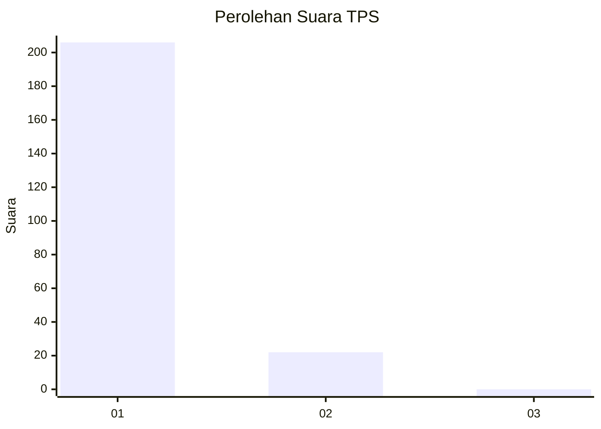
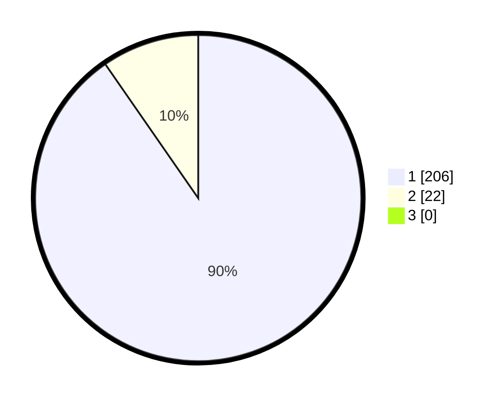

# Hasil

## Grafik

## Tabel

| No. | Nama Paslon    | Suara | Suara (raw) | Persentase |
|:--- |:-------------- | -----:| -----------:| ----------:|
| 1   | ANIES MUHAIMIN | 206   | [206][p-1]  | 90,35      |
| 2   | PRABOWO GIBRAN | 22    | [22][p-2]   | 9,65       |
| 3   | GANJAR MAHFUD  | 0     | [0][p-3]    | 0,00       |

[p-1]: https://github.com/gigit-pemilu/pemilu-2024-11-aceh/blob/main/pilpres/hitung-suara/sub/11-aceh/sub/06-aceh-besar/sub/12-darussalam/sub/2029-siem/sub/001-tps/sub/paslon-1.txt
[p-2]: https://github.com/gigit-pemilu/pemilu-2024-11-aceh/blob/main/pilpres/hitung-suara/sub/11-aceh/sub/06-aceh-besar/sub/12-darussalam/sub/2029-siem/sub/001-tps/sub/paslon-2.txt
[p-3]: https://github.com/gigit-pemilu/pemilu-2024-11-aceh/blob/main/pilpres/hitung-suara/sub/11-aceh/sub/06-aceh-besar/sub/12-darussalam/sub/2029-siem/sub/001-tps/sub/paslon-3.txt

## Foto C Plano

https://sirekap-obj-formc.kpu.go.id/3963/pemilu/ppwp/11/06/12/20/29/1106122029001-20240214-213048--cb2fecbb-a592-44a2-a2a8-17a18d4369ca.jpg

https://sirekap-obj-formc.kpu.go.id/3963/pemilu/ppwp/11/06/12/20/29/1106122029001-20240214-213503--16860869-53dc-400b-9eb0-b286ad4b16d9.jpg

https://sirekap-obj-formc.kpu.go.id/3963/pemilu/ppwp/11/06/12/20/29/1106122029001-20240214-213636--c6fa2674-f284-471f-beed-f5cad0d9497a.jpg

## Metadata

| Key        | Value               |
| ---------- | ------------------- |
| Time Stamp | 2024-02-16 00:00:26 |

