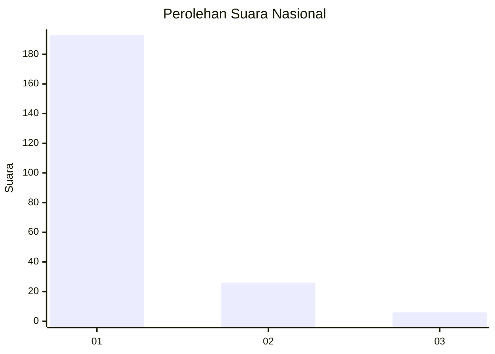
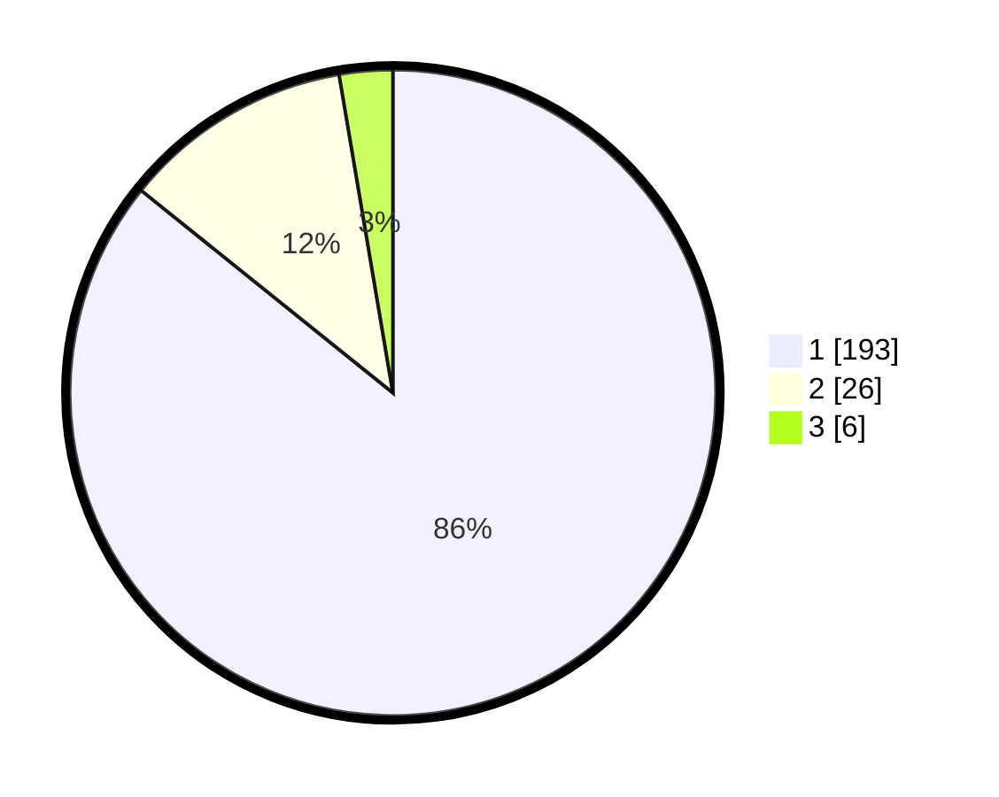

# Hasil

## Grafik

## Tabel

| No. | Nama Paslon    | Suara | Suara (raw) | Persentase |
|:--- |:-------------- | -----:| -----------:| ----------:|
| 1   | ANIES MUHAIMIN | 193   | [193][p-1]  | 85,78      |
| 2   | PRABOWO GIBRAN | 26    | [26][p-2]   | 11,56      |
| 3   | GANJAR MAHFUD  | 6     | [6][p-3]    | 2,67       |

[p-1]: https://github.com/gigit-pemilu/pemilu-2024/blob/main/pilpres/hitung-suara/sub/11-aceh/sub/06-aceh-besar/sub/12-darussalam/sub/2029-siem/sub/002-tps/sub/paslon-1.txt
[p-2]: https://github.com/gigit-pemilu/pemilu-2024/blob/main/pilpres/hitung-suara/sub/11-aceh/sub/06-aceh-besar/sub/12-darussalam/sub/2029-siem/sub/002-tps/sub/paslon-2.txt
[p-3]: https://github.com/gigit-pemilu/pemilu-2024/blob/main/pilpres/hitung-suara/sub/11-aceh/sub/06-aceh-besar/sub/12-darussalam/sub/2029-siem/sub/002-tps/sub/paslon-3.txt

## Foto C Plano

https://sirekap-obj-formc.kpu.go.id/820e/pemilu/ppwp/11/06/12/20/29/1106122029002-20240214-212108--c51f3fc8-dc2c-40ff-a836-df091b0b9c64.jpg

https://sirekap-obj-formc.kpu.go.id/820e/pemilu/ppwp/11/06/12/20/29/1106122029002-20240214-211139--d6f49f41-e83f-4b7b-807f-e1f176c65a7c.jpg

https://sirekap-obj-formc.kpu.go.id/820e/pemilu/ppwp/11/06/12/20/29/1106122029002-20240214-211240--0b41222d-1313-4ee6-863a-7b7b1729c896.jpg

## Metadata

| Key        | Value               |
| ---------- | ------------------- |
| Time Stamp | 2024-02-15 17:30:25 |

