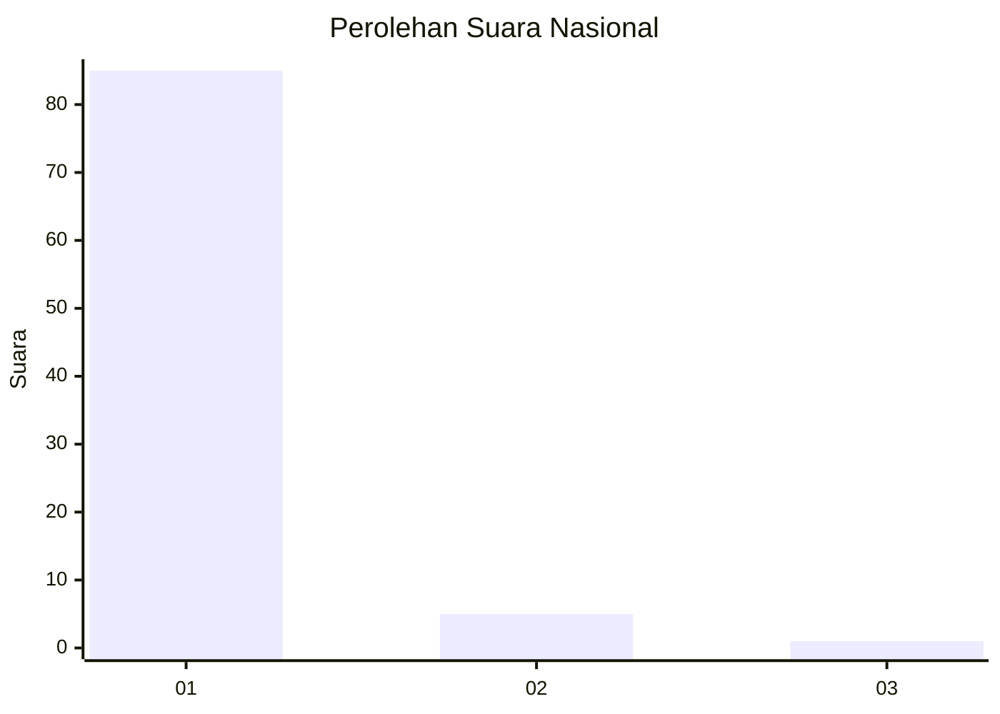
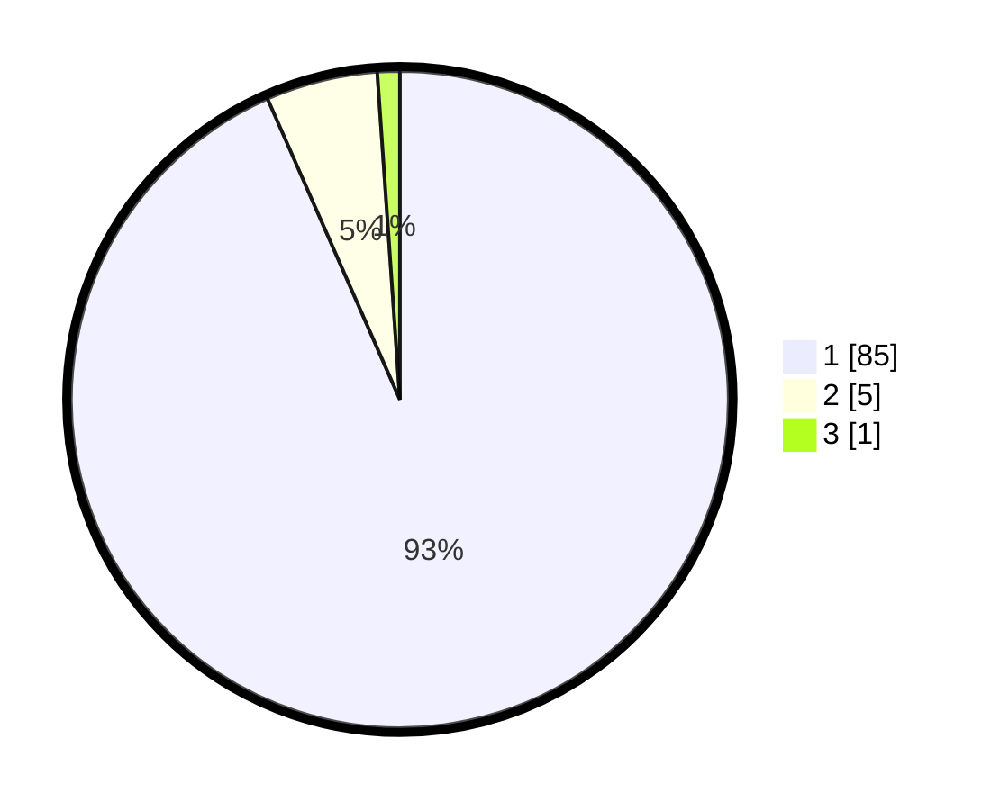

# Hasil

## Grafik

## Tabel

| No. | Nama Paslon    | Suara | Suara (raw) | Persentase |
|:--- |:-------------- | -----:| -----------:| ----------:|
| 1   | ANIES MUHAIMIN | 85    | [85][p-1]   | 93,41      |
| 2   | PRABOWO GIBRAN | 5     | [5][p-2]    | 5,49       |
| 3   | GANJAR MAHFUD  | 1     | [1][p-3]    | 1,10       |

[p-1]: https://github.com/gigit-pemilu/pemilu-2024/blob/main/pilpres/hitung-suara/sub/11-aceh/sub/06-aceh-besar/sub/13-pulo-aceh/sub/2002-alue-raya/sub/001-tps/sub/paslon-1.txt
[p-2]: https://github.com/gigit-pemilu/pemilu-2024/blob/main/pilpres/hitung-suara/sub/11-aceh/sub/06-aceh-besar/sub/13-pulo-aceh/sub/2002-alue-raya/sub/001-tps/sub/paslon-2.txt
[p-3]: https://github.com/gigit-pemilu/pemilu-2024/blob/main/pilpres/hitung-suara/sub/11-aceh/sub/06-aceh-besar/sub/13-pulo-aceh/sub/2002-alue-raya/sub/001-tps/sub/paslon-3.txt

## Foto C Plano

https://sirekap-obj-formc.kpu.go.id/c9fe/pemilu/ppwp/11/06/13/20/02/1106132002001-20240217-110902--de6e1263-3903-41cf-a63f-f7a8fabf548f.jpg

https://sirekap-obj-formc.kpu.go.id/c9fe/pemilu/ppwp/11/06/13/20/02/1106132002001-20240217-111432--5436d416-64ce-4895-82fe-a5c1f8a79923.jpg

https://sirekap-obj-formc.kpu.go.id/c9fe/pemilu/ppwp/11/06/13/20/02/1106132002001-20240217-112039--ebc14768-fb92-45e3-8fe5-10c2bbc6b484.jpg

## Metadata

| Key        | Value               |
| ---------- | ------------------- |
| Time Stamp | 2024-02-19 21:00:00 |

## DATA PEMILIH TETAP

Jumlah pemilih dalam DPT: **111**.
 * L: **57**.
 * P: **54**.

## DATA PENGGUNA HAK PILIH

Jumlah pengguna hak pilih dalam DPT: **89**.
 * L: **45**.
 * P: **44**.

Jumlah pengguna hak pilih dalam DPTb: **0**.
 * L: **0**.
 * P: **0**.

Jumlah pengguna hak pilih dalam DPK: **2**.
 * L: **1**.
 * P: **1**.

Jumlah pengguna hak pilih: **91**.
 * L: **46**.
 * P: **45**.

## JUMLAH SUARA SAH DAN TIDAK SAH

JUMLAH SELURUH SUARA SAH: **91**.

JUMLAH SUARA TIDAK SAH: **0**.

JUMLAH SELURUH SUARA SAH DAN SUARA TIDAK SAH: **91**.

