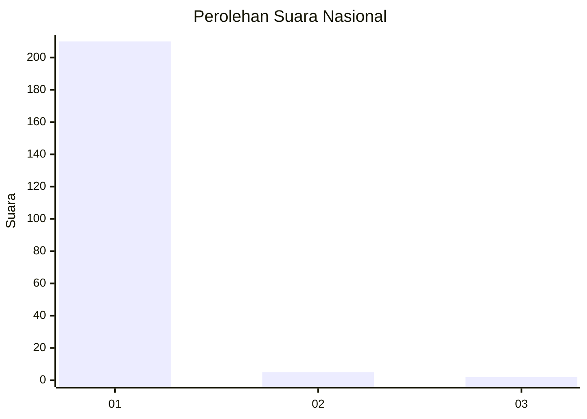
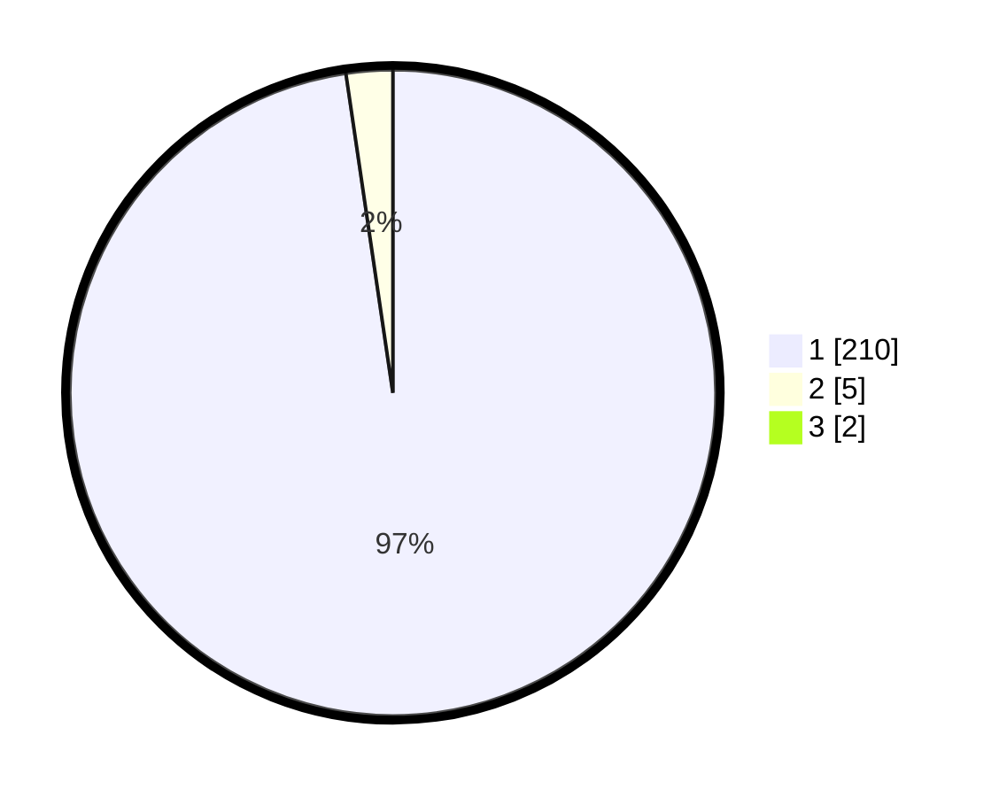

# Hasil

## Grafik

## Tabel

| No. | Nama Paslon    | Suara | Suara (raw) | Persentase |
|:--- |:-------------- | -----:| -----------:| ----------:|
| 1   | ANIES MUHAIMIN | 210   | [210][p-1]  | 96,77      |
| 2   | PRABOWO GIBRAN | 5     | [5][p-2]    | 2,30       |
| 3   | GANJAR MAHFUD  | 2     | [2][p-3]    | 0,92       |

[p-1]: https://github.com/gigit-pemilu/pemilu-2024/blob/main/pilpres/hitung-suara/sub/11-aceh/sub/06-aceh-besar/sub/13-pulo-aceh/sub/2003-melingge/sub/001-tps/sub/paslon-1.txt
[p-2]: https://github.com/gigit-pemilu/pemilu-2024/blob/main/pilpres/hitung-suara/sub/11-aceh/sub/06-aceh-besar/sub/13-pulo-aceh/sub/2003-melingge/sub/001-tps/sub/paslon-2.txt
[p-3]: https://github.com/gigit-pemilu/pemilu-2024/blob/main/pilpres/hitung-suara/sub/11-aceh/sub/06-aceh-besar/sub/13-pulo-aceh/sub/2003-melingge/sub/001-tps/sub/paslon-3.txt

## Foto C Plano

https://sirekap-obj-formc.kpu.go.id/37a0/pemilu/ppwp/11/06/13/20/03/1106132003001-20240217-101552--78f7baa3-8e42-4b51-bacb-3d86c6805c4c.jpg

https://sirekap-obj-formc.kpu.go.id/37a0/pemilu/ppwp/11/06/13/20/03/1106132003001-20240216-143645--ed870732-5067-44ae-a796-57dc8718e055.jpg

## Metadata

| Key        | Value               |
| ---------- | ------------------- |
| Time Stamp | 2024-02-24 22:31:28 |

