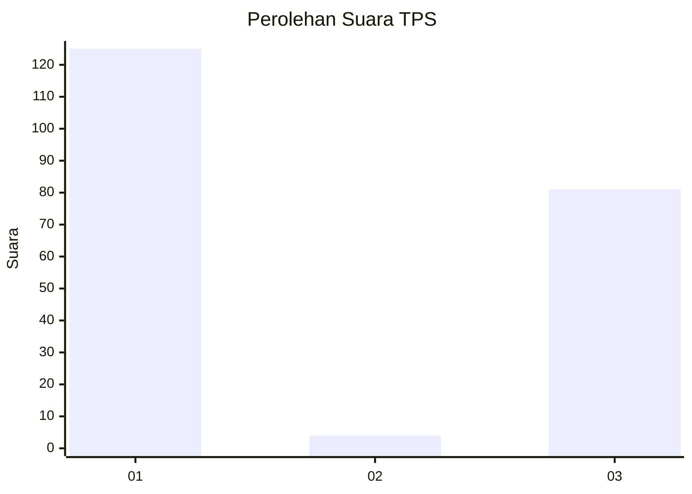
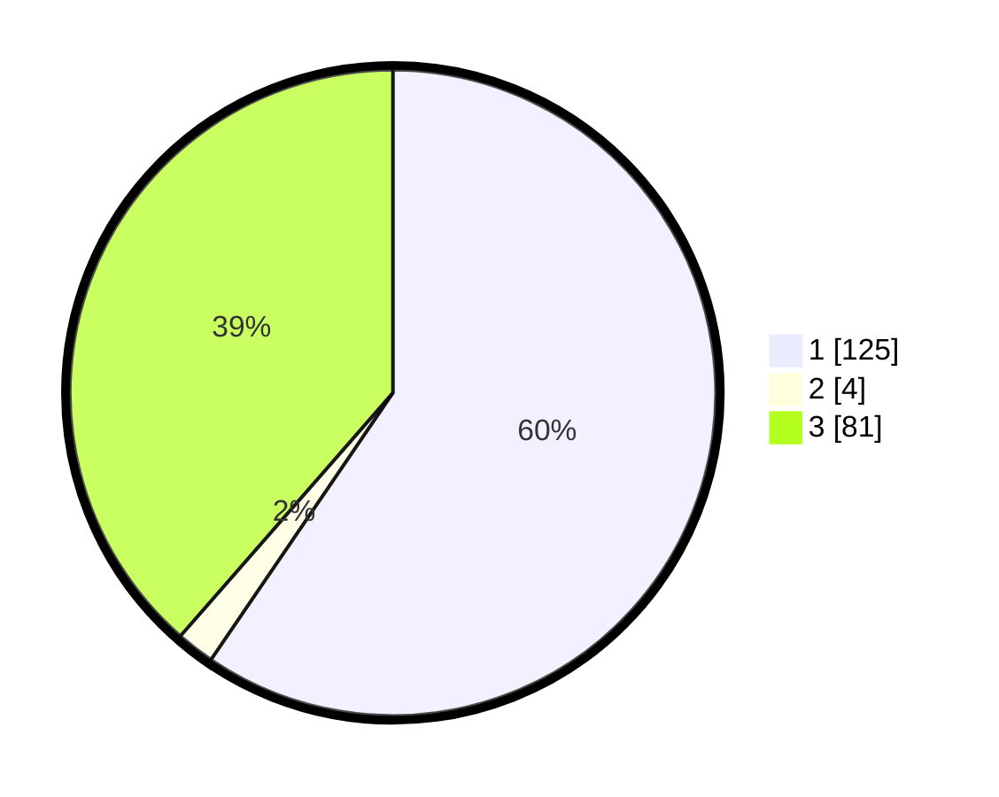

# Hasil

## Grafik

## Tabel

| No. | Nama Paslon    | Suara | Suara (raw) | Persentase |
|:--- |:-------------- | -----:| -----------:| ----------:|
| 1   | ANIES MUHAIMIN | 125   | [125][p-1]  | 59,52      |
| 2   | PRABOWO GIBRAN | 4     | [4][p-2]    | 1,90       |
| 3   | GANJAR MAHFUD  | 81    | [81][p-3]   | 38,57      |

[p-1]: https://github.com/gigit-pemilu/pemilu-2024-11-aceh/blob/main/pilpres/hitung-suara/sub/11-aceh/sub/06-aceh-besar/sub/13-pulo-aceh/sub/2005-ulee-paya/sub/001-tps/sub/paslon-1.txt
[p-2]: https://github.com/gigit-pemilu/pemilu-2024-11-aceh/blob/main/pilpres/hitung-suara/sub/11-aceh/sub/06-aceh-besar/sub/13-pulo-aceh/sub/2005-ulee-paya/sub/001-tps/sub/paslon-2.txt
[p-3]: https://github.com/gigit-pemilu/pemilu-2024-11-aceh/blob/main/pilpres/hitung-suara/sub/11-aceh/sub/06-aceh-besar/sub/13-pulo-aceh/sub/2005-ulee-paya/sub/001-tps/sub/paslon-3.txt

## Foto C Plano

https://sirekap-obj-formc.kpu.go.id/95d7/pemilu/ppwp/11/06/13/20/05/1106132005001-20240217-114547--d001b205-3379-41d2-8ed2-37ab8659d2d0.jpg

https://sirekap-obj-formc.kpu.go.id/95d7/pemilu/ppwp/11/06/13/20/05/1106132005001-20240217-114647--027941f7-bbc7-41f2-96c1-61d273098d6d.jpg

https://sirekap-obj-formc.kpu.go.id/95d7/pemilu/ppwp/11/06/13/20/05/1106132005001-20240217-114833--c5b4b3b0-cc90-49f2-9182-bd6efb504cb0.jpg

## Metadata

| Key        | Value               |
| ---------- | ------------------- |
| Time Stamp | 2024-02-17 12:00:00 |

## DATA PEMILIH TETAP

Jumlah pemilih dalam DPT: **132**.
 * L: **66**.
 * P: **66**.

## DATA PENGGUNA HAK PILIH

Jumlah pengguna hak pilih dalam DPT: **130**.
 * L: **65**.
 * P: **65**.

Jumlah pengguna hak pilih dalam DPTb: **1**.
 * L: **1**.
 * P: **0**.

Jumlah pengguna hak pilih dalam DPK: **0**.
 * L: **0**.
 * P: **0**.

Jumlah pengguna hak pilih: **131**.
 * L: **66**.
 * P: **65**.

## JUMLAH SUARA SAH DAN TIDAK SAH

JUMLAH SELURUH SUARA SAH: **130**.

JUMLAH SUARA TIDAK SAH: **1**.

JUMLAH SELURUH SUARA SAH DAN SUARA TIDAK SAH: **131**.

