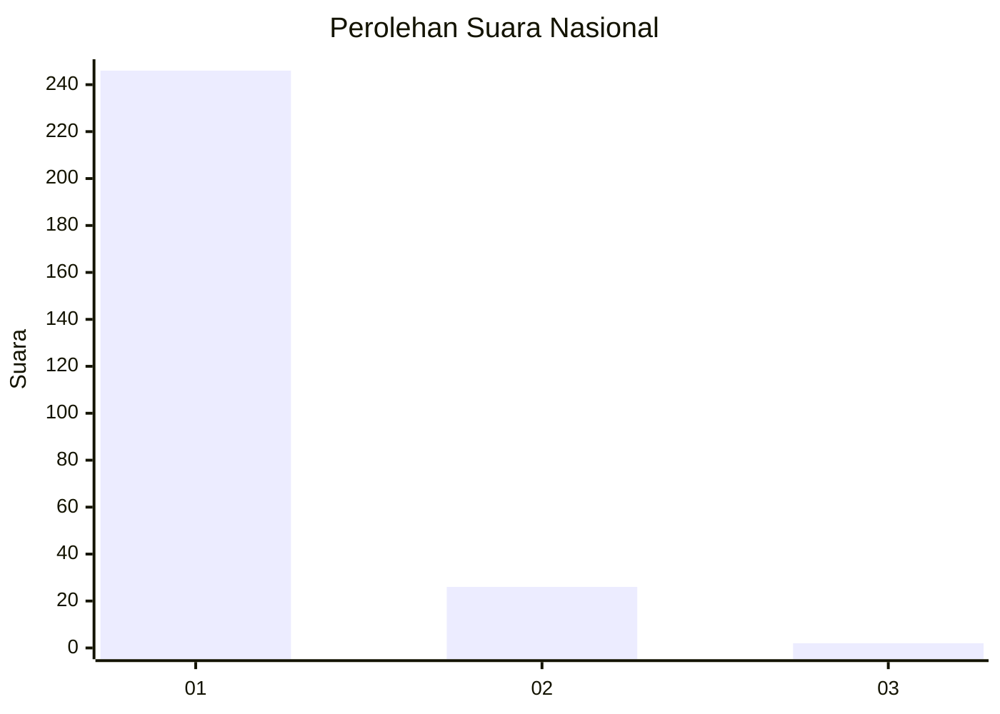
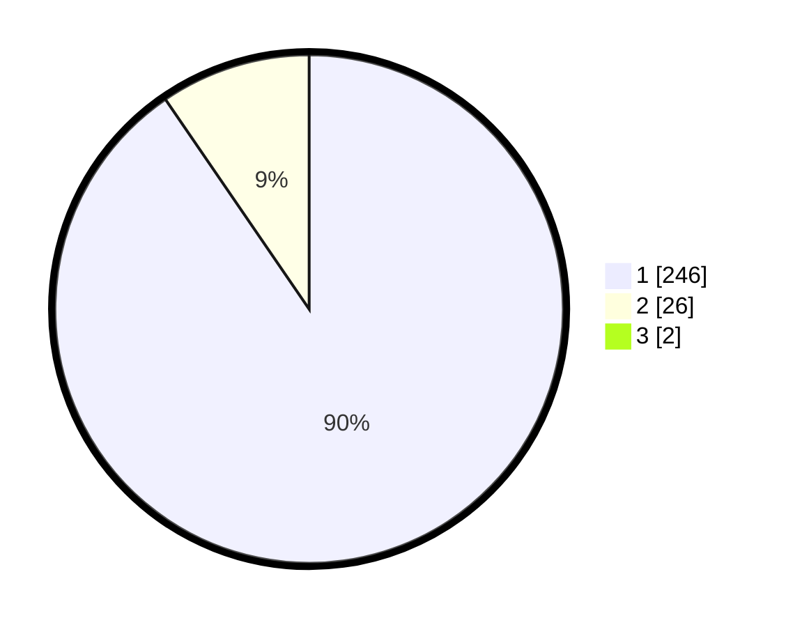

# Hasil

## Grafik

## Tabel

| No. | Nama Paslon    | Suara | Suara (raw) | Persentase |
|:--- |:-------------- | -----:| -----------:| ----------:|
| 1   | ANIES MUHAIMIN | 246   | [246][p-1]  | 89,78      |
| 2   | PRABOWO GIBRAN | 26    | [26][p-2]   | 9,49       |
| 3   | GANJAR MAHFUD  | 2     | [2][p-3]    | 0,73       |

[p-1]: https://github.com/gigit-pemilu/pemilu-2024/blob/main/pilpres/hitung-suara/sub/11-aceh/sub/06-aceh-besar/sub/13-pulo-aceh/sub/2006-gugop/sub/001-tps/sub/paslon-1.txt
[p-2]: https://github.com/gigit-pemilu/pemilu-2024/blob/main/pilpres/hitung-suara/sub/11-aceh/sub/06-aceh-besar/sub/13-pulo-aceh/sub/2006-gugop/sub/001-tps/sub/paslon-2.txt
[p-3]: https://github.com/gigit-pemilu/pemilu-2024/blob/main/pilpres/hitung-suara/sub/11-aceh/sub/06-aceh-besar/sub/13-pulo-aceh/sub/2006-gugop/sub/001-tps/sub/paslon-3.txt

## Foto C Plano

https://sirekap-obj-formc.kpu.go.id/947e/pemilu/ppwp/11/06/13/20/06/1106132006001-20240214-203030--4839580a-47e1-49f9-b6f7-412725c50640.jpg

https://sirekap-obj-formc.kpu.go.id/947e/pemilu/ppwp/11/06/13/20/06/1106132006001-20240214-203301--9196dad7-d0b8-4e8b-9d53-fa8e8bd230c9.jpg

https://sirekap-obj-formc.kpu.go.id/947e/pemilu/ppwp/11/06/13/20/06/1106132006001-20240214-203422--75f83010-a40f-4e3e-a4b5-427915a66bcc.jpg

## Metadata

| Key        | Value               |
| ---------- | ------------------- |
| Time Stamp | 2024-02-15 16:00:26 |

