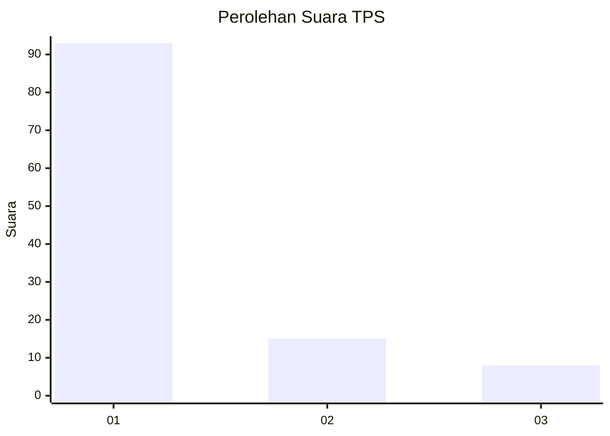
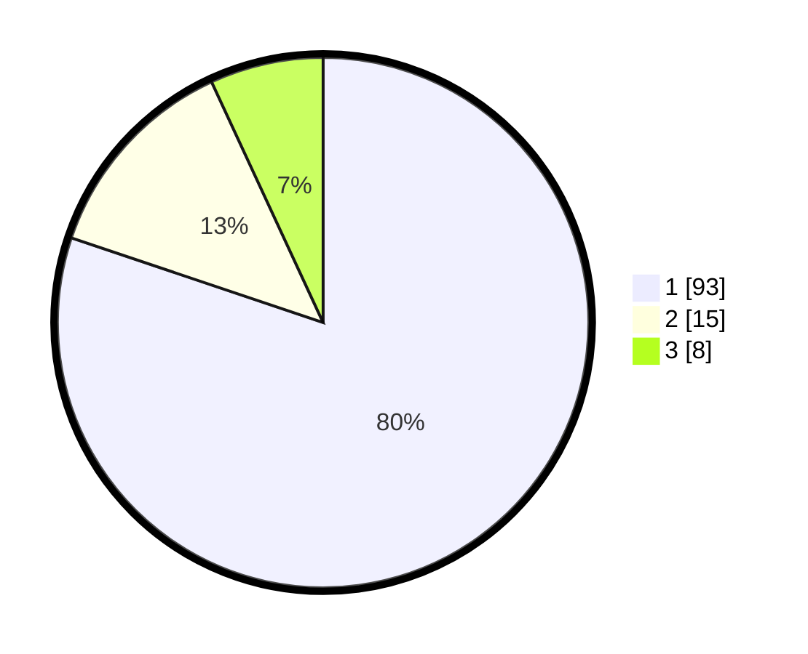

# Hasil

## Grafik

## Tabel

| No. | Nama Paslon    | Suara | Suara (raw) | Persentase |
|:--- |:-------------- | -----:| -----------:| ----------:|
| 1   | ANIES MUHAIMIN | 93    | [93][p-1]   | 80,17      |
| 2   | PRABOWO GIBRAN | 15    | [15][p-2]   | 12,93      |
| 3   | GANJAR MAHFUD  | 8     | [8][p-3]    | 6,90       |

[p-1]: https://github.com/gigit-pemilu/pemilu-2024-11-aceh/blob/main/pilpres/hitung-suara/sub/11-aceh/sub/06-aceh-besar/sub/13-pulo-aceh/sub/2011-lhok/sub/001-tps/sub/paslon-1.txt
[p-2]: https://github.com/gigit-pemilu/pemilu-2024-11-aceh/blob/main/pilpres/hitung-suara/sub/11-aceh/sub/06-aceh-besar/sub/13-pulo-aceh/sub/2011-lhok/sub/001-tps/sub/paslon-2.txt
[p-3]: https://github.com/gigit-pemilu/pemilu-2024-11-aceh/blob/main/pilpres/hitung-suara/sub/11-aceh/sub/06-aceh-besar/sub/13-pulo-aceh/sub/2011-lhok/sub/001-tps/sub/paslon-3.txt

## Foto C Plano

https://sirekap-obj-formc.kpu.go.id/2447/pemilu/ppwp/11/06/13/20/11/1106132011001-20240215-125046--f96159a8-9463-4bf4-9ef7-89bd5311c759.jpg

https://sirekap-obj-formc.kpu.go.id/2447/pemilu/ppwp/11/06/13/20/11/1106132011001-20240215-125158--187d91c0-b27d-4525-856b-c46b3cc7e5cb.jpg

https://sirekap-obj-formc.kpu.go.id/2447/pemilu/ppwp/11/06/13/20/11/1106132011001-20240215-125307--9ec1f586-8f9e-4233-96d9-d6af5764566a.jpg

## Metadata

| Key        | Value               |
| ---------- | ------------------- |
| Time Stamp | 2024-02-15 15:00:29 |

