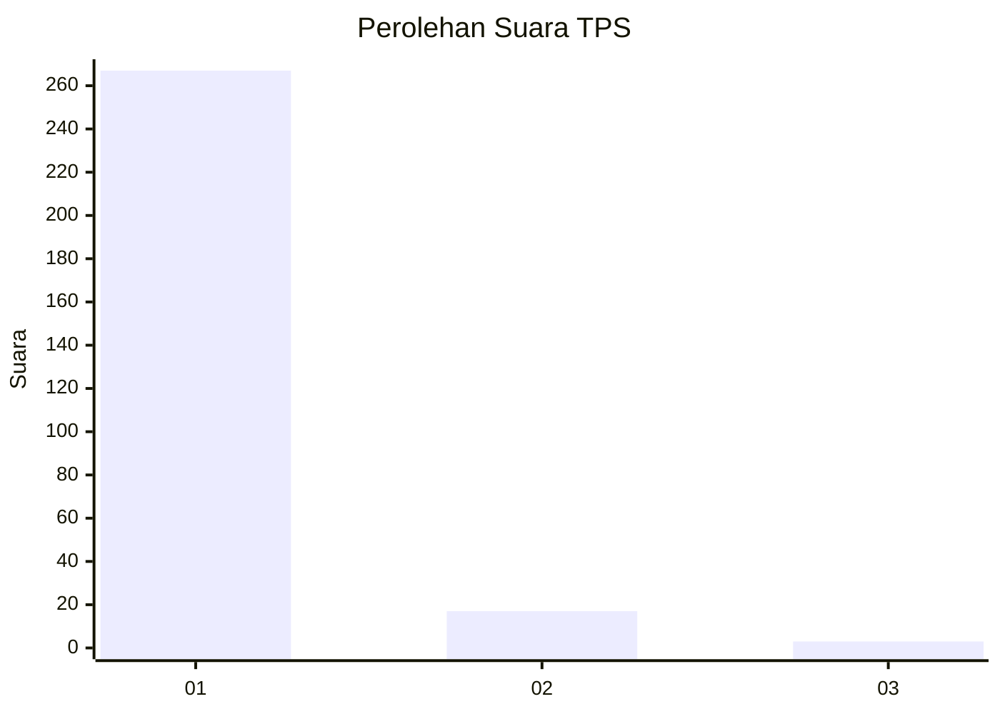
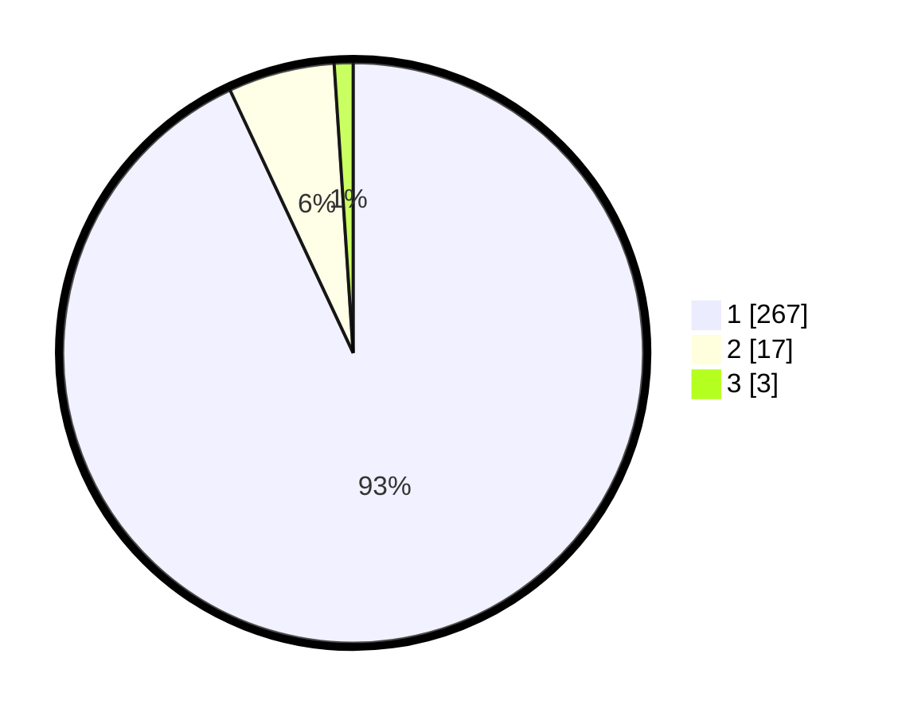

# Hasil

## Grafik

## Tabel

| No. | Nama Paslon    | Suara | Suara (raw) | Persentase |
|:--- |:-------------- | -----:| -----------:| ----------:|
| 1   | ANIES MUHAIMIN | 267   | [267][p-1]  | 93,03      |
| 2   | PRABOWO GIBRAN | 17    | [17][p-2]   | 5,92       |
| 3   | GANJAR MAHFUD  | 3     | [3][p-3]    | 1,05       |

[p-1]: https://github.com/gigit-pemilu/pemilu-2024-11-aceh/blob/main/pilpres/hitung-suara/sub/11-aceh/sub/06-aceh-besar/sub/13-pulo-aceh/sub/2016-alue-reuyeueng/sub/001-tps/sub/paslon-1.txt
[p-2]: https://github.com/gigit-pemilu/pemilu-2024-11-aceh/blob/main/pilpres/hitung-suara/sub/11-aceh/sub/06-aceh-besar/sub/13-pulo-aceh/sub/2016-alue-reuyeueng/sub/001-tps/sub/paslon-2.txt
[p-3]: https://github.com/gigit-pemilu/pemilu-2024-11-aceh/blob/main/pilpres/hitung-suara/sub/11-aceh/sub/06-aceh-besar/sub/13-pulo-aceh/sub/2016-alue-reuyeueng/sub/001-tps/sub/paslon-3.txt

## Foto C Plano

https://sirekap-obj-formc.kpu.go.id/d231/pemilu/ppwp/11/06/13/20/16/1106132016001-20240214-235325--b520b18e-aa3c-49b6-939d-ba3b11460039.jpg

https://sirekap-obj-formc.kpu.go.id/d231/pemilu/ppwp/11/06/13/20/16/1106132016001-20240215-000001--2bc37a5c-f243-4570-9120-342017f72126.jpg

https://sirekap-obj-formc.kpu.go.id/d231/pemilu/ppwp/11/06/13/20/16/1106132016001-20240215-000047--293f04c7-a8e3-43af-ac68-266b8a2ba298.jpg

## Metadata

| Key        | Value               |
| ---------- | ------------------- |
| Time Stamp | 2024-02-15 21:30:27 |

