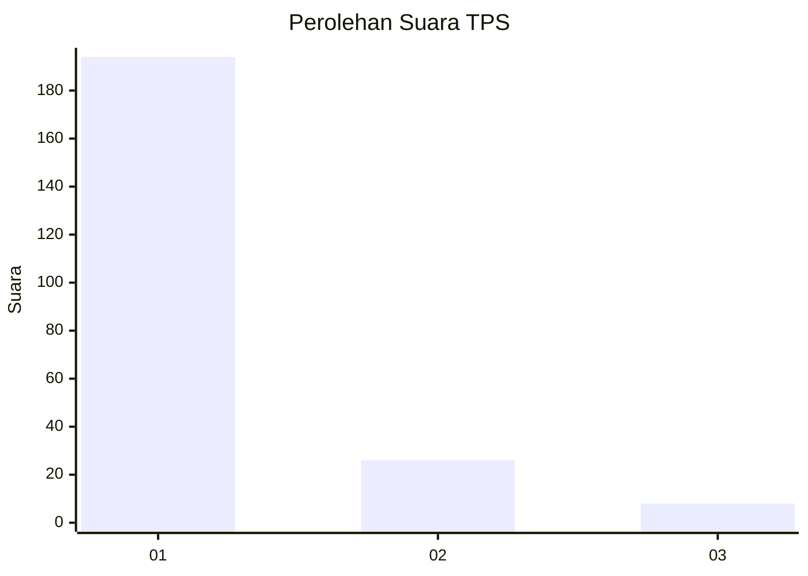
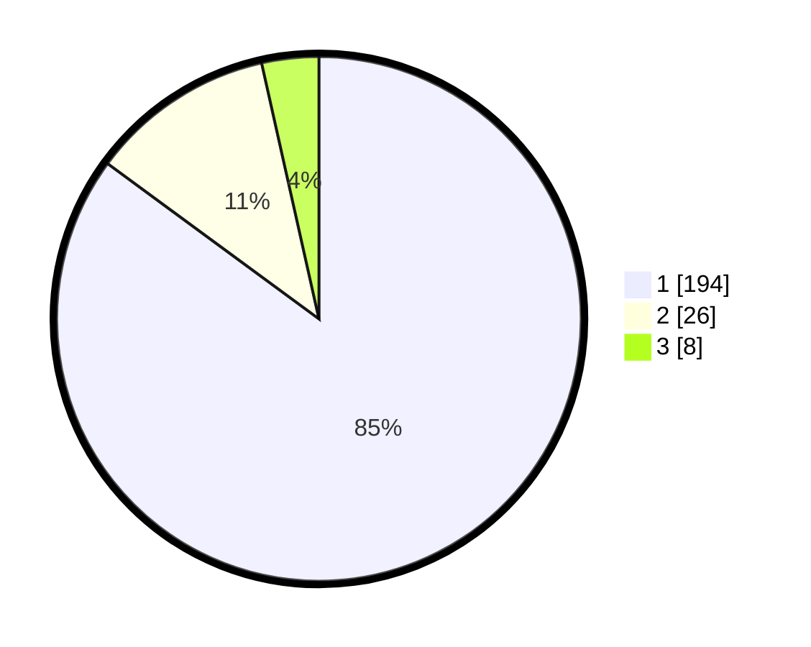

# Hasil

## Grafik

## Tabel

| No. | Nama Paslon    | Suara | Suara (raw) | Persentase |
|:--- |:-------------- | -----:| -----------:| ----------:|
| 1   | ANIES MUHAIMIN | 194   | [194][p-1]  | 85,09      |
| 2   | PRABOWO GIBRAN | 26    | [26][p-2]   | 11,40      |
| 3   | GANJAR MAHFUD  | 8     | [8][p-3]    | 3,51       |

[p-1]: https://github.com/gigit-pemilu/pemilu-2024-11-aceh/blob/main/pilpres/hitung-suara/sub/11-aceh/sub/06-aceh-besar/sub/14-lembah-seulawah/sub/2001-lamtamot/sub/001-tps/sub/paslon-1.txt
[p-2]: https://github.com/gigit-pemilu/pemilu-2024-11-aceh/blob/main/pilpres/hitung-suara/sub/11-aceh/sub/06-aceh-besar/sub/14-lembah-seulawah/sub/2001-lamtamot/sub/001-tps/sub/paslon-2.txt
[p-3]: https://github.com/gigit-pemilu/pemilu-2024-11-aceh/blob/main/pilpres/hitung-suara/sub/11-aceh/sub/06-aceh-besar/sub/14-lembah-seulawah/sub/2001-lamtamot/sub/001-tps/sub/paslon-3.txt

## Foto C Plano

https://sirekap-obj-formc.kpu.go.id/a04a/pemilu/ppwp/11/06/14/20/01/1106142001001-20240219-112619--32425440-9d15-4f08-b45c-626d2c7c45aa.jpg

https://sirekap-obj-formc.kpu.go.id/a04a/pemilu/ppwp/11/06/14/20/01/1106142001001-20240219-112838--c1b03088-2b62-45fc-9be1-3b761a292847.jpg

https://sirekap-obj-formc.kpu.go.id/a04a/pemilu/ppwp/11/06/14/20/01/1106142001001-20240219-113157--400dbc7f-2480-4a50-bd65-4263e130f480.jpg

## Metadata

| Key        | Value               |
| ---------- | ------------------- |
| Time Stamp | 2024-02-19 21:00:00 |

