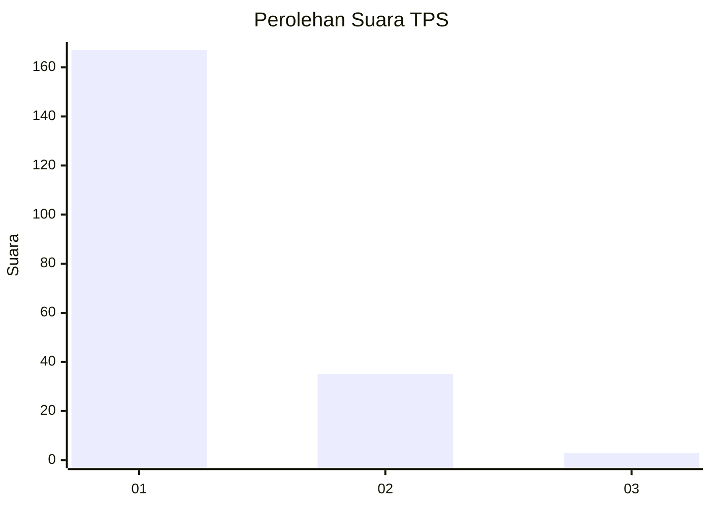
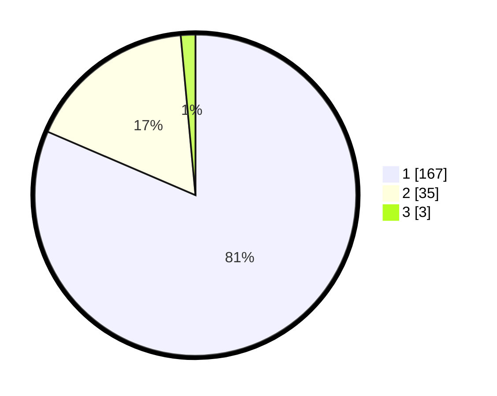

# Hasil

## Grafik

## Tabel

| No. | Nama Paslon    | Suara | Suara (raw) | Persentase |
|:--- |:-------------- | -----:| -----------:| ----------:|
| 1   | ANIES MUHAIMIN | 167   | [167][p-1]  | 81,46      |
| 2   | PRABOWO GIBRAN | 35    | [35][p-2]   | 17,07      |
| 3   | GANJAR MAHFUD  | 3     | [3][p-3]    | 1,46       |

[p-1]: https://github.com/gigit-pemilu/pemilu-2024-11-aceh/blob/main/pilpres/hitung-suara/sub/11-aceh/sub/06-aceh-besar/sub/14-lembah-seulawah/sub/2001-lamtamot/sub/002-tps/sub/paslon-1.txt
[p-2]: https://github.com/gigit-pemilu/pemilu-2024-11-aceh/blob/main/pilpres/hitung-suara/sub/11-aceh/sub/06-aceh-besar/sub/14-lembah-seulawah/sub/2001-lamtamot/sub/002-tps/sub/paslon-2.txt
[p-3]: https://github.com/gigit-pemilu/pemilu-2024-11-aceh/blob/main/pilpres/hitung-suara/sub/11-aceh/sub/06-aceh-besar/sub/14-lembah-seulawah/sub/2001-lamtamot/sub/002-tps/sub/paslon-3.txt

## Foto C Plano

https://sirekap-obj-formc.kpu.go.id/b229/pemilu/ppwp/11/06/14/20/01/1106142001002-20240219-143315--23e6f468-fe80-426c-b6b4-81d4fd0cd10b.jpg

https://sirekap-obj-formc.kpu.go.id/b229/pemilu/ppwp/11/06/14/20/01/1106142001002-20240215-011655--b1c7f043-0ceb-4e43-9d67-de4f192d9f56.jpg

https://sirekap-obj-formc.kpu.go.id/b229/pemilu/ppwp/11/06/14/20/01/1106142001002-20240215-024907--ed39d77d-7993-42e5-ac41-8f773474d682.jpg

## Metadata

| Key        | Value               |
| ---------- | ------------------- |
| Time Stamp | 2024-02-19 15:00:00 |

