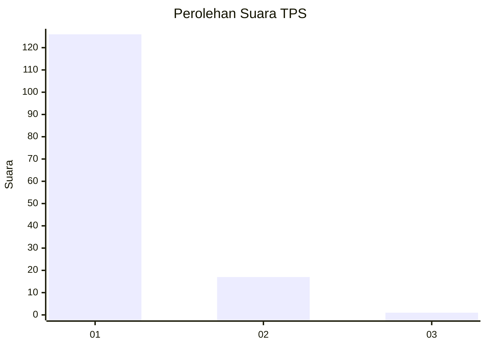
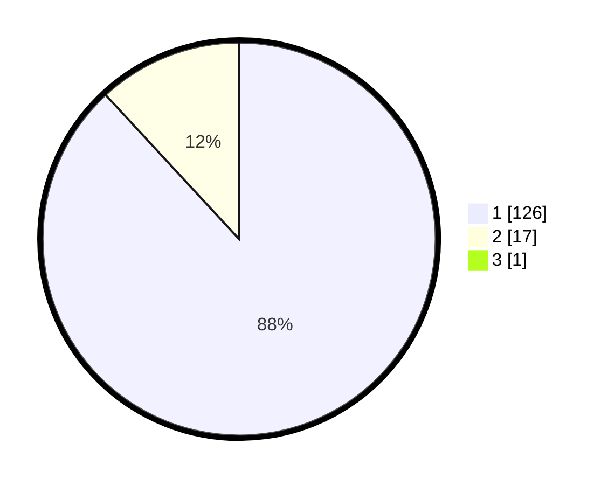

# Hasil

## Grafik

## Tabel

| No. | Nama Paslon    | Suara | Suara (raw) | Persentase |
|:--- |:-------------- | -----:| -----------:| ----------:|
| 1   | ANIES MUHAIMIN | 126   | [126][p-1]  | 87,50      |
| 2   | PRABOWO GIBRAN | 17    | [17][p-2]   | 11,81      |
| 3   | GANJAR MAHFUD  | 1     | [1][p-3]    | 0,69       |

[p-1]: https://github.com/gigit-pemilu/pemilu-2024-11-aceh/blob/main/pilpres/hitung-suara/sub/11-aceh/sub/06-aceh-besar/sub/14-lembah-seulawah/sub/2002-lambaro-tunong/sub/001-tps/sub/paslon-1.txt
[p-2]: https://github.com/gigit-pemilu/pemilu-2024-11-aceh/blob/main/pilpres/hitung-suara/sub/11-aceh/sub/06-aceh-besar/sub/14-lembah-seulawah/sub/2002-lambaro-tunong/sub/001-tps/sub/paslon-2.txt
[p-3]: https://github.com/gigit-pemilu/pemilu-2024-11-aceh/blob/main/pilpres/hitung-suara/sub/11-aceh/sub/06-aceh-besar/sub/14-lembah-seulawah/sub/2002-lambaro-tunong/sub/001-tps/sub/paslon-3.txt

## Foto C Plano

https://sirekap-obj-formc.kpu.go.id/c8ea/pemilu/ppwp/11/06/14/20/02/1106142002001-20240214-155319--c2dc35ea-08c0-4d3b-9e28-6371925b037c.jpg

https://sirekap-obj-formc.kpu.go.id/c8ea/pemilu/ppwp/11/06/14/20/02/1106142002001-20240214-192030--9c732656-895c-48d1-9a7c-405212c78b1c.jpg

https://sirekap-obj-formc.kpu.go.id/c8ea/pemilu/ppwp/11/06/14/20/02/1106142002001-20240214-155752--9f886edb-2187-4844-80f3-e1e5adc408ca.jpg

## Metadata

| Key        | Value               |
| ---------- | ------------------- |
| Time Stamp | 2024-02-14 21:46:01 |

