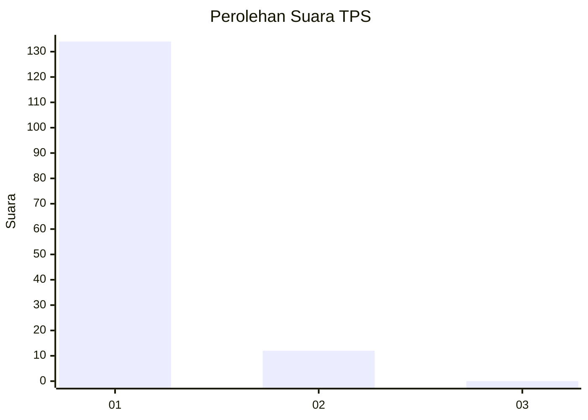
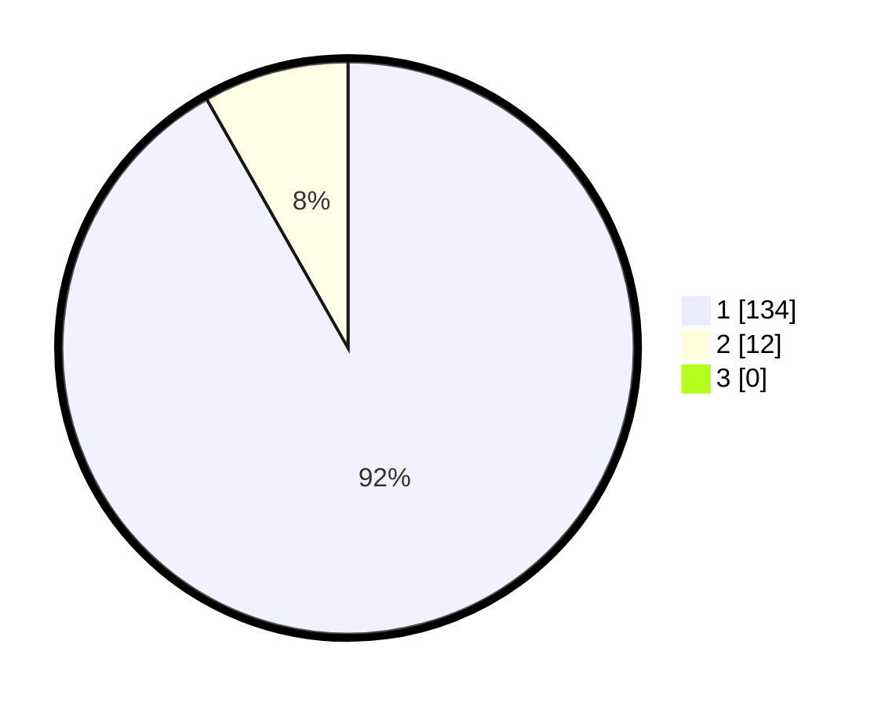

# Hasil

## Grafik

## Tabel

| No. | Nama Paslon    | Suara | Suara (raw) | Persentase |
|:--- |:-------------- | -----:| -----------:| ----------:|
| 1   | ANIES MUHAIMIN | 134   | [134][p-1]  | 91,78      |
| 2   | PRABOWO GIBRAN | 12    | [12][p-2]   | 8,22       |
| 3   | GANJAR MAHFUD  | 0     | [0][p-3]    | 0,00       |

[p-1]: https://github.com/gigit-pemilu/pemilu-2024-11-aceh/blob/main/pilpres/hitung-suara/sub/11-aceh/sub/06-aceh-besar/sub/14-lembah-seulawah/sub/2003-lonbaroh/sub/002-tps/sub/paslon-1.txt
[p-2]: https://github.com/gigit-pemilu/pemilu-2024-11-aceh/blob/main/pilpres/hitung-suara/sub/11-aceh/sub/06-aceh-besar/sub/14-lembah-seulawah/sub/2003-lonbaroh/sub/002-tps/sub/paslon-2.txt
[p-3]: https://github.com/gigit-pemilu/pemilu-2024-11-aceh/blob/main/pilpres/hitung-suara/sub/11-aceh/sub/06-aceh-besar/sub/14-lembah-seulawah/sub/2003-lonbaroh/sub/002-tps/sub/paslon-3.txt

## Foto C Plano

https://sirekap-obj-formc.kpu.go.id/a88f/pemilu/ppwp/11/06/14/20/03/1106142003002-20240214-191149--bd9caa27-0b97-4afd-99a5-62d4729f3f71.jpg

https://sirekap-obj-formc.kpu.go.id/a88f/pemilu/ppwp/11/06/14/20/03/1106142003002-20240214-204641--2479ff42-e6f4-4fb7-bef6-94458a9073e5.jpg

https://sirekap-obj-formc.kpu.go.id/a88f/pemilu/ppwp/11/06/14/20/03/1106142003002-20240214-213909--ed5da271-be96-4e1d-9bc8-88e9b7560d5d.jpg

## Metadata

| Key        | Value               |
| ---------- | ------------------- |
| Time Stamp | 2024-02-15 09:00:24 |

