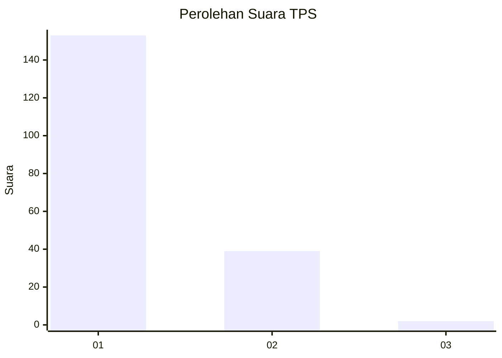
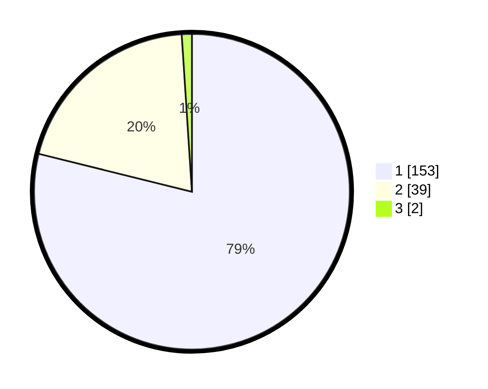

# Hasil

## Grafik

## Tabel

| No. | Nama Paslon    | Suara | Suara (raw) | Persentase |
|:--- |:-------------- | -----:| -----------:| ----------:|
| 1   | ANIES MUHAIMIN | 153   | [153][p-1]  | 78,87      |
| 2   | PRABOWO GIBRAN | 39    | [39][p-2]   | 20,10      |
| 3   | GANJAR MAHFUD  | 2     | [2][p-3]    | 1,03       |

[p-1]: https://github.com/gigit-pemilu/pemilu-2024-11-aceh/blob/main/pilpres/hitung-suara/sub/11-aceh/sub/06-aceh-besar/sub/14-lembah-seulawah/sub/2005-paya-keureuleh/sub/002-tps/sub/paslon-1.txt
[p-2]: https://github.com/gigit-pemilu/pemilu-2024-11-aceh/blob/main/pilpres/hitung-suara/sub/11-aceh/sub/06-aceh-besar/sub/14-lembah-seulawah/sub/2005-paya-keureuleh/sub/002-tps/sub/paslon-2.txt
[p-3]: https://github.com/gigit-pemilu/pemilu-2024-11-aceh/blob/main/pilpres/hitung-suara/sub/11-aceh/sub/06-aceh-besar/sub/14-lembah-seulawah/sub/2005-paya-keureuleh/sub/002-tps/sub/paslon-3.txt

## Foto C Plano

https://sirekap-obj-formc.kpu.go.id/e620/pemilu/ppwp/11/06/14/20/05/1106142005002-20240218-145840--822a334b-c2e7-46f6-99ef-502c9747c31a.jpg

https://sirekap-obj-formc.kpu.go.id/e620/pemilu/ppwp/11/06/14/20/05/1106142005002-20240218-145559--57d8aa9f-0b94-4add-9447-ad94c00201e7.jpg

https://sirekap-obj-formc.kpu.go.id/e620/pemilu/ppwp/11/06/14/20/05/1106142005002-20240218-150121--aca6b302-cafe-4c0c-ba6e-ec76d77dc505.jpg

## Metadata

| Key        | Value               |
| ---------- | ------------------- |
| Time Stamp | 2024-02-19 21:00:00 |

