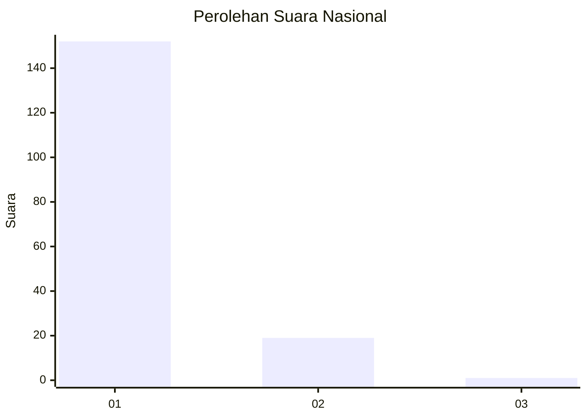
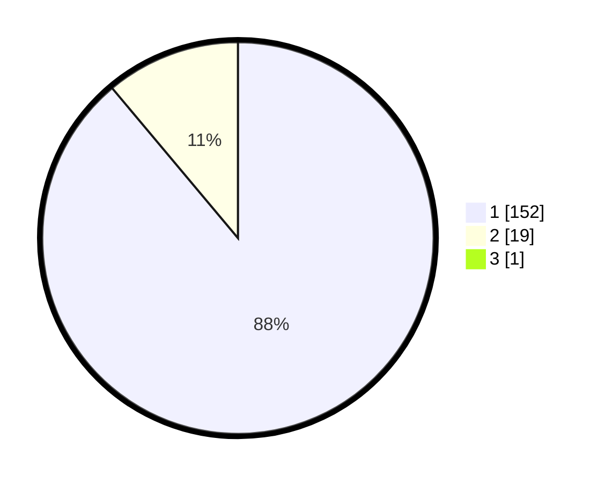

# Hasil

## Grafik

## Tabel

| No. | Nama Paslon    | Suara | Suara (raw) | Persentase |
|:--- |:-------------- | -----:| -----------:| ----------:|
| 1   | ANIES MUHAIMIN | 152   | [152][p-1]  | 88,37      |
| 2   | PRABOWO GIBRAN | 19    | [19][p-2]   | 11,05      |
| 3   | GANJAR MAHFUD  | 1     | [1][p-3]    | 0,58       |

[p-1]: https://github.com/gigit-pemilu/pemilu-2024/blob/main/pilpres/hitung-suara/sub/11-aceh/sub/06-aceh-besar/sub/14-lembah-seulawah/sub/2006-panca/sub/001-tps/sub/paslon-1.txt
[p-2]: https://github.com/gigit-pemilu/pemilu-2024/blob/main/pilpres/hitung-suara/sub/11-aceh/sub/06-aceh-besar/sub/14-lembah-seulawah/sub/2006-panca/sub/001-tps/sub/paslon-2.txt
[p-3]: https://github.com/gigit-pemilu/pemilu-2024/blob/main/pilpres/hitung-suara/sub/11-aceh/sub/06-aceh-besar/sub/14-lembah-seulawah/sub/2006-panca/sub/001-tps/sub/paslon-3.txt

## Foto C Plano

https://sirekap-obj-formc.kpu.go.id/517e/pemilu/ppwp/11/06/14/20/06/1106142006001-20240219-201619--fd104e28-c067-464e-a9f5-02bf2273c5ae.jpg

https://sirekap-obj-formc.kpu.go.id/517e/pemilu/ppwp/11/06/14/20/06/1106142006001-20240219-225413--7aacd12d-95de-47a1-8d76-ef45df39d0b6.jpg

https://sirekap-obj-formc.kpu.go.id/517e/pemilu/ppwp/11/06/14/20/06/1106142006001-20240219-225834--40a6e1e4-954b-421f-ba7e-f97dbc5fb8d7.jpg

## Metadata

| Key        | Value               |
| ---------- | ------------------- |
| Time Stamp | 2024-02-24 22:31:28 |

