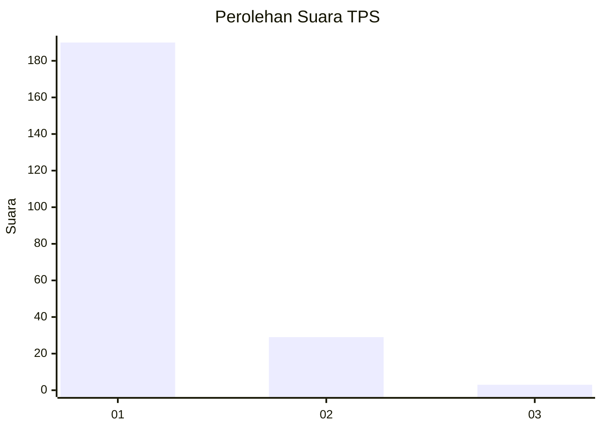
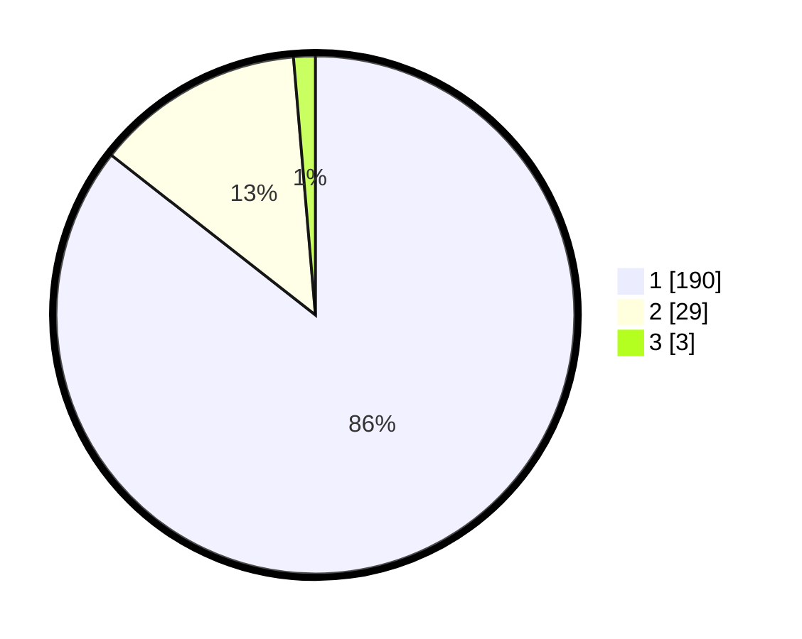

# Hasil

## Grafik

## Tabel

| No. | Nama Paslon    | Suara | Suara (raw) | Persentase |
|:--- |:-------------- | -----:| -----------:| ----------:|
| 1   | ANIES MUHAIMIN | 190   | [190][p-1]  | 85,59      |
| 2   | PRABOWO GIBRAN | 29    | [29][p-2]   | 13,06      |
| 3   | GANJAR MAHFUD  | 3     | [3][p-3]    | 1,35       |

[p-1]: https://github.com/gigit-pemilu/pemilu-2024-11-aceh/blob/main/pilpres/hitung-suara/sub/11-aceh/sub/06-aceh-besar/sub/14-lembah-seulawah/sub/2007-lam-kubu/sub/001-tps/sub/paslon-1.txt
[p-2]: https://github.com/gigit-pemilu/pemilu-2024-11-aceh/blob/main/pilpres/hitung-suara/sub/11-aceh/sub/06-aceh-besar/sub/14-lembah-seulawah/sub/2007-lam-kubu/sub/001-tps/sub/paslon-2.txt
[p-3]: https://github.com/gigit-pemilu/pemilu-2024-11-aceh/blob/main/pilpres/hitung-suara/sub/11-aceh/sub/06-aceh-besar/sub/14-lembah-seulawah/sub/2007-lam-kubu/sub/001-tps/sub/paslon-3.txt

## Foto C Plano

https://sirekap-obj-formc.kpu.go.id/dd1e/pemilu/ppwp/11/06/14/20/07/1106142007001-20240219-231247--73f2bf83-b656-4184-a2f2-578bd266c5ff.jpg

https://sirekap-obj-formc.kpu.go.id/dd1e/pemilu/ppwp/11/06/14/20/07/1106142007001-20240219-231929--31174774-c276-47eb-bbdb-f9fc7ff092f3.jpg

https://sirekap-obj-formc.kpu.go.id/dd1e/pemilu/ppwp/11/06/14/20/07/1106142007001-20240219-232130--99f3e036-5817-4dd3-ac3e-0efc176eb417.jpg

## Metadata

| Key        | Value               |
| ---------- | ------------------- |
| Time Stamp | 2024-02-27 12:00:00 |

