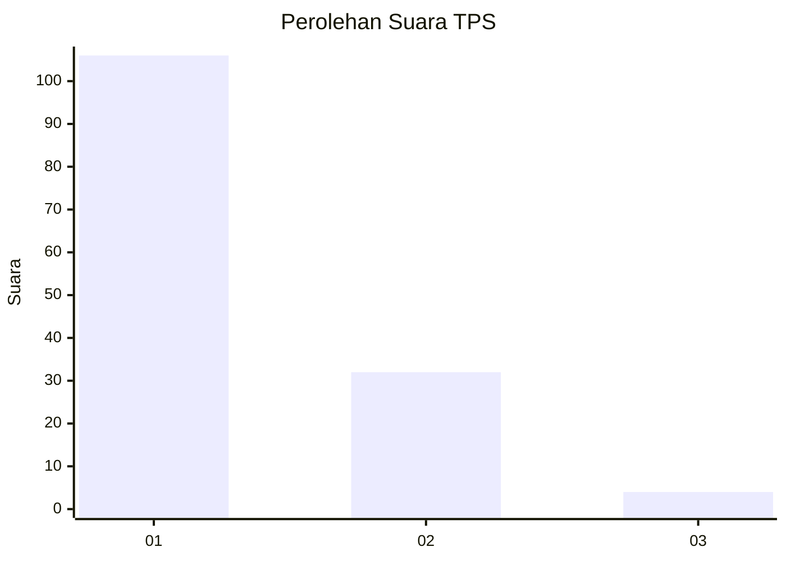
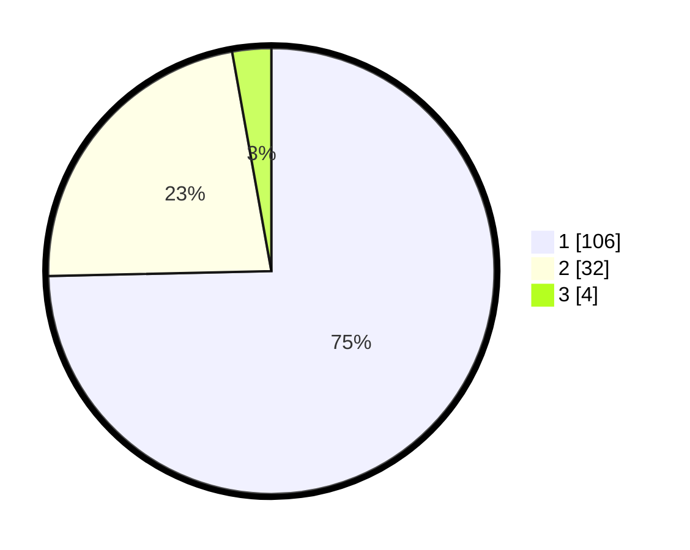

# Hasil

## Grafik

## Tabel

| No. | Nama Paslon    | Suara | Suara (raw) | Persentase |
|:--- |:-------------- | -----:| -----------:| ----------:|
| 1   | ANIES MUHAIMIN | 106   | [106][p-1]  | 74,65      |
| 2   | PRABOWO GIBRAN | 32    | [32][p-2]   | 22,54      |
| 3   | GANJAR MAHFUD  | 4     | [4][p-3]    | 2,82       |

[p-1]: https://github.com/gigit-pemilu/pemilu-2024-11-aceh/blob/main/pilpres/hitung-suara/sub/11-aceh/sub/06-aceh-besar/sub/14-lembah-seulawah/sub/2008-panca-kubu/sub/001-tps/sub/paslon-1.txt
[p-2]: https://github.com/gigit-pemilu/pemilu-2024-11-aceh/blob/main/pilpres/hitung-suara/sub/11-aceh/sub/06-aceh-besar/sub/14-lembah-seulawah/sub/2008-panca-kubu/sub/001-tps/sub/paslon-2.txt
[p-3]: https://github.com/gigit-pemilu/pemilu-2024-11-aceh/blob/main/pilpres/hitung-suara/sub/11-aceh/sub/06-aceh-besar/sub/14-lembah-seulawah/sub/2008-panca-kubu/sub/001-tps/sub/paslon-3.txt

## Foto C Plano

https://sirekap-obj-formc.kpu.go.id/bf22/pemilu/ppwp/11/06/14/20/08/1106142008001-20240219-233128--061dfda8-6554-4643-b260-b000a7482d2c.jpg

https://sirekap-obj-formc.kpu.go.id/bf22/pemilu/ppwp/11/06/14/20/08/1106142008001-20240219-233636--7ae0cd51-7afa-4891-816a-ea4f68ac4aad.jpg

https://sirekap-obj-formc.kpu.go.id/bf22/pemilu/ppwp/11/06/14/20/08/1106142008001-20240219-234110--5dc49656-85b4-4dfe-91f3-c01d3d18a235.jpg

## Metadata

| Key        | Value               |
| ---------- | ------------------- |
| Time Stamp | 2024-02-20 02:00:00 |

