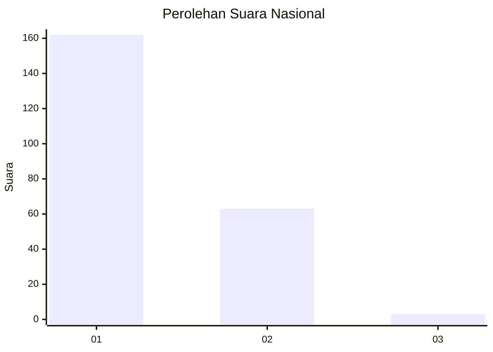
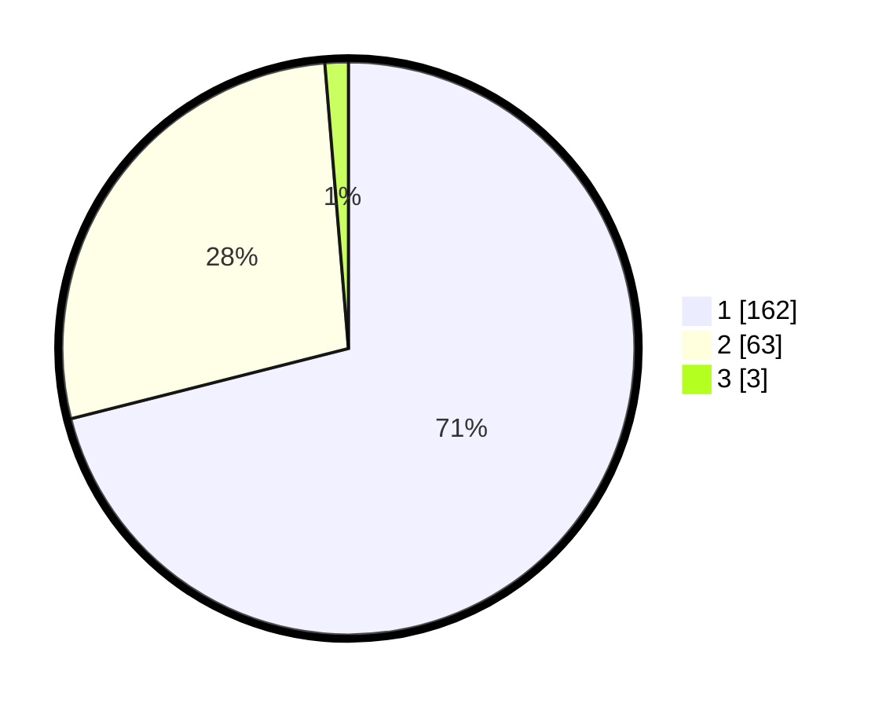

# Hasil

## Grafik

## Tabel

| No. | Nama Paslon    | Suara | Suara (raw) | Persentase |
|:--- |:-------------- | -----:| -----------:| ----------:|
| 1   | ANIES MUHAIMIN | 162   | [162][p-1]  | 71,05      |
| 2   | PRABOWO GIBRAN | 63    | [63][p-2]   | 27,63      |
| 3   | GANJAR MAHFUD  | 3     | [3][p-3]    | 1,32       |

[p-1]: https://github.com/gigit-pemilu/pemilu-2024/blob/main/pilpres/hitung-suara/sub/11-aceh/sub/06-aceh-besar/sub/14-lembah-seulawah/sub/2009-suka-damai/sub/001-tps/sub/paslon-1.txt
[p-2]: https://github.com/gigit-pemilu/pemilu-2024/blob/main/pilpres/hitung-suara/sub/11-aceh/sub/06-aceh-besar/sub/14-lembah-seulawah/sub/2009-suka-damai/sub/001-tps/sub/paslon-2.txt
[p-3]: https://github.com/gigit-pemilu/pemilu-2024/blob/main/pilpres/hitung-suara/sub/11-aceh/sub/06-aceh-besar/sub/14-lembah-seulawah/sub/2009-suka-damai/sub/001-tps/sub/paslon-3.txt

## Foto C Plano

https://sirekap-obj-formc.kpu.go.id/6447/pemilu/ppwp/11/06/14/20/09/1106142009001-20240219-235237--69b105db-8a26-4f95-b633-606748981910.jpg

https://sirekap-obj-formc.kpu.go.id/6447/pemilu/ppwp/11/06/14/20/09/1106142009001-20240219-235410--a8679e56-e289-4cdd-8710-5cd73fd42c8a.jpg

https://sirekap-obj-formc.kpu.go.id/6447/pemilu/ppwp/11/06/14/20/09/1106142009001-20240219-235645--c20d912b-61cc-4f65-9cf6-9c219be86710.jpg

## Metadata

| Key        | Value               |
| ---------- | ------------------- |
| Time Stamp | 2024-02-24 22:31:28 |

