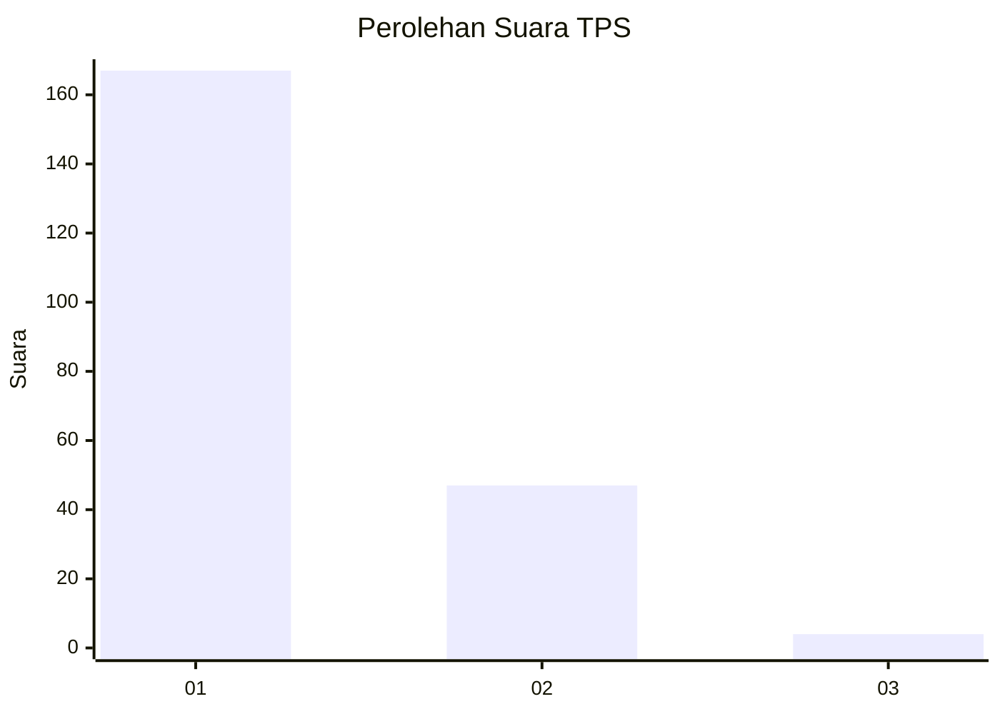
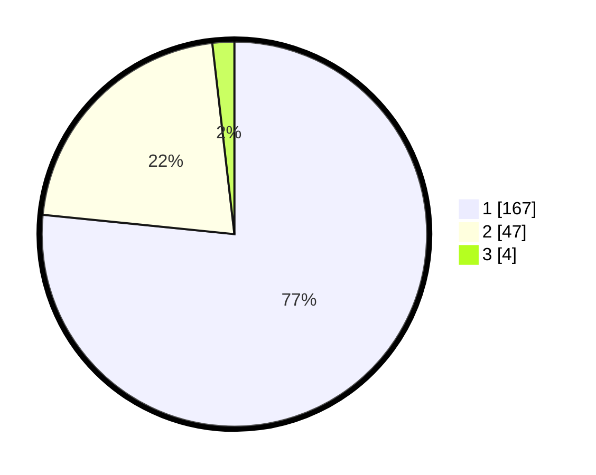

# Hasil

## Grafik

## Tabel

| No. | Nama Paslon    | Suara | Suara (raw) | Persentase |
|:--- |:-------------- | -----:| -----------:| ----------:|
| 1   | ANIES MUHAIMIN | 167   | [167][p-1]  | 76,61      |
| 2   | PRABOWO GIBRAN | 47    | [47][p-2]   | 21,56      |
| 3   | GANJAR MAHFUD  | 4     | [4][p-3]    | 1,83       |

[p-1]: https://github.com/gigit-pemilu/pemilu-2024-11-aceh/blob/main/pilpres/hitung-suara/sub/11-aceh/sub/06-aceh-besar/sub/14-lembah-seulawah/sub/2009-suka-damai/sub/005-tps/sub/paslon-1.txt
[p-2]: https://github.com/gigit-pemilu/pemilu-2024-11-aceh/blob/main/pilpres/hitung-suara/sub/11-aceh/sub/06-aceh-besar/sub/14-lembah-seulawah/sub/2009-suka-damai/sub/005-tps/sub/paslon-2.txt
[p-3]: https://github.com/gigit-pemilu/pemilu-2024-11-aceh/blob/main/pilpres/hitung-suara/sub/11-aceh/sub/06-aceh-besar/sub/14-lembah-seulawah/sub/2009-suka-damai/sub/005-tps/sub/paslon-3.txt

## Foto C Plano

https://sirekap-obj-formc.kpu.go.id/fd18/pemilu/ppwp/11/06/14/20/09/1106142009005-20240220-001812--4855ca5c-72c6-401d-af22-ba6b31406270.jpg

https://sirekap-obj-formc.kpu.go.id/fd18/pemilu/ppwp/11/06/14/20/09/1106142009005-20240220-002257--fb2a6172-1d35-415d-b6ac-6af857542ab1.jpg

https://sirekap-obj-formc.kpu.go.id/fd18/pemilu/ppwp/11/06/14/20/09/1106142009005-20240220-002705--d41b386d-62f3-4567-8663-e844969e911d.jpg

## Metadata

| Key        | Value               |
| ---------- | ------------------- |
| Time Stamp | 2024-02-20 02:00:00 |

