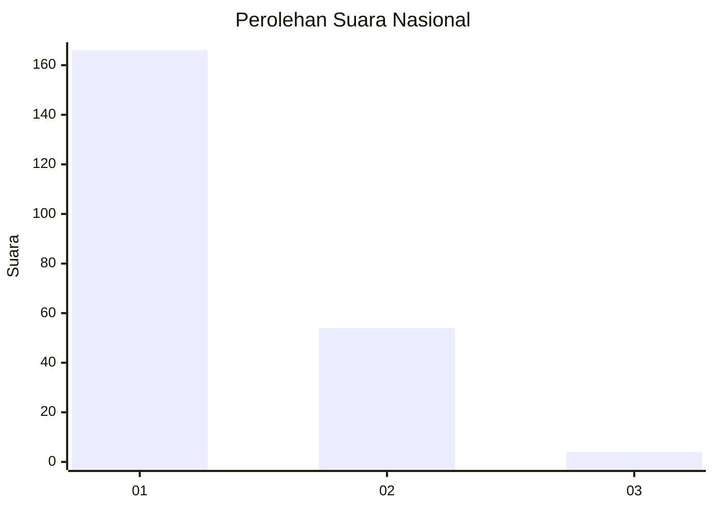
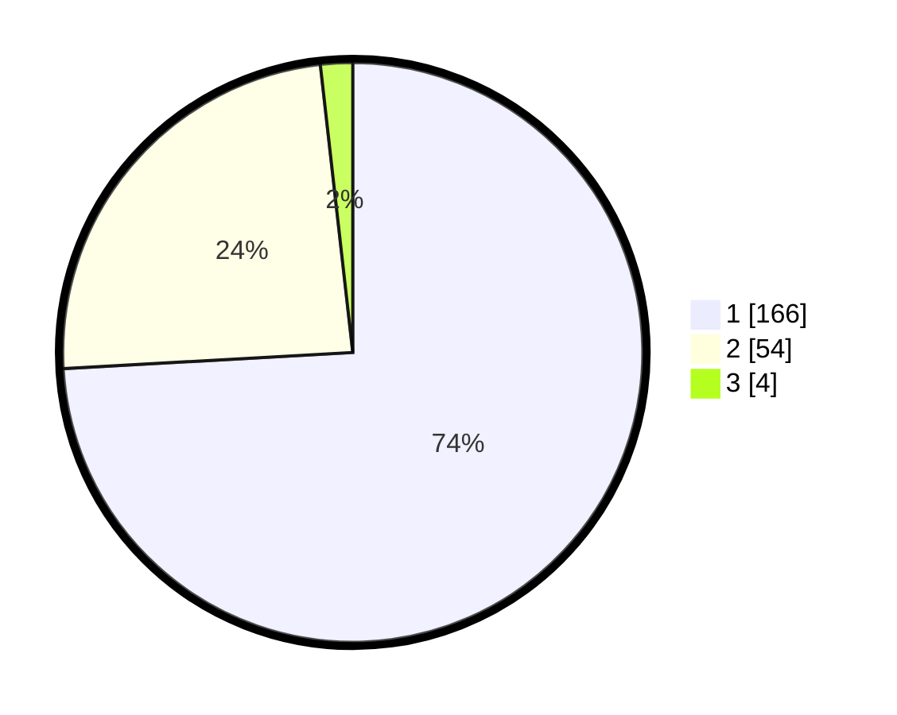

# Hasil

## Grafik

## Tabel

| No. | Nama Paslon    | Suara | Suara (raw) | Persentase |
|:--- |:-------------- | -----:| -----------:| ----------:|
| 1   | ANIES MUHAIMIN | 166   | [166][p-1]  | 74,11      |
| 2   | PRABOWO GIBRAN | 54    | [54][p-2]   | 24,11      |
| 3   | GANJAR MAHFUD  | 4     | [4][p-3]    | 1,79       |

[p-1]: https://github.com/gigit-pemilu/pemilu-2024/blob/main/pilpres/hitung-suara/sub/11-aceh/sub/06-aceh-besar/sub/14-lembah-seulawah/sub/2009-suka-damai/sub/006-tps/sub/paslon-1.txt
[p-2]: https://github.com/gigit-pemilu/pemilu-2024/blob/main/pilpres/hitung-suara/sub/11-aceh/sub/06-aceh-besar/sub/14-lembah-seulawah/sub/2009-suka-damai/sub/006-tps/sub/paslon-2.txt
[p-3]: https://github.com/gigit-pemilu/pemilu-2024/blob/main/pilpres/hitung-suara/sub/11-aceh/sub/06-aceh-besar/sub/14-lembah-seulawah/sub/2009-suka-damai/sub/006-tps/sub/paslon-3.txt

## Foto C Plano

https://sirekap-obj-formc.kpu.go.id/2779/pemilu/ppwp/11/06/14/20/09/1106142009006-20240220-003110--a086d60d-ee6b-4eea-b8ad-d1254e444519.jpg

https://sirekap-obj-formc.kpu.go.id/2779/pemilu/ppwp/11/06/14/20/09/1106142009006-20240220-003251--a3f56f01-7e00-48a5-b8c0-aa9d3f67e3db.jpg

https://sirekap-obj-formc.kpu.go.id/2779/pemilu/ppwp/11/06/14/20/09/1106142009006-20240220-003425--298cbb2f-2911-4318-8726-6e8a72664719.jpg

## Metadata

| Key        | Value               |
| ---------- | ------------------- |
| Time Stamp | 2024-02-24 22:31:28 |

