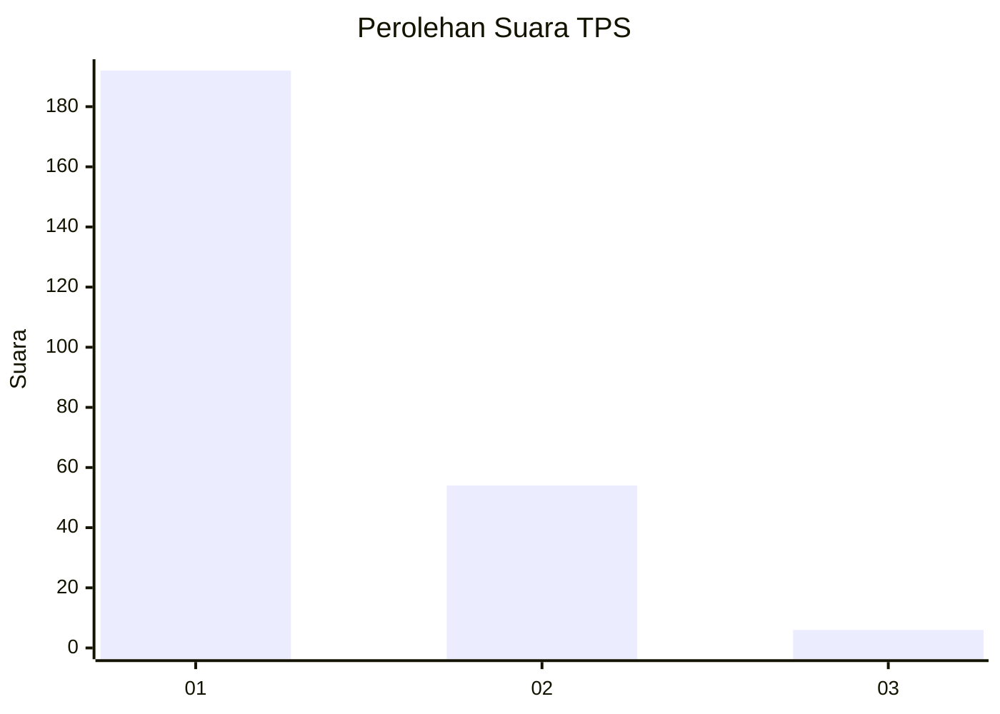
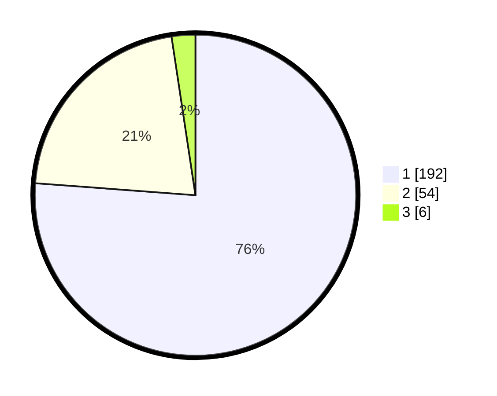

# Hasil

## Grafik

## Tabel

| No. | Nama Paslon    | Suara | Suara (raw) | Persentase |
|:--- |:-------------- | -----:| -----------:| ----------:|
| 1   | ANIES MUHAIMIN | 192   | [192][p-1]  | 76,19      |
| 2   | PRABOWO GIBRAN | 54    | [54][p-2]   | 21,43      |
| 3   | GANJAR MAHFUD  | 6     | [6][p-3]    | 2,38       |

[p-1]: https://github.com/gigit-pemilu/pemilu-2024-11-aceh/blob/main/pilpres/hitung-suara/sub/11-aceh/sub/06-aceh-besar/sub/14-lembah-seulawah/sub/2010-suka-mulya/sub/002-tps/sub/paslon-1.txt
[p-2]: https://github.com/gigit-pemilu/pemilu-2024-11-aceh/blob/main/pilpres/hitung-suara/sub/11-aceh/sub/06-aceh-besar/sub/14-lembah-seulawah/sub/2010-suka-mulya/sub/002-tps/sub/paslon-2.txt
[p-3]: https://github.com/gigit-pemilu/pemilu-2024-11-aceh/blob/main/pilpres/hitung-suara/sub/11-aceh/sub/06-aceh-besar/sub/14-lembah-seulawah/sub/2010-suka-mulya/sub/002-tps/sub/paslon-3.txt

## Foto C Plano

https://sirekap-obj-formc.kpu.go.id/f084/pemilu/ppwp/11/06/14/20/10/1106142010002-20240214-202652--f86ac2dd-299c-42f8-8608-471e8929e71f.jpg

https://sirekap-obj-formc.kpu.go.id/f084/pemilu/ppwp/11/06/14/20/10/1106142010002-20240214-202847--98e209e8-7663-46cf-b66e-b145b9c16d9a.jpg

https://sirekap-obj-formc.kpu.go.id/f084/pemilu/ppwp/11/06/14/20/10/1106142010002-20240214-202935--1e160c1b-7ccf-4745-95fd-eb28ef357fc2.jpg

## Metadata

| Key        | Value               |
| ---------- | ------------------- |
| Time Stamp | 2024-02-15 01:47:43 |

## DATA PEMILIH TETAP

Jumlah pemilih dalam DPT: **296**.
 * L: **138**.
 * P: **158**.

## DATA PENGGUNA HAK PILIH

Jumlah pengguna hak pilih dalam DPT: **243**.
 * L: **103**.
 * P: **140**.

Jumlah pengguna hak pilih dalam DPTb: **0**.
 * L: **0**.
 * P: **0**.

Jumlah pengguna hak pilih dalam DPK: **9**.
 * L: **8**.
 * P: **1**.

Jumlah pengguna hak pilih: **252**.
 * L: **111**.
 * P: **141**.

## JUMLAH SUARA SAH DAN TIDAK SAH

JUMLAH SELURUH SUARA SAH: **252**.

JUMLAH SUARA TIDAK SAH: **0**.

JUMLAH SELURUH SUARA SAH DAN SUARA TIDAK SAH: **252**.

