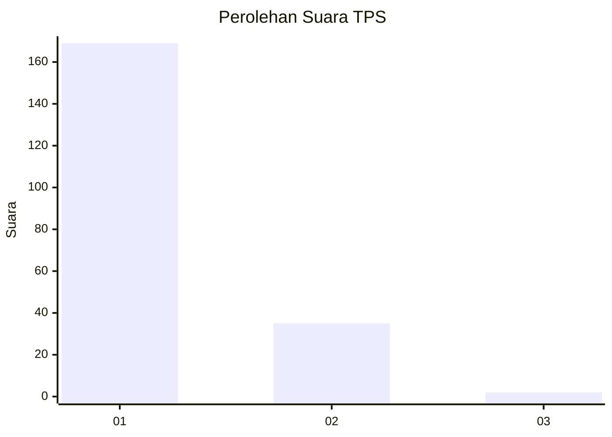
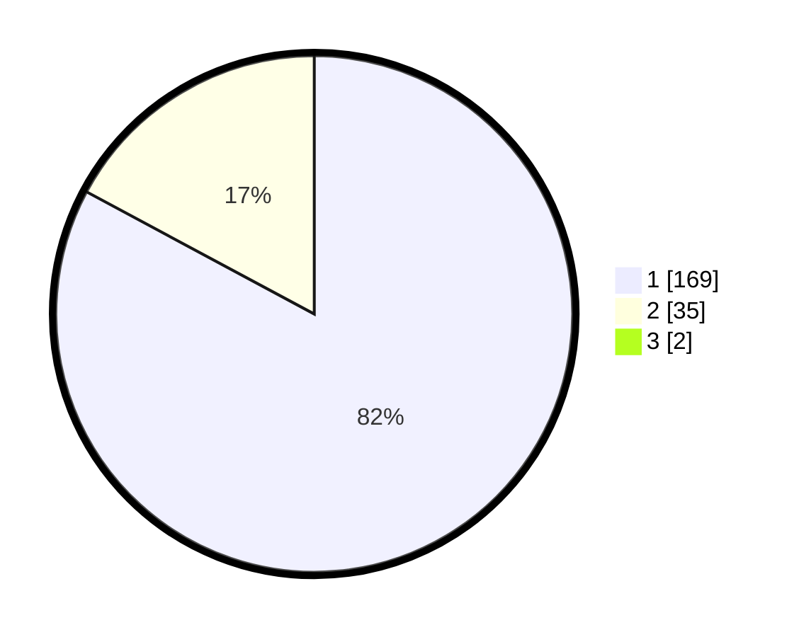

# Hasil

## Grafik

## Tabel

| No. | Nama Paslon    | Suara | Suara (raw) | Persentase |
|:--- |:-------------- | -----:| -----------:| ----------:|
| 1   | ANIES MUHAIMIN | 169   | [169][p-1]  | 82,04      |
| 2   | PRABOWO GIBRAN | 35    | [35][p-2]   | 16,99      |
| 3   | GANJAR MAHFUD  | 2     | [2][p-3]    | 0,97       |

[p-1]: https://github.com/gigit-pemilu/pemilu-2024-11-aceh/blob/main/pilpres/hitung-suara/sub/11-aceh/sub/06-aceh-besar/sub/14-lembah-seulawah/sub/2011-saree-aceh/sub/003-tps/sub/paslon-1.txt
[p-2]: https://github.com/gigit-pemilu/pemilu-2024-11-aceh/blob/main/pilpres/hitung-suara/sub/11-aceh/sub/06-aceh-besar/sub/14-lembah-seulawah/sub/2011-saree-aceh/sub/003-tps/sub/paslon-2.txt
[p-3]: https://github.com/gigit-pemilu/pemilu-2024-11-aceh/blob/main/pilpres/hitung-suara/sub/11-aceh/sub/06-aceh-besar/sub/14-lembah-seulawah/sub/2011-saree-aceh/sub/003-tps/sub/paslon-3.txt

## Foto C Plano

https://sirekap-obj-formc.kpu.go.id/551a/pemilu/ppwp/11/06/14/20/11/1106142011003-20240215-031909--a79407c7-dfd5-4d81-b80c-b5a579c09547.jpg

https://sirekap-obj-formc.kpu.go.id/551a/pemilu/ppwp/11/06/14/20/11/1106142011003-20240214-225852--83e8bf46-10d2-4b36-b2d5-14478efb77a3.jpg

https://sirekap-obj-formc.kpu.go.id/551a/pemilu/ppwp/11/06/14/20/11/1106142011003-20240215-032052--5a0489ff-0d6f-4b9b-801e-55baaaadf51c.jpg

## Metadata

| Key        | Value               |
| ---------- | ------------------- |
| Time Stamp | 2024-02-15 15:00:29 |

