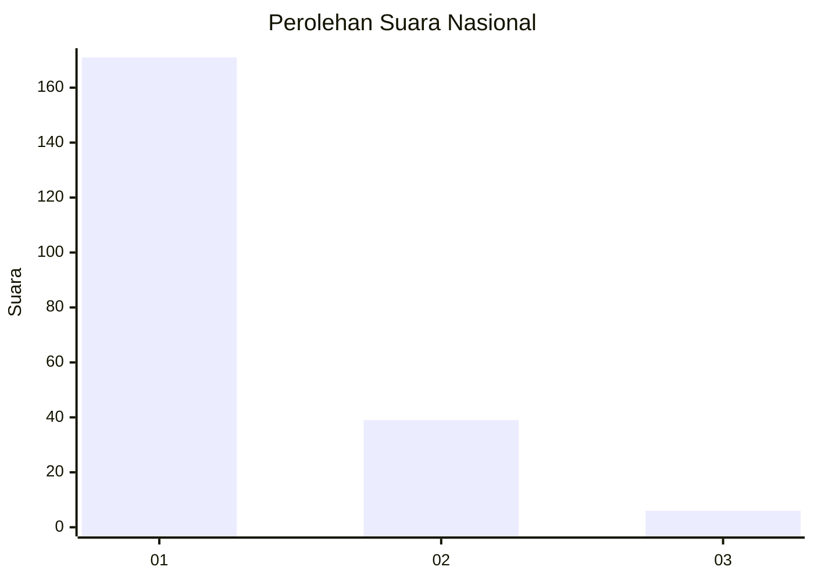
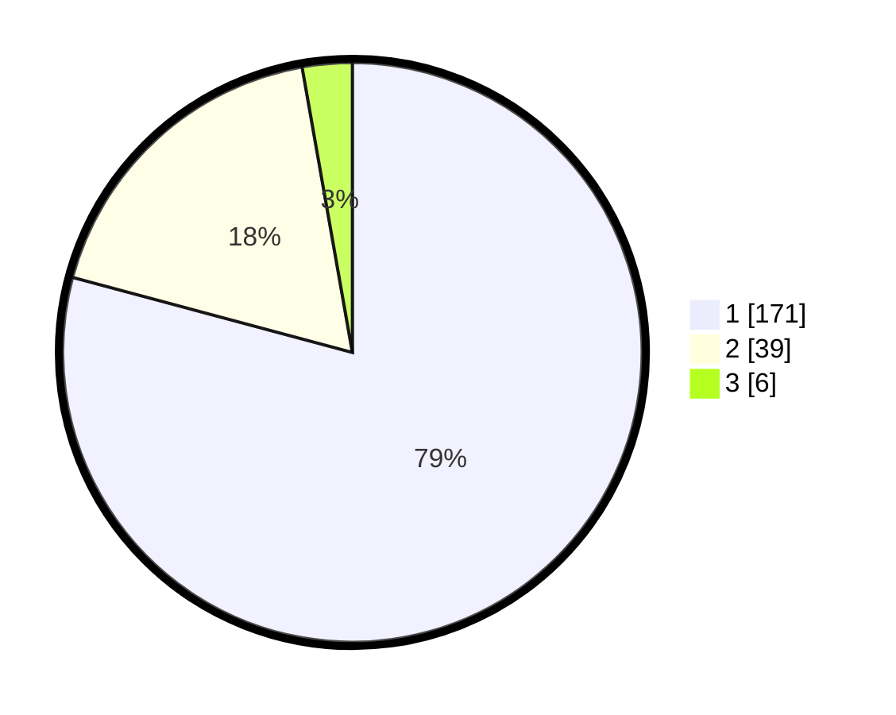

# Hasil

## Grafik

## Tabel

| No. | Nama Paslon    | Suara | Suara (raw) | Persentase |
|:--- |:-------------- | -----:| -----------:| ----------:|
| 1   | ANIES MUHAIMIN | 171   | [171][p-1]  | 79,17      |
| 2   | PRABOWO GIBRAN | 39    | [39][p-2]   | 18,06      |
| 3   | GANJAR MAHFUD  | 6     | [6][p-3]    | 2,78       |

[p-1]: https://github.com/gigit-pemilu/pemilu-2024/blob/main/pilpres/hitung-suara/sub/11-aceh/sub/06-aceh-besar/sub/14-lembah-seulawah/sub/2011-saree-aceh/sub/004-tps/sub/paslon-1.txt
[p-2]: https://github.com/gigit-pemilu/pemilu-2024/blob/main/pilpres/hitung-suara/sub/11-aceh/sub/06-aceh-besar/sub/14-lembah-seulawah/sub/2011-saree-aceh/sub/004-tps/sub/paslon-2.txt
[p-3]: https://github.com/gigit-pemilu/pemilu-2024/blob/main/pilpres/hitung-suara/sub/11-aceh/sub/06-aceh-besar/sub/14-lembah-seulawah/sub/2011-saree-aceh/sub/004-tps/sub/paslon-3.txt

## Foto C Plano

https://sirekap-obj-formc.kpu.go.id/770f/pemilu/ppwp/11/06/14/20/11/1106142011004-20240214-202521--68aead08-4567-47d3-8a75-155e689317d3.jpg

https://sirekap-obj-formc.kpu.go.id/770f/pemilu/ppwp/11/06/14/20/11/1106142011004-20240214-202616--401616bc-b60c-4569-9f92-4ad0f8bd0435.jpg

https://sirekap-obj-formc.kpu.go.id/770f/pemilu/ppwp/11/06/14/20/11/1106142011004-20240215-014900--9d065d50-d07b-4216-bd7c-4075ac65bb1f.jpg

## Metadata

| Key        | Value               |
| ---------- | ------------------- |
| Time Stamp | 2024-02-15 12:00:28 |

