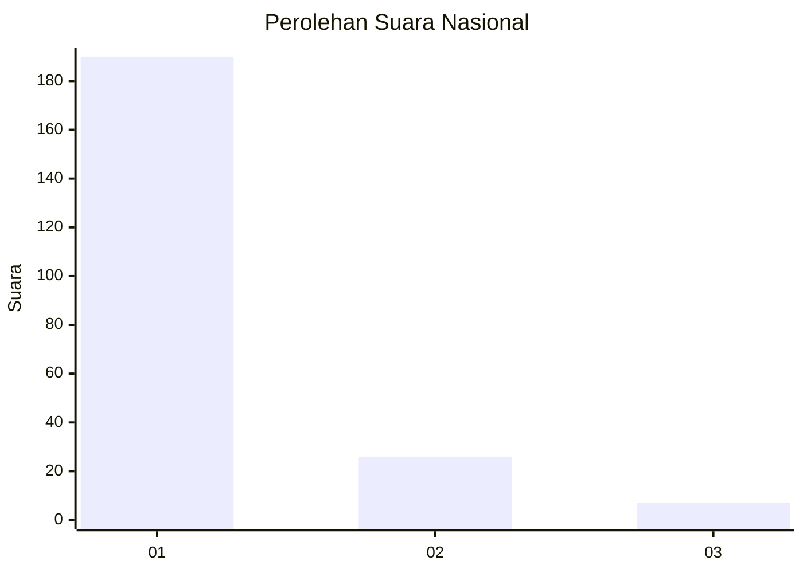
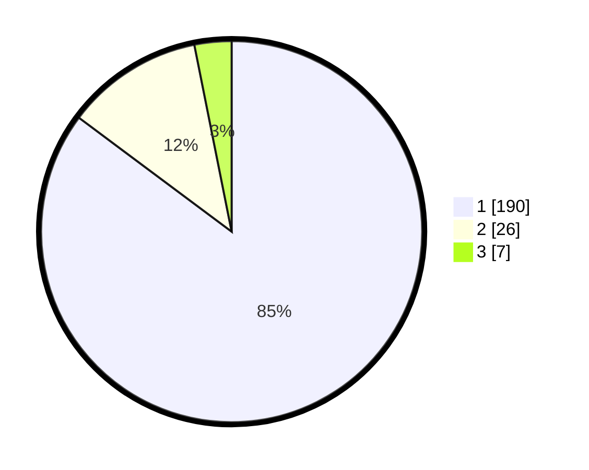

# Hasil

## Grafik

## Tabel

| No. | Nama Paslon    | Suara | Suara (raw) | Persentase |
|:--- |:-------------- | -----:| -----------:| ----------:|
| 1   | ANIES MUHAIMIN | 190   | [190][p-1]  | 85,20      |
| 2   | PRABOWO GIBRAN | 26    | [26][p-2]   | 11,66      |
| 3   | GANJAR MAHFUD  | 7     | [7][p-3]    | 3,14       |

[p-1]: https://github.com/gigit-pemilu/pemilu-2024/blob/main/pilpres/hitung-suara/sub/11-aceh/sub/06-aceh-besar/sub/15-kota-jantho/sub/2001-teureubeh/sub/001-tps/sub/paslon-1.txt
[p-2]: https://github.com/gigit-pemilu/pemilu-2024/blob/main/pilpres/hitung-suara/sub/11-aceh/sub/06-aceh-besar/sub/15-kota-jantho/sub/2001-teureubeh/sub/001-tps/sub/paslon-2.txt
[p-3]: https://github.com/gigit-pemilu/pemilu-2024/blob/main/pilpres/hitung-suara/sub/11-aceh/sub/06-aceh-besar/sub/15-kota-jantho/sub/2001-teureubeh/sub/001-tps/sub/paslon-3.txt

## Foto C Plano

https://sirekap-obj-formc.kpu.go.id/49e7/pemilu/ppwp/11/06/15/20/01/1106152001001-20240215-055337--4deb4099-6932-4f9f-a44b-abe2d4174983.jpg

https://sirekap-obj-formc.kpu.go.id/49e7/pemilu/ppwp/11/06/15/20/01/1106152001001-20240215-055539--a5f689fd-5a8c-4293-8a23-5d6b3cea1ee8.jpg

https://sirekap-obj-formc.kpu.go.id/49e7/pemilu/ppwp/11/06/15/20/01/1106152001001-20240215-055741--0c5f9106-df88-4436-80e7-914db40f1280.jpg

## Metadata

| Key        | Value               |
| ---------- | ------------------- |
| Time Stamp | 2024-02-16 00:00:26 |

