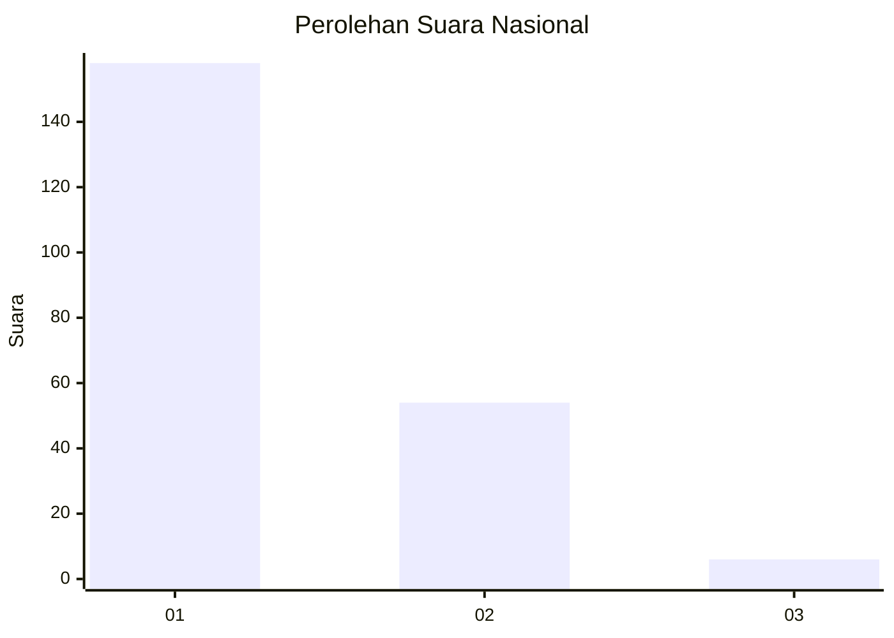
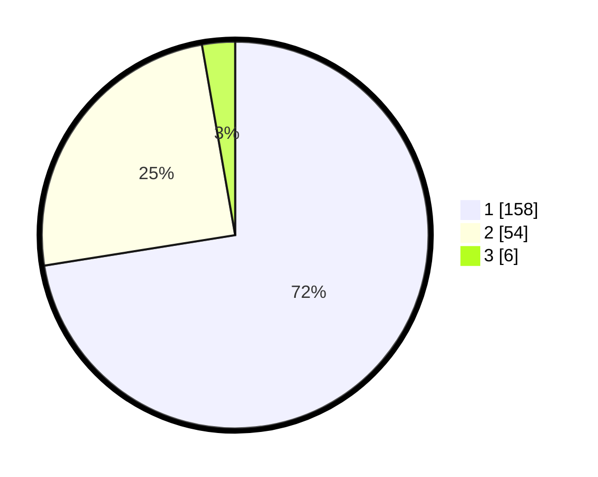

# Hasil

## Grafik

## Tabel

| No. | Nama Paslon    | Suara | Suara (raw) | Persentase |
|:--- |:-------------- | -----:| -----------:| ----------:|
| 1   | ANIES MUHAIMIN | 158   | [158][p-1]  | 72,48      |
| 2   | PRABOWO GIBRAN | 54    | [54][p-2]   | 24,77      |
| 3   | GANJAR MAHFUD  | 6     | [6][p-3]    | 2,75       |

[p-1]: https://github.com/gigit-pemilu/pemilu-2024/blob/main/pilpres/hitung-suara/sub/11-aceh/sub/06-aceh-besar/sub/15-kota-jantho/sub/2001-teureubeh/sub/002-tps/sub/paslon-1.txt
[p-2]: https://github.com/gigit-pemilu/pemilu-2024/blob/main/pilpres/hitung-suara/sub/11-aceh/sub/06-aceh-besar/sub/15-kota-jantho/sub/2001-teureubeh/sub/002-tps/sub/paslon-2.txt
[p-3]: https://github.com/gigit-pemilu/pemilu-2024/blob/main/pilpres/hitung-suara/sub/11-aceh/sub/06-aceh-besar/sub/15-kota-jantho/sub/2001-teureubeh/sub/002-tps/sub/paslon-3.txt

## Foto C Plano

https://sirekap-obj-formc.kpu.go.id/358f/pemilu/ppwp/11/06/15/20/01/1106152001002-20240214-204218--06eca292-5f9e-4d18-9f99-7eb31c203403.jpg

https://sirekap-obj-formc.kpu.go.id/358f/pemilu/ppwp/11/06/15/20/01/1106152001002-20240214-201625--c88c4b04-0ae6-466b-bf76-7d8e9e4e3d24.jpg

https://sirekap-obj-formc.kpu.go.id/358f/pemilu/ppwp/11/06/15/20/01/1106152001002-20240214-202535--f0e56bd3-137b-4108-a3f6-867930b3f505.jpg

## Metadata

| Key        | Value               |
| ---------- | ------------------- |
| Time Stamp | 2024-02-15 15:00:29 |

## DATA PEMILIH TETAP

Jumlah pemilih dalam DPT: **263**.
 * L: **140**.
 * P: **123**.

## DATA PENGGUNA HAK PILIH

Jumlah pengguna hak pilih dalam DPT: **220**.
 * L: **115**.
 * P: **105**.

Jumlah pengguna hak pilih dalam DPTb: **4**.
 * L: **2**.
 * P: **2**.

Jumlah pengguna hak pilih dalam DPK: **3**.
 * L: **2**.
 * P: **1**.

Jumlah pengguna hak pilih: **227**.
 * L: **119**.
 * P: **108**.

## JUMLAH SUARA SAH DAN TIDAK SAH

JUMLAH SELURUH SUARA SAH: **222**.

JUMLAH SUARA TIDAK SAH: **5**.

JUMLAH SELURUH SUARA SAH DAN SUARA TIDAK SAH: **227**.

