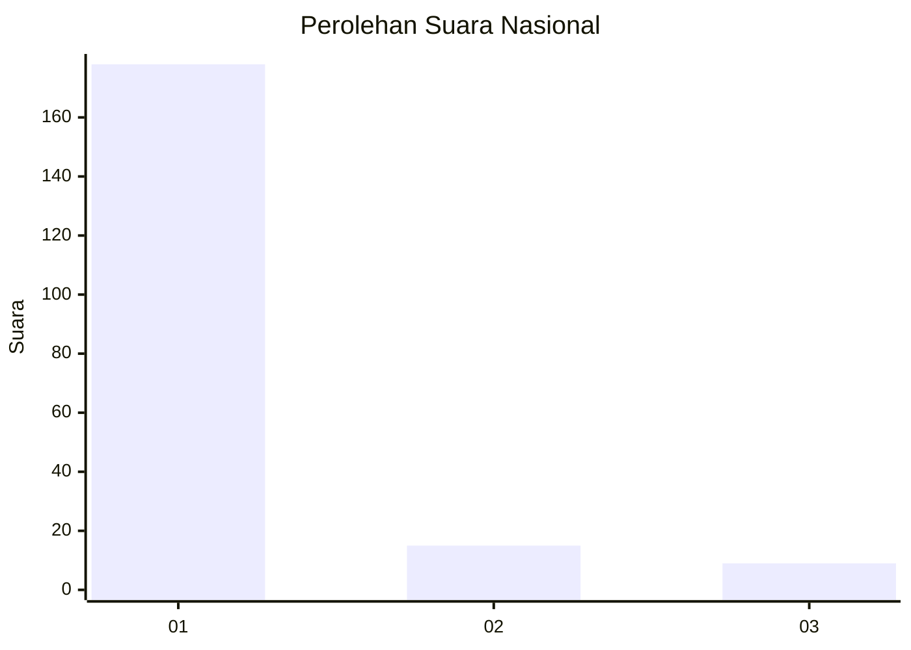
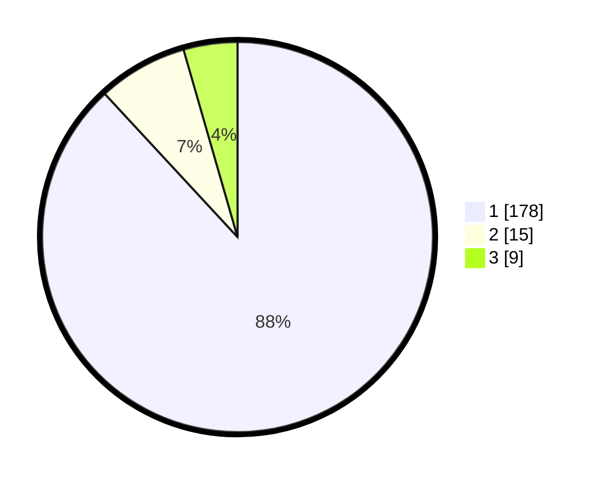

# Hasil

## Grafik

## Tabel

| No. | Nama Paslon    | Suara | Suara (raw) | Persentase |
|:--- |:-------------- | -----:| -----------:| ----------:|
| 1   | ANIES MUHAIMIN | 178   | [178][p-1]  | 88,12      |
| 2   | PRABOWO GIBRAN | 15    | [15][p-2]   | 7,43       |
| 3   | GANJAR MAHFUD  | 9     | [9][p-3]    | 4,46       |

[p-1]: https://github.com/gigit-pemilu/pemilu-2024/blob/main/pilpres/hitung-suara/sub/11-aceh/sub/06-aceh-besar/sub/15-kota-jantho/sub/2001-teureubeh/sub/003-tps/sub/paslon-1.txt
[p-2]: https://github.com/gigit-pemilu/pemilu-2024/blob/main/pilpres/hitung-suara/sub/11-aceh/sub/06-aceh-besar/sub/15-kota-jantho/sub/2001-teureubeh/sub/003-tps/sub/paslon-2.txt
[p-3]: https://github.com/gigit-pemilu/pemilu-2024/blob/main/pilpres/hitung-suara/sub/11-aceh/sub/06-aceh-besar/sub/15-kota-jantho/sub/2001-teureubeh/sub/003-tps/sub/paslon-3.txt

## Foto C Plano

https://sirekap-obj-formc.kpu.go.id/ed78/pemilu/ppwp/11/06/15/20/01/1106152001003-20240215-011437--6d3baf26-70a4-4c96-bc39-9dd0b2b731b7.jpg

https://sirekap-obj-formc.kpu.go.id/ed78/pemilu/ppwp/11/06/15/20/01/1106152001003-20240215-011830--72efb5ca-02f1-420e-a09f-f305be98434d.jpg

https://sirekap-obj-formc.kpu.go.id/ed78/pemilu/ppwp/11/06/15/20/01/1106152001003-20240215-012014--61204b48-a338-4bc1-aeb2-838bc23b5ee3.jpg

## Metadata

| Key        | Value               |
| ---------- | ------------------- |
| Time Stamp | 2024-02-15 18:30:25 |

## DATA PEMILIH TETAP

Jumlah pemilih dalam DPT: **262**.
 * L: **137**.
 * P: **125**.

## DATA PENGGUNA HAK PILIH

Jumlah pengguna hak pilih dalam DPT: **200**.
 * L: **102**.
 * P: **98**.

Jumlah pengguna hak pilih dalam DPTb: **2**.
 * L: **1**.
 * P: **1**.

Jumlah pengguna hak pilih dalam DPK: **2**.
 * L: **1**.
 * P: **1**.

Jumlah pengguna hak pilih: **204**.
 * L: **104**.
 * P: **100**.

## JUMLAH SUARA SAH DAN TIDAK SAH

JUMLAH SELURUH SUARA SAH: **202**.

JUMLAH SUARA TIDAK SAH: **2**.

JUMLAH SELURUH SUARA SAH DAN SUARA TIDAK SAH: **204**.

