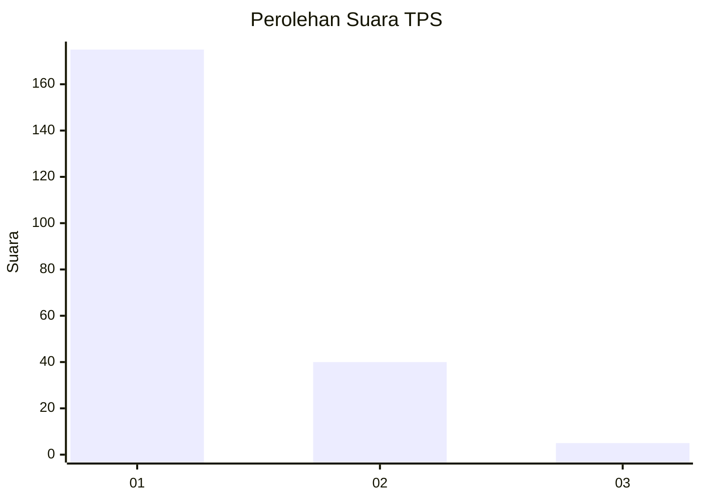
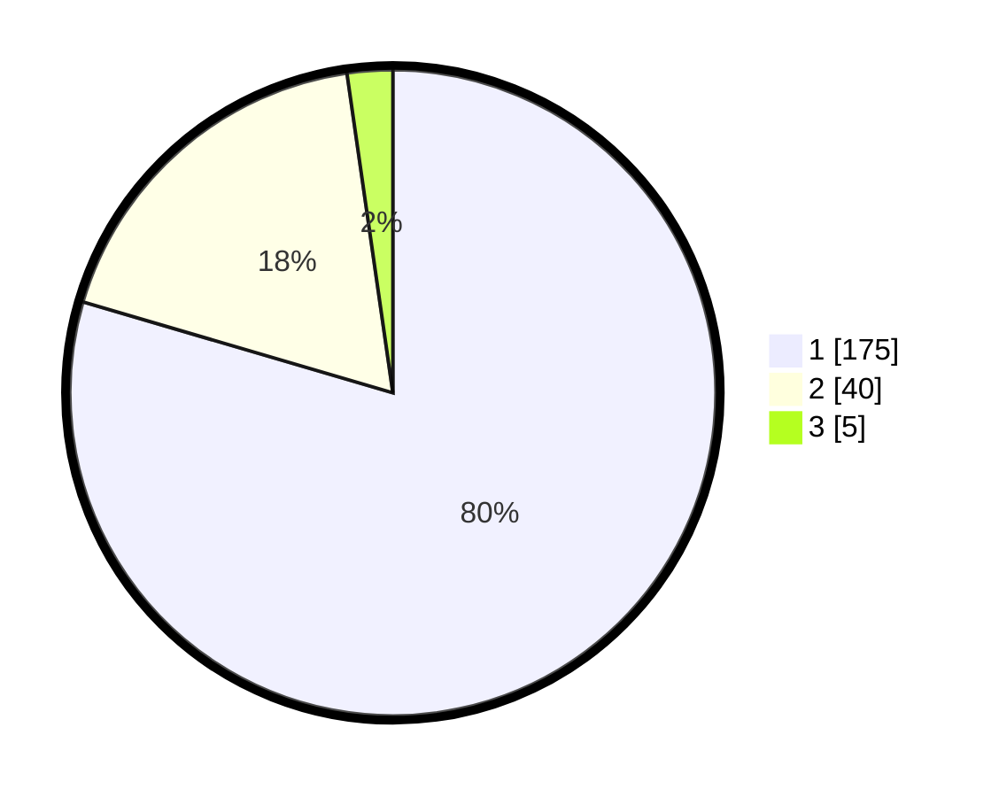

# Hasil

## Grafik

## Tabel

| No. | Nama Paslon    | Suara | Suara (raw) | Persentase |
|:--- |:-------------- | -----:| -----------:| ----------:|
| 1   | ANIES MUHAIMIN | 175   | [175][p-1]  | 79,55      |
| 2   | PRABOWO GIBRAN | 40    | [40][p-2]   | 18,18      |
| 3   | GANJAR MAHFUD  | 5     | [5][p-3]    | 2,27       |

[p-1]: https://github.com/gigit-pemilu/pemilu-2024-11-aceh/blob/main/pilpres/hitung-suara/sub/11-aceh/sub/06-aceh-besar/sub/15-kota-jantho/sub/2001-teureubeh/sub/004-tps/sub/paslon-1.txt
[p-2]: https://github.com/gigit-pemilu/pemilu-2024-11-aceh/blob/main/pilpres/hitung-suara/sub/11-aceh/sub/06-aceh-besar/sub/15-kota-jantho/sub/2001-teureubeh/sub/004-tps/sub/paslon-2.txt
[p-3]: https://github.com/gigit-pemilu/pemilu-2024-11-aceh/blob/main/pilpres/hitung-suara/sub/11-aceh/sub/06-aceh-besar/sub/15-kota-jantho/sub/2001-teureubeh/sub/004-tps/sub/paslon-3.txt

## Foto C Plano

https://sirekap-obj-formc.kpu.go.id/195d/pemilu/ppwp/11/06/15/20/01/1106152001004-20240215-090843--afafbf69-b7ef-4df2-b19c-30740a9fa6de.jpg

https://sirekap-obj-formc.kpu.go.id/195d/pemilu/ppwp/11/06/15/20/01/1106152001004-20240215-091035--a79c3b75-4d25-40e8-bc8a-9c66de1e4b24.jpg

https://sirekap-obj-formc.kpu.go.id/195d/pemilu/ppwp/11/06/15/20/01/1106152001004-20240215-085959--25d63ed0-01cf-402f-81a0-0e96b9b589f0.jpg

## Metadata

| Key        | Value               |
| ---------- | ------------------- |
| Time Stamp | 2024-02-16 00:00:26 |

