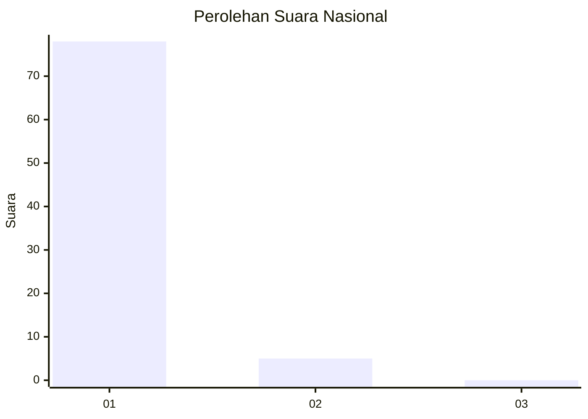
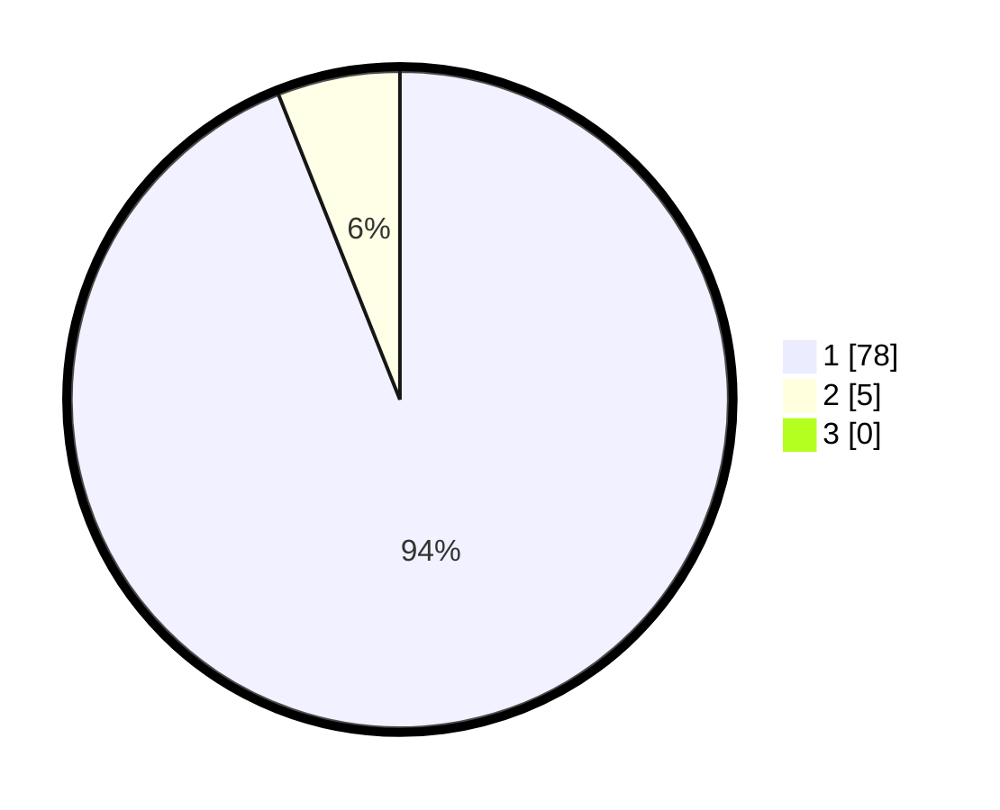

# Hasil

## Grafik

## Tabel

| No. | Nama Paslon    | Suara | Suara (raw) | Persentase |
|:--- |:-------------- | -----:| -----------:| ----------:|
| 1   | ANIES MUHAIMIN | 78    | [78][p-1]   | 93,98      |
| 2   | PRABOWO GIBRAN | 5     | [5][p-2]    | 6,02       |
| 3   | GANJAR MAHFUD  | 0     | [0][p-3]    | 0,00       |

[p-1]: https://github.com/gigit-pemilu/pemilu-2024/blob/main/pilpres/hitung-suara/sub/11-aceh/sub/06-aceh-besar/sub/15-kota-jantho/sub/2005-data-cut/sub/001-tps/sub/paslon-1.txt
[p-2]: https://github.com/gigit-pemilu/pemilu-2024/blob/main/pilpres/hitung-suara/sub/11-aceh/sub/06-aceh-besar/sub/15-kota-jantho/sub/2005-data-cut/sub/001-tps/sub/paslon-2.txt
[p-3]: https://github.com/gigit-pemilu/pemilu-2024/blob/main/pilpres/hitung-suara/sub/11-aceh/sub/06-aceh-besar/sub/15-kota-jantho/sub/2005-data-cut/sub/001-tps/sub/paslon-3.txt

## Foto C Plano

https://sirekap-obj-formc.kpu.go.id/3e6e/pemilu/ppwp/11/06/15/20/05/1106152005001-20240221-013818--0365a9f0-5c01-4562-b170-822fb7e247ab.jpg

https://sirekap-obj-formc.kpu.go.id/3e6e/pemilu/ppwp/11/06/15/20/05/1106152005001-20240221-014005--1d4e65be-c9b3-4188-8ca6-ff8415ebc11a.jpg

https://sirekap-obj-formc.kpu.go.id/3e6e/pemilu/ppwp/11/06/15/20/05/1106152005001-20240221-014213--2115d123-88a7-4f40-85b4-99b688f82a57.jpg

## Metadata

| Key        | Value               |
| ---------- | ------------------- |
| Time Stamp | 2024-02-21 04:00:00 |

## DATA PEMILIH TETAP

Jumlah pemilih dalam DPT: **92**.
 * L: **46**.
 * P: **46**.

## DATA PENGGUNA HAK PILIH

Jumlah pengguna hak pilih dalam DPT: **85**.
 * L: **41**.
 * P: **44**.

Jumlah pengguna hak pilih dalam DPTb: **2**.
 * L: **0**.
 * P: **2**.

Jumlah pengguna hak pilih dalam DPK: **0**.
 * L: **0**.
 * P: **0**.

Jumlah pengguna hak pilih: **87**.
 * L: **41**.
 * P: **46**.

## JUMLAH SUARA SAH DAN TIDAK SAH

JUMLAH SELURUH SUARA SAH: **83**.

JUMLAH SUARA TIDAK SAH: **4**.

JUMLAH SELURUH SUARA SAH DAN SUARA TIDAK SAH: **87**.

