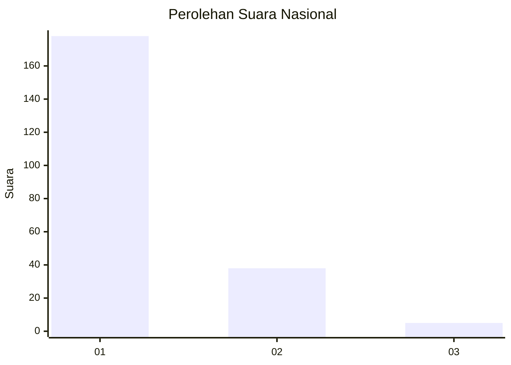
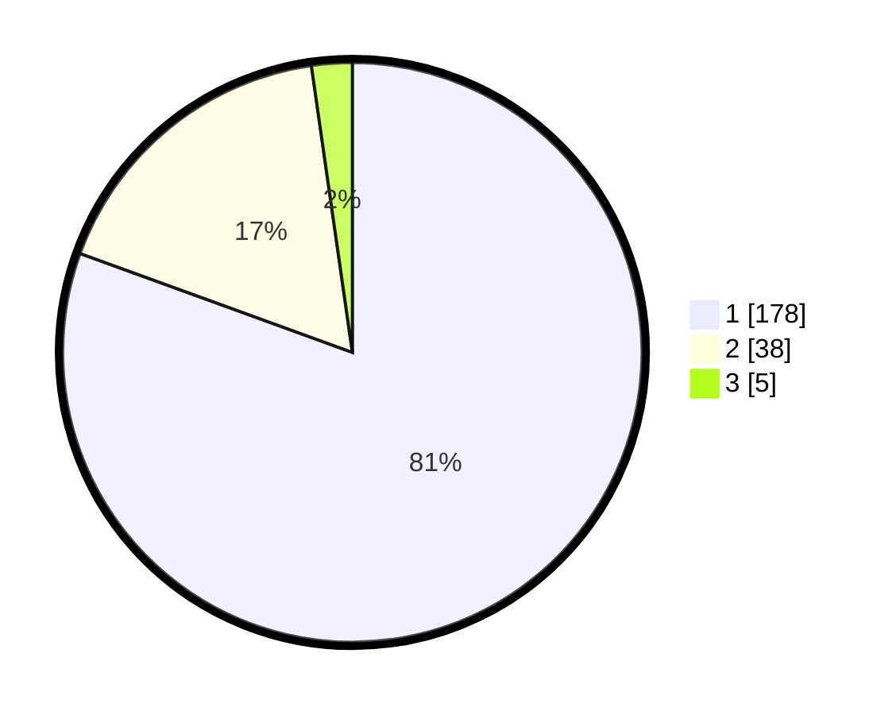

# Hasil

## Grafik

## Tabel

| No. | Nama Paslon    | Suara | Suara (raw) | Persentase |
|:--- |:-------------- | -----:| -----------:| ----------:|
| 1   | ANIES MUHAIMIN | 178   | [178][p-1]  | 80,54      |
| 2   | PRABOWO GIBRAN | 38    | [38][p-2]   | 17,19      |
| 3   | GANJAR MAHFUD  | 5     | [5][p-3]    | 2,26       |

[p-1]: https://github.com/gigit-pemilu/pemilu-2024/blob/main/pilpres/hitung-suara/sub/11-aceh/sub/06-aceh-besar/sub/15-kota-jantho/sub/2012-jantho-makmur/sub/901-tps/sub/paslon-1.txt
[p-2]: https://github.com/gigit-pemilu/pemilu-2024/blob/main/pilpres/hitung-suara/sub/11-aceh/sub/06-aceh-besar/sub/15-kota-jantho/sub/2012-jantho-makmur/sub/901-tps/sub/paslon-2.txt
[p-3]: https://github.com/gigit-pemilu/pemilu-2024/blob/main/pilpres/hitung-suara/sub/11-aceh/sub/06-aceh-besar/sub/15-kota-jantho/sub/2012-jantho-makmur/sub/901-tps/sub/paslon-3.txt

## Foto C Plano

https://sirekap-obj-formc.kpu.go.id/62d6/pemilu/ppwp/11/06/15/20/12/1106152012901-20240216-193010--380b3ee3-d719-42df-aef8-0dfd618af66f.jpg

https://sirekap-obj-formc.kpu.go.id/62d6/pemilu/ppwp/11/06/15/20/12/1106152012901-20240215-010721--dcf18e8f-65f5-4881-aa07-d990bd83aef3.jpg

https://sirekap-obj-formc.kpu.go.id/62d6/pemilu/ppwp/11/06/15/20/12/1106152012901-20240215-025615--5f8235b8-88d6-47c7-a33f-d97c58236b6f.jpg

## Metadata

| Key        | Value               |
| ---------- | ------------------- |
| Time Stamp | 2024-02-16 21:01:00 |

## DATA PEMILIH TETAP

Jumlah pemilih dalam DPT: **221**.
 * L: **221**.
 * P: **0**.

## DATA PENGGUNA HAK PILIH

Jumlah pengguna hak pilih dalam DPT: **112**.
 * L: **112**.
 * P: **0**.

Jumlah pengguna hak pilih dalam DPTb: **114**.
 * L: **113**.
 * P: **1**.

Jumlah pengguna hak pilih dalam DPK: **0**.
 * L: **0**.
 * P: **0**.

Jumlah pengguna hak pilih: **226**.
 * L: **225**.
 * P: **1**.

## JUMLAH SUARA SAH DAN TIDAK SAH

JUMLAH SELURUH SUARA SAH: **221**.

JUMLAH SUARA TIDAK SAH: **5**.

JUMLAH SELURUH SUARA SAH DAN SUARA TIDAK SAH: **226**.

