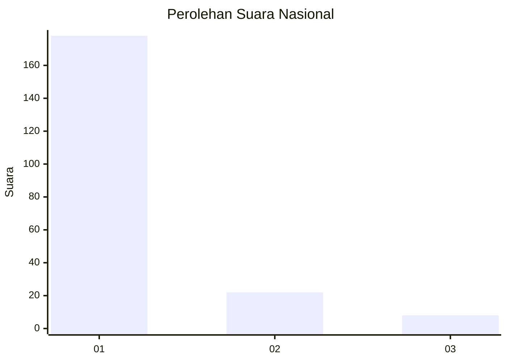
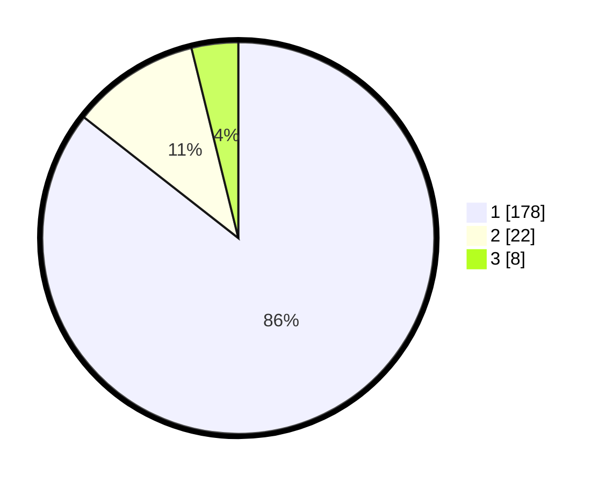

# Hasil

## Grafik

## Tabel

| No. | Nama Paslon    | Suara | Suara (raw) | Persentase |
|:--- |:-------------- | -----:| -----------:| ----------:|
| 1   | ANIES MUHAIMIN | 178   | [178][p-1]  | 85,58      |
| 2   | PRABOWO GIBRAN | 22    | [22][p-2]   | 10,58      |
| 3   | GANJAR MAHFUD  | 8     | [8][p-3]    | 3,85       |

[p-1]: https://github.com/gigit-pemilu/pemilu-2024/blob/main/pilpres/hitung-suara/sub/11-aceh/sub/06-aceh-besar/sub/15-kota-jantho/sub/2013-bukit-meusara/sub/002-tps/sub/paslon-1.txt
[p-2]: https://github.com/gigit-pemilu/pemilu-2024/blob/main/pilpres/hitung-suara/sub/11-aceh/sub/06-aceh-besar/sub/15-kota-jantho/sub/2013-bukit-meusara/sub/002-tps/sub/paslon-2.txt
[p-3]: https://github.com/gigit-pemilu/pemilu-2024/blob/main/pilpres/hitung-suara/sub/11-aceh/sub/06-aceh-besar/sub/15-kota-jantho/sub/2013-bukit-meusara/sub/002-tps/sub/paslon-3.txt

## Foto C Plano

https://sirekap-obj-formc.kpu.go.id/20c8/pemilu/ppwp/11/06/15/20/13/1106152013002-20240215-000154--2ac5cd99-632f-4bec-be8f-f009b3aa8683.jpg

https://sirekap-obj-formc.kpu.go.id/20c8/pemilu/ppwp/11/06/15/20/13/1106152013002-20240215-020624--faf39d5e-e62f-4a04-8861-f99a57c4965d.jpg

https://sirekap-obj-formc.kpu.go.id/20c8/pemilu/ppwp/11/06/15/20/13/1106152013002-20240215-000326--1b0dfb82-3c6e-4500-b3f6-c4c6238d08fc.jpg

## Metadata

| Key        | Value               |
| ---------- | ------------------- |
| Time Stamp | 2024-02-16 00:00:26 |

