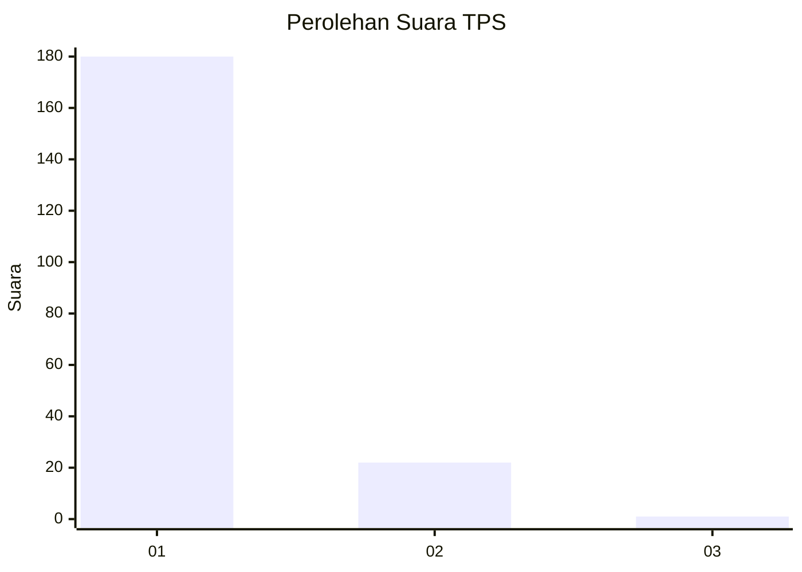
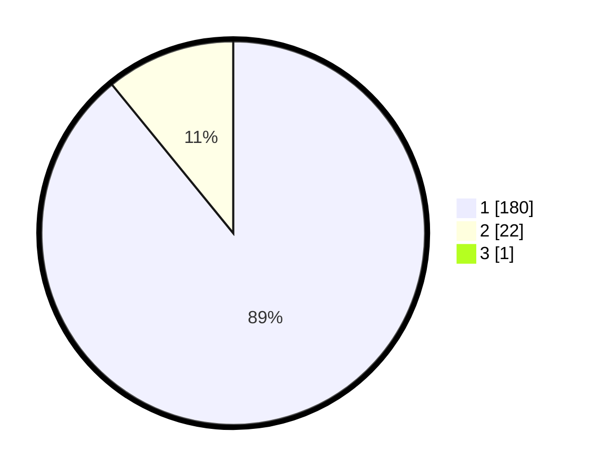

# Hasil

## Grafik

## Tabel

| No. | Nama Paslon    | Suara | Suara (raw) | Persentase |
|:--- |:-------------- | -----:| -----------:| ----------:|
| 1   | ANIES MUHAIMIN | 180   | [180][p-1]  | 88,67      |
| 2   | PRABOWO GIBRAN | 22    | [22][p-2]   | 10,84      |
| 3   | GANJAR MAHFUD  | 1     | [1][p-3]    | 0,49       |

[p-1]: https://github.com/gigit-pemilu/pemilu-2024-11-aceh/blob/main/pilpres/hitung-suara/sub/11-aceh/sub/06-aceh-besar/sub/15-kota-jantho/sub/2013-bukit-meusara/sub/004-tps/sub/paslon-1.txt
[p-2]: https://github.com/gigit-pemilu/pemilu-2024-11-aceh/blob/main/pilpres/hitung-suara/sub/11-aceh/sub/06-aceh-besar/sub/15-kota-jantho/sub/2013-bukit-meusara/sub/004-tps/sub/paslon-2.txt
[p-3]: https://github.com/gigit-pemilu/pemilu-2024-11-aceh/blob/main/pilpres/hitung-suara/sub/11-aceh/sub/06-aceh-besar/sub/15-kota-jantho/sub/2013-bukit-meusara/sub/004-tps/sub/paslon-3.txt

## Foto C Plano

https://sirekap-obj-formc.kpu.go.id/0f2d/pemilu/ppwp/11/06/15/20/13/1106152013004-20240214-233827--50729ba9-6ebe-4397-84b7-879ec3529353.jpg

https://sirekap-obj-formc.kpu.go.id/0f2d/pemilu/ppwp/11/06/15/20/13/1106152013004-20240214-234013--50cfcce1-866c-4935-b67f-7d7ef01b8667.jpg

https://sirekap-obj-formc.kpu.go.id/0f2d/pemilu/ppwp/11/06/15/20/13/1106152013004-20240214-234221--c773e8c2-5a41-4db3-b134-35622d122e8f.jpg

## Metadata

| Key        | Value               |
| ---------- | ------------------- |
| Time Stamp | 2024-02-16 00:00:26 |

