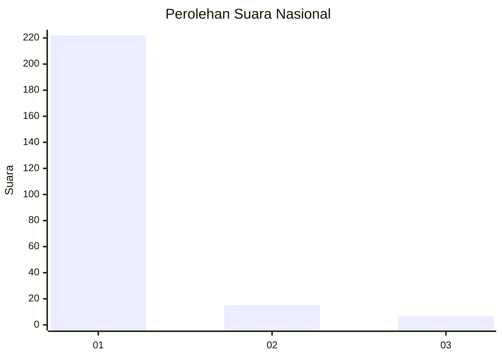
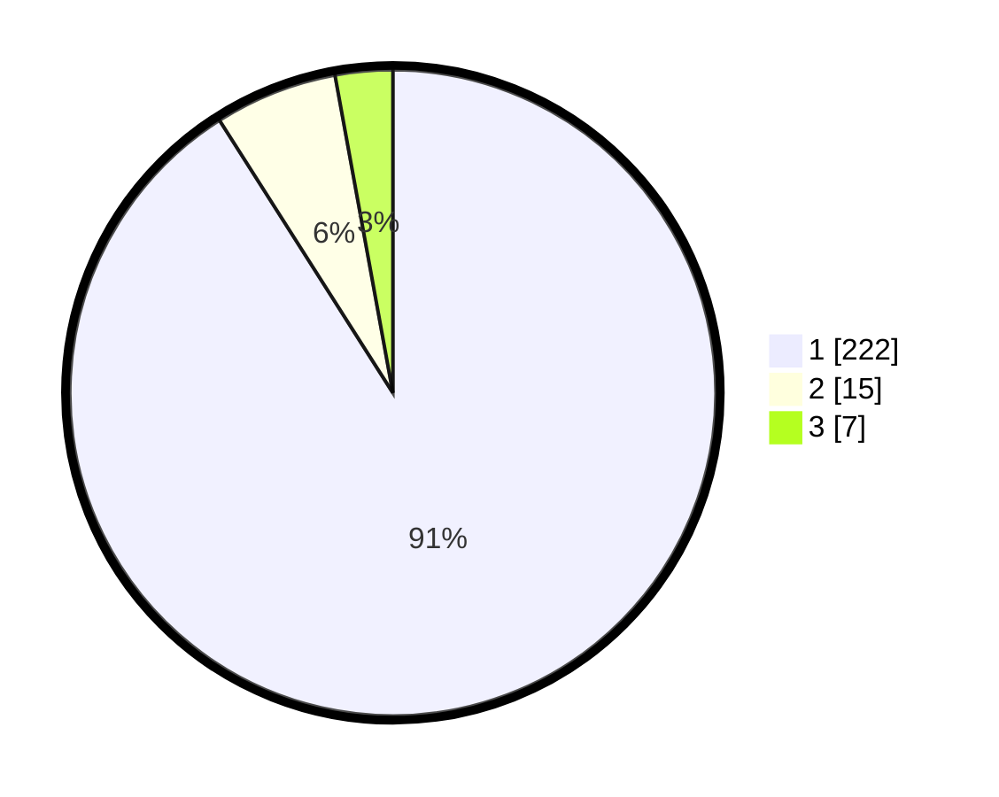

# Hasil

## Grafik

## Tabel

| No. | Nama Paslon    | Suara | Suara (raw) | Persentase |
|:--- |:-------------- | -----:| -----------:| ----------:|
| 1   | ANIES MUHAIMIN | 222   | [222][p-1]  | 90,98      |
| 2   | PRABOWO GIBRAN | 15    | [15][p-2]   | 6,15       |
| 3   | GANJAR MAHFUD  | 7     | [7][p-3]    | 2,87       |

[p-1]: https://github.com/gigit-pemilu/pemilu-2024/blob/main/pilpres/hitung-suara/sub/11-aceh/sub/06-aceh-besar/sub/16-kuta-cot-glie/sub/2001-lampakuk/sub/002-tps/sub/paslon-1.txt
[p-2]: https://github.com/gigit-pemilu/pemilu-2024/blob/main/pilpres/hitung-suara/sub/11-aceh/sub/06-aceh-besar/sub/16-kuta-cot-glie/sub/2001-lampakuk/sub/002-tps/sub/paslon-2.txt
[p-3]: https://github.com/gigit-pemilu/pemilu-2024/blob/main/pilpres/hitung-suara/sub/11-aceh/sub/06-aceh-besar/sub/16-kuta-cot-glie/sub/2001-lampakuk/sub/002-tps/sub/paslon-3.txt

## Foto C Plano

https://sirekap-obj-formc.kpu.go.id/8e71/pemilu/ppwp/11/06/16/20/01/1106162001002-20240216-002724--139753e6-ed76-408a-8f90-edda6566cd7d.jpg

https://sirekap-obj-formc.kpu.go.id/8e71/pemilu/ppwp/11/06/16/20/01/1106162001002-20240216-002727--545a4ecc-15a8-412e-8244-770c6ab5b523.jpg

https://sirekap-obj-formc.kpu.go.id/8e71/pemilu/ppwp/11/06/16/20/01/1106162001002-20240216-002726--db215dcc-5f3e-4f33-8499-d9e0fabdac2e.jpg

## Metadata

| Key        | Value               |
| ---------- | ------------------- |
| Time Stamp | 2024-02-16 01:00:27 |

## DATA PEMILIH TETAP

Jumlah pemilih dalam DPT: **266**.
 * L: **126**.
 * P: **140**.

## DATA PENGGUNA HAK PILIH

Jumlah pengguna hak pilih dalam DPT: **247**.
 * L: **113**.
 * P: **134**.

Jumlah pengguna hak pilih dalam DPTb: **0**.
 * L: **0**.
 * P: **0**.

Jumlah pengguna hak pilih dalam DPK: **1**.
 * L: **0**.
 * P: **1**.

Jumlah pengguna hak pilih: **248**.
 * L: **113**.
 * P: **135**.

## JUMLAH SUARA SAH DAN TIDAK SAH

JUMLAH SELURUH SUARA SAH: **244**.

JUMLAH SUARA TIDAK SAH: **4**.

JUMLAH SELURUH SUARA SAH DAN SUARA TIDAK SAH: **248**.

