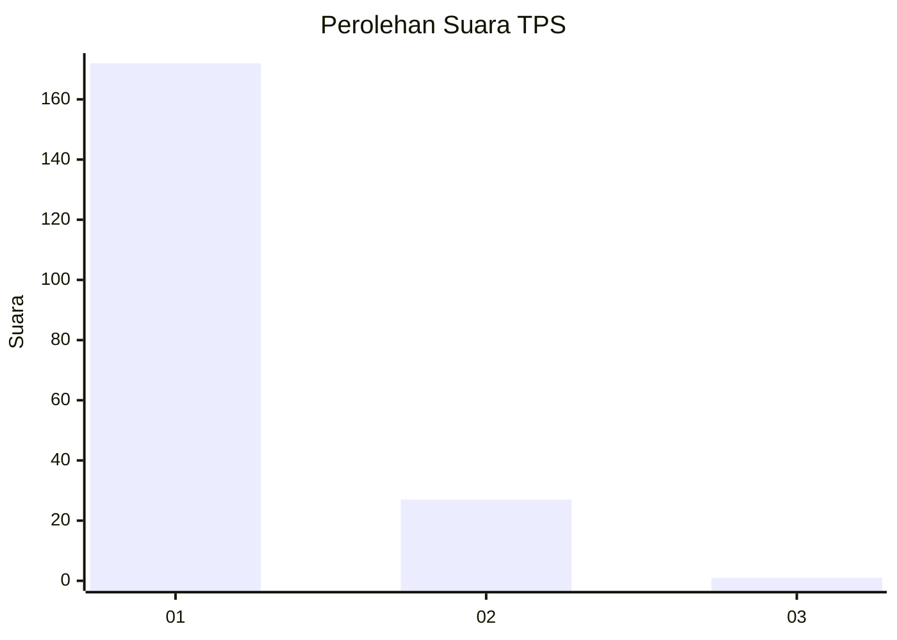
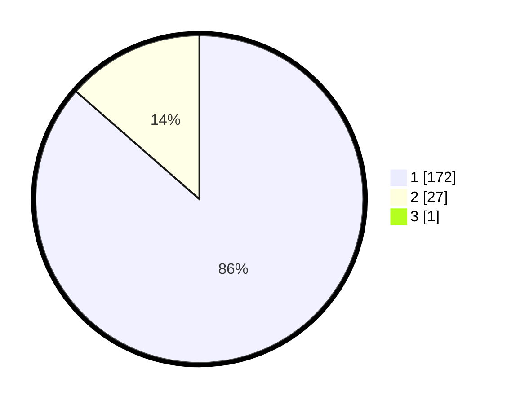

# Hasil

## Grafik

## Tabel

| No. | Nama Paslon    | Suara | Suara (raw) | Persentase |
|:--- |:-------------- | -----:| -----------:| ----------:|
| 1   | ANIES MUHAIMIN | 172   | [172][p-1]  | 86,00      |
| 2   | PRABOWO GIBRAN | 27    | [27][p-2]   | 13,50      |
| 3   | GANJAR MAHFUD  | 1     | [1][p-3]    | 0,50       |

[p-1]: https://github.com/gigit-pemilu/pemilu-2024-11-aceh/blob/main/pilpres/hitung-suara/sub/11-aceh/sub/06-aceh-besar/sub/16-kuta-cot-glie/sub/2002-lampoh-raja/sub/002-tps/sub/paslon-1.txt
[p-2]: https://github.com/gigit-pemilu/pemilu-2024-11-aceh/blob/main/pilpres/hitung-suara/sub/11-aceh/sub/06-aceh-besar/sub/16-kuta-cot-glie/sub/2002-lampoh-raja/sub/002-tps/sub/paslon-2.txt
[p-3]: https://github.com/gigit-pemilu/pemilu-2024-11-aceh/blob/main/pilpres/hitung-suara/sub/11-aceh/sub/06-aceh-besar/sub/16-kuta-cot-glie/sub/2002-lampoh-raja/sub/002-tps/sub/paslon-3.txt

## Foto C Plano

https://sirekap-obj-formc.kpu.go.id/c8c7/pemilu/ppwp/11/06/16/20/02/1106162002002-20240215-021232--0920d9e7-7228-4ca4-a05e-620efe03a805.jpg

https://sirekap-obj-formc.kpu.go.id/c8c7/pemilu/ppwp/11/06/16/20/02/1106162002002-20240220-172416--bd1a176d-769b-4b0a-ba0a-58bef8d5691b.jpg

https://sirekap-obj-formc.kpu.go.id/c8c7/pemilu/ppwp/11/06/16/20/02/1106162002002-20240215-021635--e5c85523-fe19-4e87-b958-b8775c074250.jpg

## Metadata

| Key        | Value               |
| ---------- | ------------------- |
| Time Stamp | 2024-02-24 22:31:28 |

