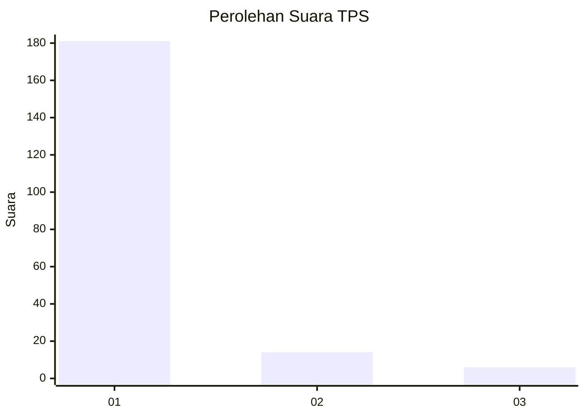
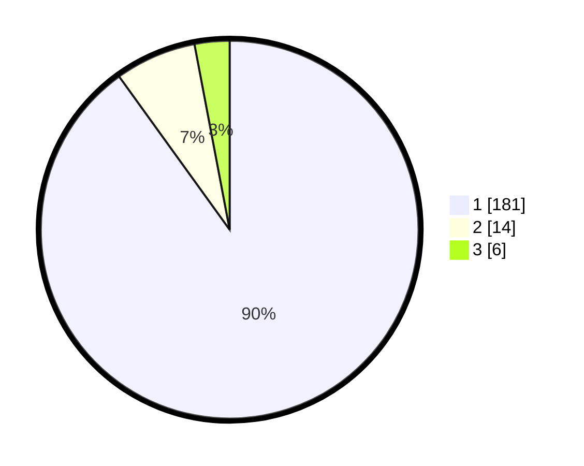

# Hasil

## Grafik

## Tabel

| No. | Nama Paslon    | Suara | Suara (raw) | Persentase |
|:--- |:-------------- | -----:| -----------:| ----------:|
| 1   | ANIES MUHAIMIN | 181   | [181][p-1]  | 90,05      |
| 2   | PRABOWO GIBRAN | 14    | [14][p-2]   | 6,97       |
| 3   | GANJAR MAHFUD  | 6     | [6][p-3]    | 2,99       |

[p-1]: https://github.com/gigit-pemilu/pemilu-2024-11-aceh/blob/main/pilpres/hitung-suara/sub/11-aceh/sub/06-aceh-besar/sub/16-kuta-cot-glie/sub/2017-lamsie/sub/002-tps/sub/paslon-1.txt
[p-2]: https://github.com/gigit-pemilu/pemilu-2024-11-aceh/blob/main/pilpres/hitung-suara/sub/11-aceh/sub/06-aceh-besar/sub/16-kuta-cot-glie/sub/2017-lamsie/sub/002-tps/sub/paslon-2.txt
[p-3]: https://github.com/gigit-pemilu/pemilu-2024-11-aceh/blob/main/pilpres/hitung-suara/sub/11-aceh/sub/06-aceh-besar/sub/16-kuta-cot-glie/sub/2017-lamsie/sub/002-tps/sub/paslon-3.txt

## Foto C Plano

https://sirekap-obj-formc.kpu.go.id/ad4e/pemilu/ppwp/11/06/16/20/17/1106162017002-20240214-222838--a543aae4-f33d-4401-8c25-4ad70dc53f8d.jpg

https://sirekap-obj-formc.kpu.go.id/ad4e/pemilu/ppwp/11/06/16/20/17/1106162017002-20240214-223327--753c182f-430d-46a7-824f-5082c45e8ed1.jpg

https://sirekap-obj-formc.kpu.go.id/ad4e/pemilu/ppwp/11/06/16/20/17/1106162017002-20240214-223625--beb1653f-7d9a-4f13-a7cb-52ccb4add6f9.jpg

## Metadata

| Key        | Value               |
| ---------- | ------------------- |
| Time Stamp | 2024-02-16 00:30:27 |

