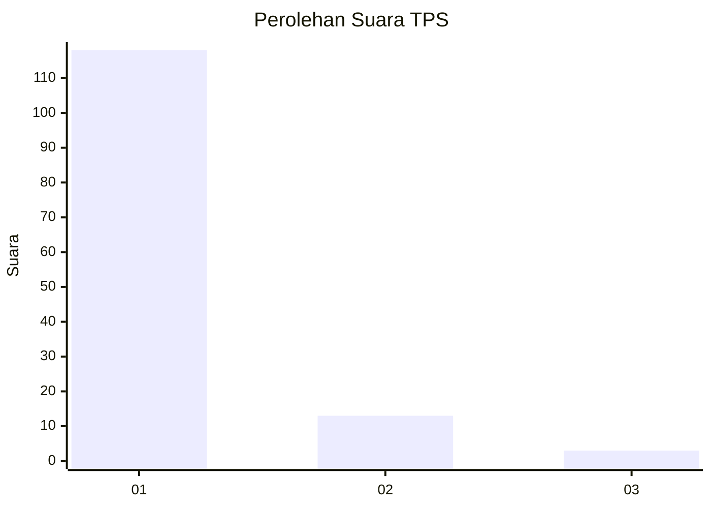
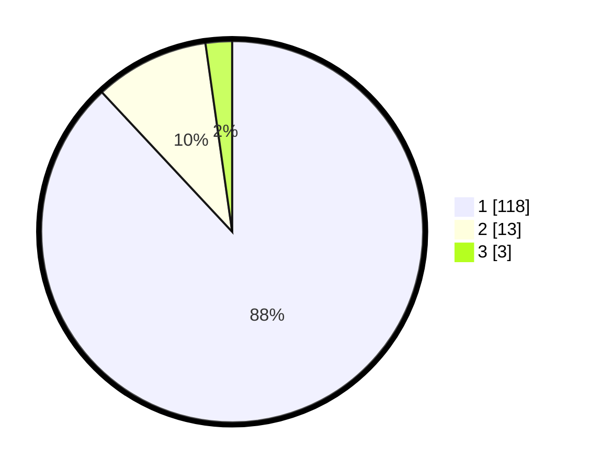

# Hasil

## Grafik

## Tabel

| No. | Nama Paslon    | Suara | Suara (raw) | Persentase |
|:--- |:-------------- | -----:| -----------:| ----------:|
| 1   | ANIES MUHAIMIN | 118   | [118][p-1]  | 88,06      |
| 2   | PRABOWO GIBRAN | 13    | [13][p-2]   | 9,70       |
| 3   | GANJAR MAHFUD  | 3     | [3][p-3]    | 2,24       |

[p-1]: https://github.com/gigit-pemilu/pemilu-2024-11-aceh/blob/main/pilpres/hitung-suara/sub/11-aceh/sub/06-aceh-besar/sub/16-kuta-cot-glie/sub/2019-tutui/sub/001-tps/sub/paslon-1.txt
[p-2]: https://github.com/gigit-pemilu/pemilu-2024-11-aceh/blob/main/pilpres/hitung-suara/sub/11-aceh/sub/06-aceh-besar/sub/16-kuta-cot-glie/sub/2019-tutui/sub/001-tps/sub/paslon-2.txt
[p-3]: https://github.com/gigit-pemilu/pemilu-2024-11-aceh/blob/main/pilpres/hitung-suara/sub/11-aceh/sub/06-aceh-besar/sub/16-kuta-cot-glie/sub/2019-tutui/sub/001-tps/sub/paslon-3.txt

## Foto C Plano

https://sirekap-obj-formc.kpu.go.id/e49a/pemilu/ppwp/11/06/16/20/19/1106162019001-20240215-024618--5c09766c-8324-4cbf-a836-d8737e3fd645.jpg

https://sirekap-obj-formc.kpu.go.id/e49a/pemilu/ppwp/11/06/16/20/19/1106162019001-20240215-024759--b3cdec09-4ea8-4c60-98e7-7ec6b8c1a0dd.jpg

https://sirekap-obj-formc.kpu.go.id/e49a/pemilu/ppwp/11/06/16/20/19/1106162019001-20240215-024932--493e3b53-a87b-44b4-beba-2eb8241b80f7.jpg

## Metadata

| Key        | Value               |
| ---------- | ------------------- |
| Time Stamp | 2024-02-16 00:30:27 |

