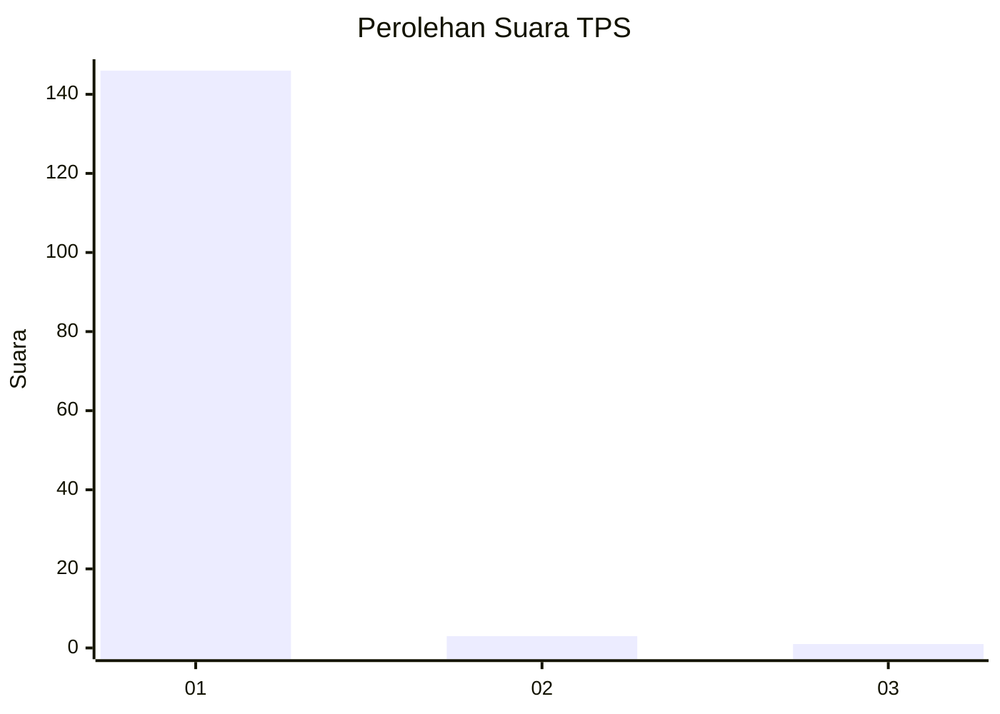
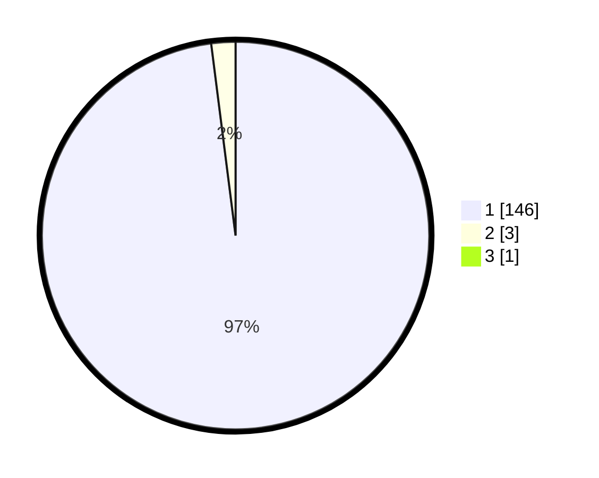

# Hasil

## Grafik

## Tabel

| No. | Nama Paslon    | Suara | Suara (raw) | Persentase |
|:--- |:-------------- | -----:| -----------:| ----------:|
| 1   | ANIES MUHAIMIN | 146   | [146][p-1]  | 97,33      |
| 2   | PRABOWO GIBRAN | 3     | [3][p-2]    | 2,00       |
| 3   | GANJAR MAHFUD  | 1     | [1][p-3]    | 0,67       |

[p-1]: https://github.com/gigit-pemilu/pemilu-2024-11-aceh/blob/main/pilpres/hitung-suara/sub/11-aceh/sub/06-aceh-besar/sub/16-kuta-cot-glie/sub/2024-lamleuot/sub/001-tps/sub/paslon-1.txt
[p-2]: https://github.com/gigit-pemilu/pemilu-2024-11-aceh/blob/main/pilpres/hitung-suara/sub/11-aceh/sub/06-aceh-besar/sub/16-kuta-cot-glie/sub/2024-lamleuot/sub/001-tps/sub/paslon-2.txt
[p-3]: https://github.com/gigit-pemilu/pemilu-2024-11-aceh/blob/main/pilpres/hitung-suara/sub/11-aceh/sub/06-aceh-besar/sub/16-kuta-cot-glie/sub/2024-lamleuot/sub/001-tps/sub/paslon-3.txt

## Foto C Plano

https://sirekap-obj-formc.kpu.go.id/dc3e/pemilu/ppwp/11/06/16/20/24/1106162024001-20240220-153321--bd3847a2-cebf-4459-81a2-6b198662b90e.jpg

https://sirekap-obj-formc.kpu.go.id/dc3e/pemilu/ppwp/11/06/16/20/24/1106162024001-20240220-155000--e17c2d6f-053d-4ddc-9724-41f4196cc1c2.jpg

https://sirekap-obj-formc.kpu.go.id/dc3e/pemilu/ppwp/11/06/16/20/24/1106162024001-20240220-154322--a912bd49-1565-4b11-9986-ba067c9fa66e.jpg

## Metadata

| Key        | Value               |
| ---------- | ------------------- |
| Time Stamp | 2024-02-24 22:31:28 |

