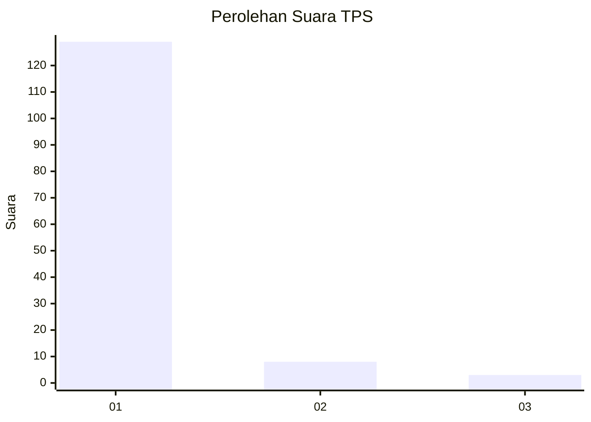
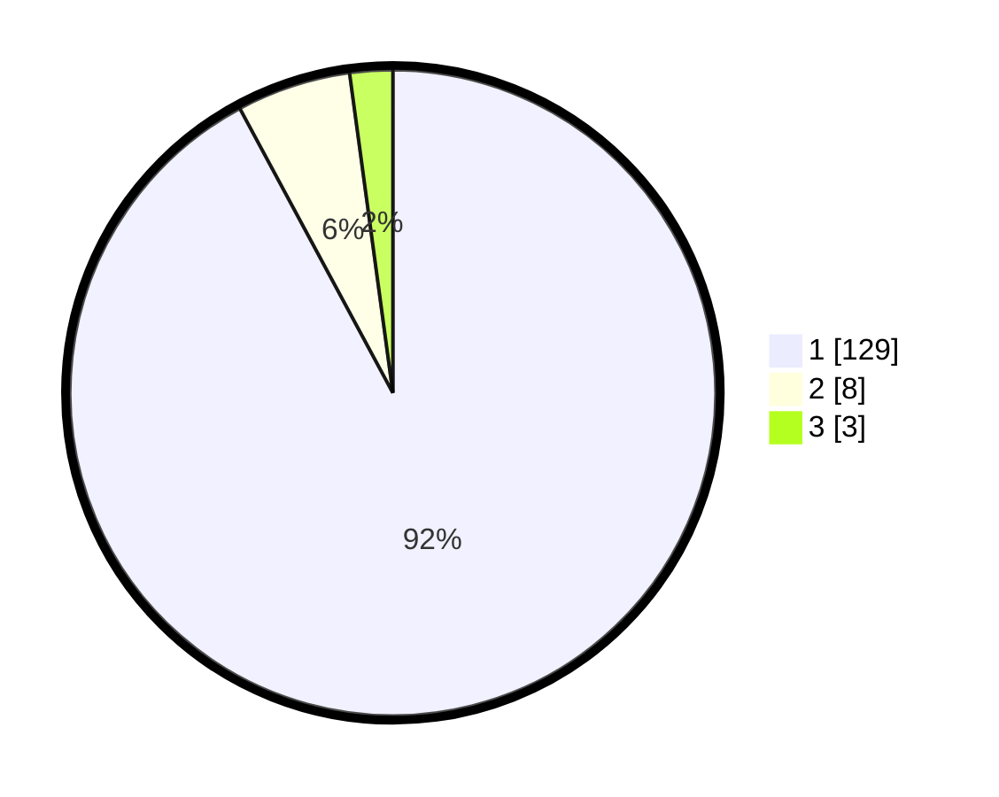

# Hasil

## Grafik

## Tabel

| No. | Nama Paslon    | Suara | Suara (raw) | Persentase |
|:--- |:-------------- | -----:| -----------:| ----------:|
| 1   | ANIES MUHAIMIN | 129   | [129][p-1]  | 92,14      |
| 2   | PRABOWO GIBRAN | 8     | [8][p-2]    | 5,71       |
| 3   | GANJAR MAHFUD  | 3     | [3][p-3]    | 2,14       |

[p-1]: https://github.com/gigit-pemilu/pemilu-2024-11-aceh/blob/main/pilpres/hitung-suara/sub/11-aceh/sub/06-aceh-besar/sub/17-kuta-malaka/sub/2001-lambaro-samahani/sub/001-tps/sub/paslon-1.txt
[p-2]: https://github.com/gigit-pemilu/pemilu-2024-11-aceh/blob/main/pilpres/hitung-suara/sub/11-aceh/sub/06-aceh-besar/sub/17-kuta-malaka/sub/2001-lambaro-samahani/sub/001-tps/sub/paslon-2.txt
[p-3]: https://github.com/gigit-pemilu/pemilu-2024-11-aceh/blob/main/pilpres/hitung-suara/sub/11-aceh/sub/06-aceh-besar/sub/17-kuta-malaka/sub/2001-lambaro-samahani/sub/001-tps/sub/paslon-3.txt

## Foto C Plano

https://sirekap-obj-formc.kpu.go.id/864c/pemilu/ppwp/11/06/17/20/01/1106172001001-20240216-212104--80209f45-86ef-4fb3-a5af-d14bc9bd736b.jpg

https://sirekap-obj-formc.kpu.go.id/864c/pemilu/ppwp/11/06/17/20/01/1106172001001-20240216-212334--2ae1cb22-d05f-4a8c-ae00-c6c18bce89eb.jpg

https://sirekap-obj-formc.kpu.go.id/864c/pemilu/ppwp/11/06/17/20/01/1106172001001-20240216-212505--33fcbd2f-c4ca-4999-b93f-5c975e9b1c20.jpg

## Metadata

| Key        | Value               |
| ---------- | ------------------- |
| Time Stamp | 2024-02-17 11:00:02 |

## DATA PEMILIH TETAP

Jumlah pemilih dalam DPT: **150**.
 * L: **78**.
 * P: **72**.

## DATA PENGGUNA HAK PILIH

Jumlah pengguna hak pilih dalam DPT: **141**.
 * L: **71**.
 * P: **70**.

Jumlah pengguna hak pilih dalam DPTb: **2**.
 * L: **1**.
 * P: **1**.

Jumlah pengguna hak pilih dalam DPK: **2**.
 * L: **2**.
 * P: **0**.

Jumlah pengguna hak pilih: **145**.
 * L: **74**.
 * P: **71**.

## JUMLAH SUARA SAH DAN TIDAK SAH

JUMLAH SELURUH SUARA SAH: **140**.

JUMLAH SUARA TIDAK SAH: **5**.

JUMLAH SELURUH SUARA SAH DAN SUARA TIDAK SAH: **145**.

