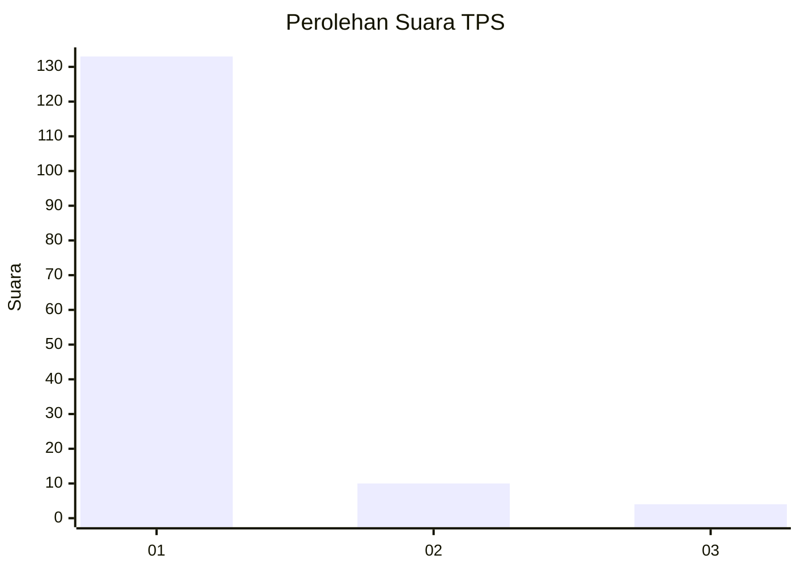
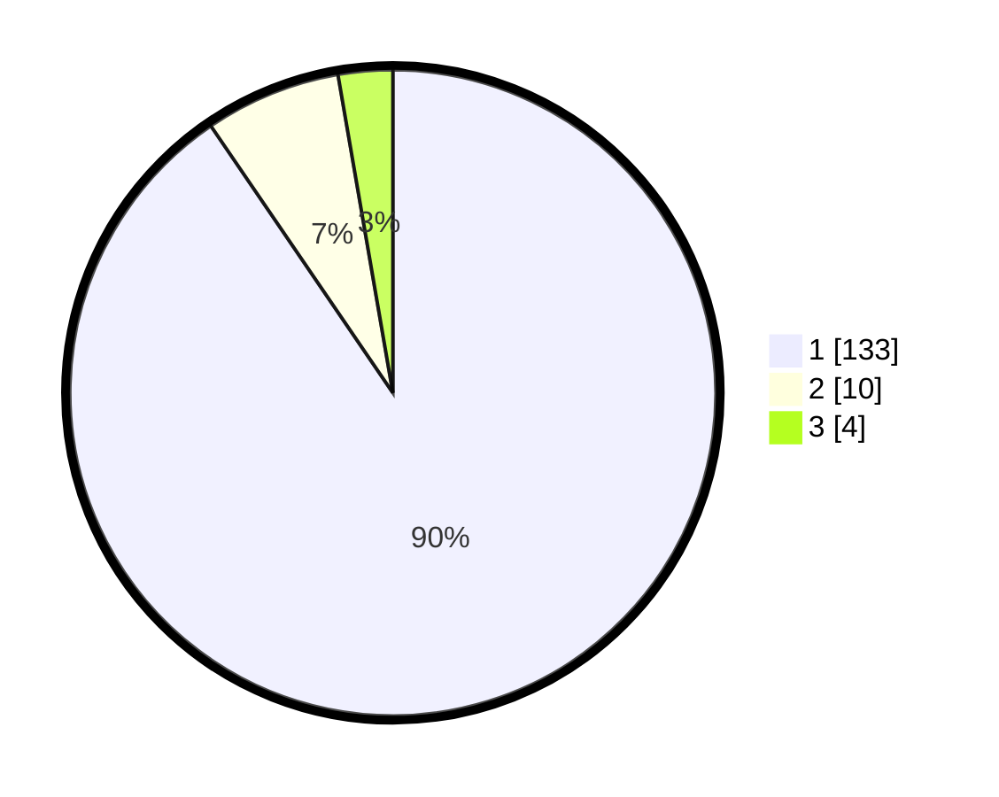

# Hasil

## Grafik

## Tabel

| No. | Nama Paslon    | Suara | Suara (raw) | Persentase |
|:--- |:-------------- | -----:| -----------:| ----------:|
| 1   | ANIES MUHAIMIN | 133   | [133][p-1]  | 90,48      |
| 2   | PRABOWO GIBRAN | 10    | [10][p-2]   | 6,80       |
| 3   | GANJAR MAHFUD  | 4     | [4][p-3]    | 2,72       |

[p-1]: https://github.com/gigit-pemilu/pemilu-2024-11-aceh/blob/main/pilpres/hitung-suara/sub/11-aceh/sub/06-aceh-besar/sub/17-kuta-malaka/sub/2001-lambaro-samahani/sub/002-tps/sub/paslon-1.txt
[p-2]: https://github.com/gigit-pemilu/pemilu-2024-11-aceh/blob/main/pilpres/hitung-suara/sub/11-aceh/sub/06-aceh-besar/sub/17-kuta-malaka/sub/2001-lambaro-samahani/sub/002-tps/sub/paslon-2.txt
[p-3]: https://github.com/gigit-pemilu/pemilu-2024-11-aceh/blob/main/pilpres/hitung-suara/sub/11-aceh/sub/06-aceh-besar/sub/17-kuta-malaka/sub/2001-lambaro-samahani/sub/002-tps/sub/paslon-3.txt

## Foto C Plano

https://sirekap-obj-formc.kpu.go.id/29d6/pemilu/ppwp/11/06/17/20/01/1106172001002-20240214-195537--5d11a905-7c63-4abd-9115-5270b0518597.jpg

https://sirekap-obj-formc.kpu.go.id/29d6/pemilu/ppwp/11/06/17/20/01/1106172001002-20240214-162238--f7d9d60b-01d5-4cd4-807a-dd9242b9ffc1.jpg

https://sirekap-obj-formc.kpu.go.id/29d6/pemilu/ppwp/11/06/17/20/01/1106172001002-20240214-175445--029236fa-20d0-4033-857a-b02aff35f47f.jpg

## Metadata

| Key        | Value               |
| ---------- | ------------------- |
| Time Stamp | 2024-02-14 21:46:01 |

## DATA PEMILIH TETAP

Jumlah pemilih dalam DPT: **152**.
 * L: **72**.
 * P: **80**.

## DATA PENGGUNA HAK PILIH

Jumlah pengguna hak pilih dalam DPT: **146**.
 * L: **69**.
 * P: **77**.

Jumlah pengguna hak pilih dalam DPTb: **2**.
 * L: **1**.
 * P: **1**.

Jumlah pengguna hak pilih dalam DPK: **0**.
 * L: **0**.
 * P: **0**.

Jumlah pengguna hak pilih: **148**.
 * L: **70**.
 * P: **78**.

## JUMLAH SUARA SAH DAN TIDAK SAH

JUMLAH SELURUH SUARA SAH: **147**.

JUMLAH SUARA TIDAK SAH: **1**.

JUMLAH SELURUH SUARA SAH DAN SUARA TIDAK SAH: **148**.

