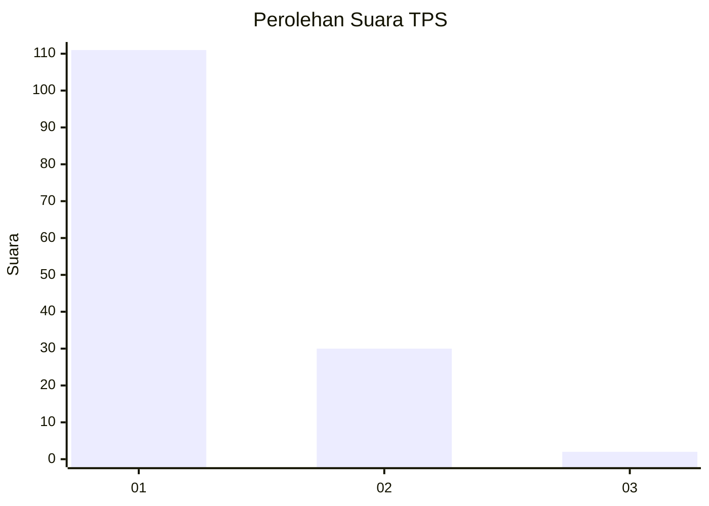
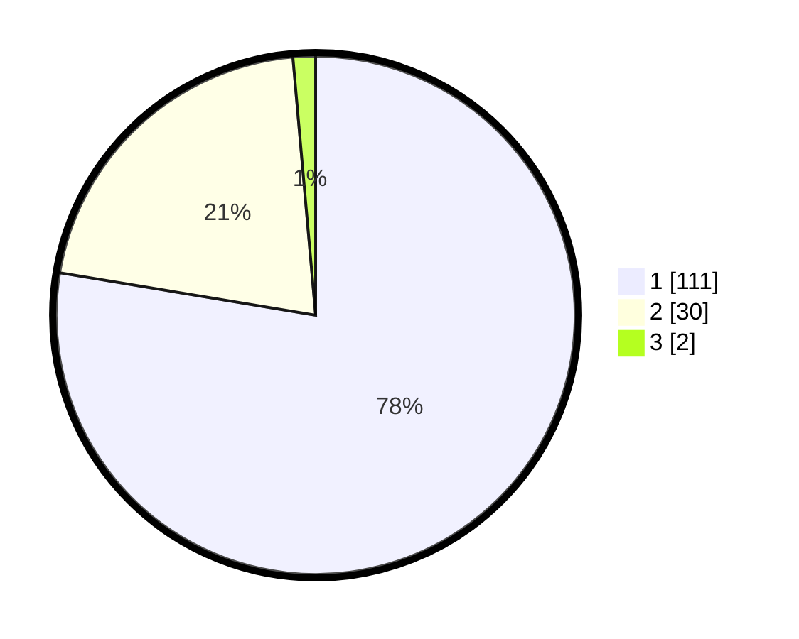

# Hasil

## Grafik

## Tabel

| No. | Nama Paslon    | Suara | Suara (raw) | Persentase |
|:--- |:-------------- | -----:| -----------:| ----------:|
| 1   | ANIES MUHAIMIN | 111   | [111][p-1]  | 77,62      |
| 2   | PRABOWO GIBRAN | 30    | [30][p-2]   | 20,98      |
| 3   | GANJAR MAHFUD  | 2     | [2][p-3]    | 1,40       |

[p-1]: https://github.com/gigit-pemilu/pemilu-2024-11-aceh/blob/main/pilpres/hitung-suara/sub/11-aceh/sub/06-aceh-besar/sub/17-kuta-malaka/sub/2002-lam-ara-cut/sub/001-tps/sub/paslon-1.txt
[p-2]: https://github.com/gigit-pemilu/pemilu-2024-11-aceh/blob/main/pilpres/hitung-suara/sub/11-aceh/sub/06-aceh-besar/sub/17-kuta-malaka/sub/2002-lam-ara-cut/sub/001-tps/sub/paslon-2.txt
[p-3]: https://github.com/gigit-pemilu/pemilu-2024-11-aceh/blob/main/pilpres/hitung-suara/sub/11-aceh/sub/06-aceh-besar/sub/17-kuta-malaka/sub/2002-lam-ara-cut/sub/001-tps/sub/paslon-3.txt

## Foto C Plano

https://sirekap-obj-formc.kpu.go.id/c762/pemilu/ppwp/11/06/17/20/02/1106172002001-20240214-220909--f626f68d-e2da-4934-81b6-f9302a3de567.jpg

https://sirekap-obj-formc.kpu.go.id/c762/pemilu/ppwp/11/06/17/20/02/1106172002001-20240214-233754--ea0c7b3e-2799-4e05-9779-31b4e73b26f9.jpg

https://sirekap-obj-formc.kpu.go.id/c762/pemilu/ppwp/11/06/17/20/02/1106172002001-20240214-222139--4751226c-c68a-4440-8ab6-1ff1eaaeca41.jpg

## Metadata

| Key        | Value               |
| ---------- | ------------------- |
| Time Stamp | 2024-02-19 18:00:00 |

