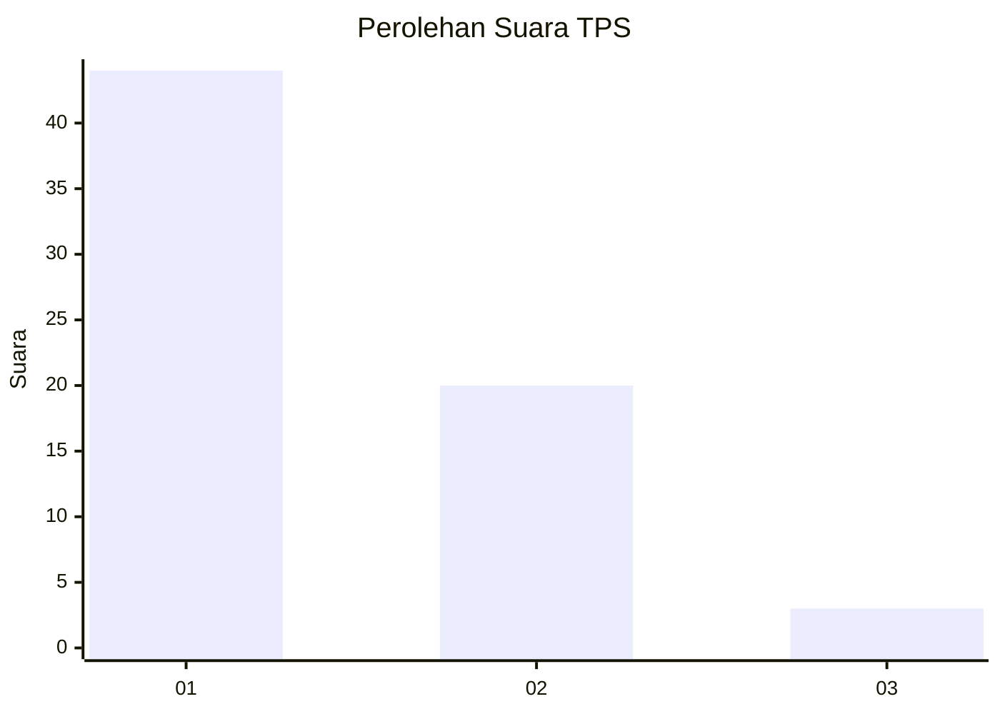
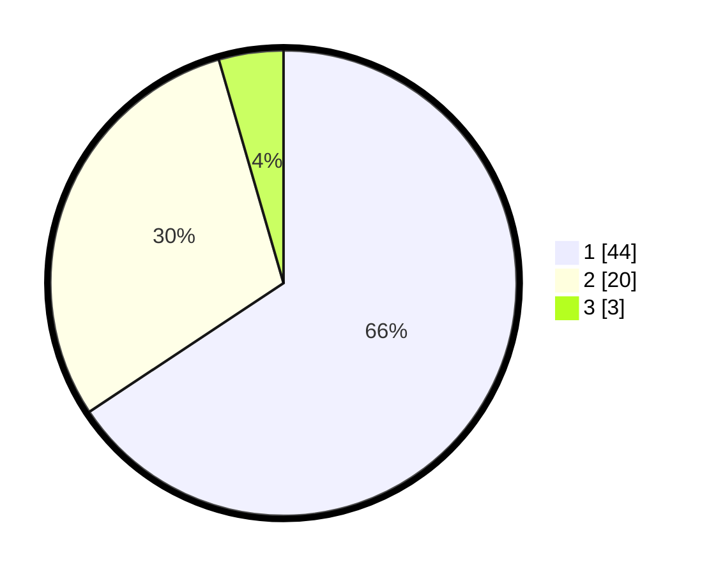

# Hasil

## Grafik

## Tabel

| No. | Nama Paslon    | Suara | Suara (raw) | Persentase |
|:--- |:-------------- | -----:| -----------:| ----------:|
| 1   | ANIES MUHAIMIN | 44    | [44][p-1]   | 65,67      |
| 2   | PRABOWO GIBRAN | 20    | [20][p-2]   | 29,85      |
| 3   | GANJAR MAHFUD  | 3     | [3][p-3]    | 4,48       |

[p-1]: https://github.com/gigit-pemilu/pemilu-2024-11-aceh/blob/main/pilpres/hitung-suara/sub/11-aceh/sub/06-aceh-besar/sub/17-kuta-malaka/sub/2011-leubok-batee/sub/001-tps/sub/paslon-1.txt
[p-2]: https://github.com/gigit-pemilu/pemilu-2024-11-aceh/blob/main/pilpres/hitung-suara/sub/11-aceh/sub/06-aceh-besar/sub/17-kuta-malaka/sub/2011-leubok-batee/sub/001-tps/sub/paslon-2.txt
[p-3]: https://github.com/gigit-pemilu/pemilu-2024-11-aceh/blob/main/pilpres/hitung-suara/sub/11-aceh/sub/06-aceh-besar/sub/17-kuta-malaka/sub/2011-leubok-batee/sub/001-tps/sub/paslon-3.txt

## Foto C Plano

https://sirekap-obj-formc.kpu.go.id/217a/pemilu/ppwp/11/06/17/20/11/1106172011001-20240214-213352--a99a51ec-c502-41eb-a580-c4e731bda40c.jpg

https://sirekap-obj-formc.kpu.go.id/217a/pemilu/ppwp/11/06/17/20/11/1106172011001-20240214-211915--fe9b034d-7dda-40e5-999e-8fcf12a69a76.jpg

https://sirekap-obj-formc.kpu.go.id/217a/pemilu/ppwp/11/06/17/20/11/1106172011001-20240214-212329--fdb5874c-b6f5-478c-bdc9-6a3ab9c9905c.jpg

## Metadata

| Key        | Value               |
| ---------- | ------------------- |
| Time Stamp | 2024-02-19 19:00:00 |

## DATA PEMILIH TETAP

Jumlah pemilih dalam DPT: **71**.
 * L: **32**.
 * P: **39**.

## DATA PENGGUNA HAK PILIH

Jumlah pengguna hak pilih dalam DPT: **69**.
 * L: **30**.
 * P: **39**.

Jumlah pengguna hak pilih dalam DPTb: **0**.
 * L: **0**.
 * P: **0**.

Jumlah pengguna hak pilih dalam DPK: **0**.
 * L: **0**.
 * P: **0**.

Jumlah pengguna hak pilih: **69**.
 * L: **30**.
 * P: **39**.

## JUMLAH SUARA SAH DAN TIDAK SAH

JUMLAH SELURUH SUARA SAH: **67**.

JUMLAH SUARA TIDAK SAH: **2**.

JUMLAH SELURUH SUARA SAH DAN SUARA TIDAK SAH: **69**.

