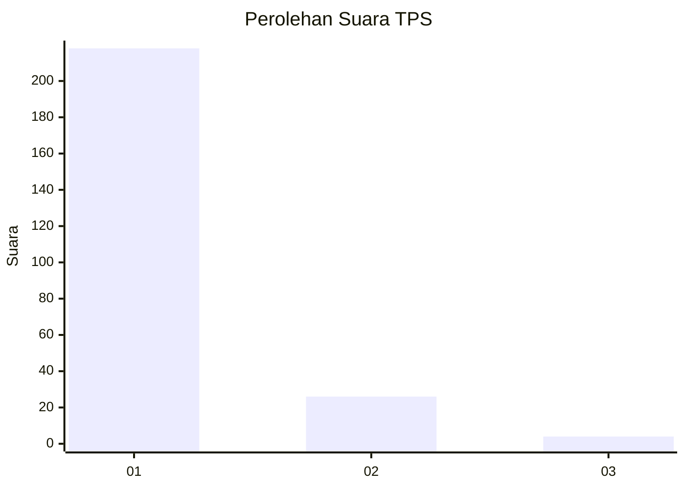
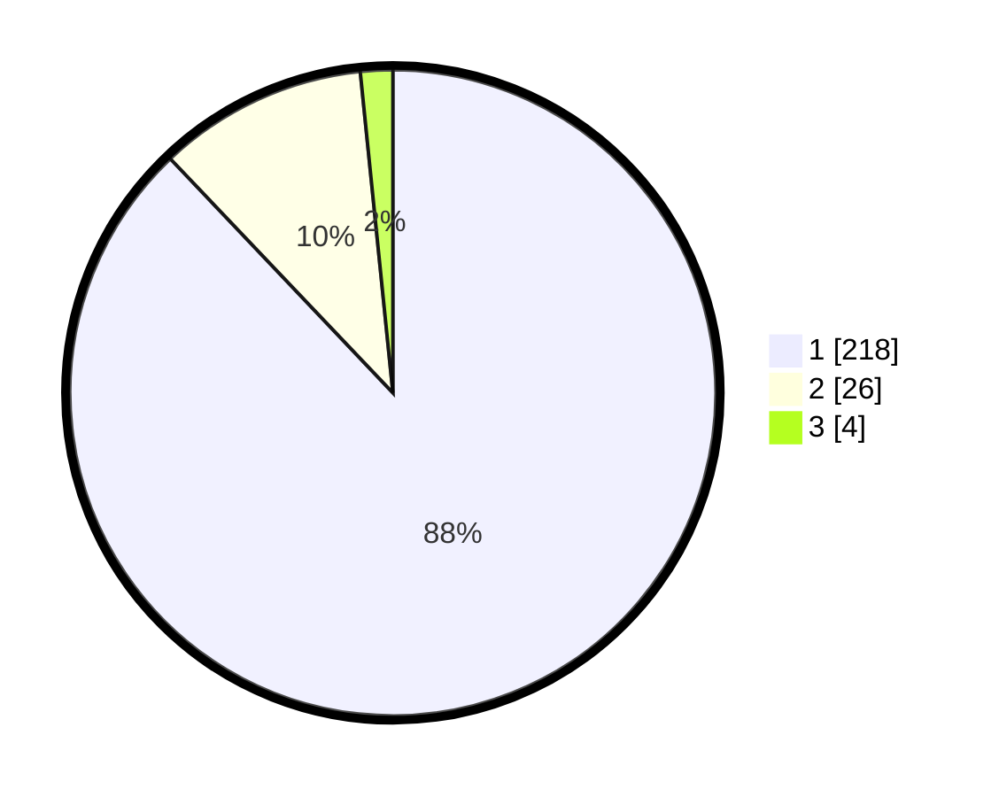

# Hasil

## Grafik

## Tabel

| No. | Nama Paslon    | Suara | Suara (raw) | Persentase |
|:--- |:-------------- | -----:| -----------:| ----------:|
| 1   | ANIES MUHAIMIN | 218   | [218][p-1]  | 87,90      |
| 2   | PRABOWO GIBRAN | 26    | [26][p-2]   | 10,48      |
| 3   | GANJAR MAHFUD  | 4     | [4][p-3]    | 1,61       |

[p-1]: https://github.com/gigit-pemilu/pemilu-2024-11-aceh/blob/main/pilpres/hitung-suara/sub/11-aceh/sub/06-aceh-besar/sub/18-simpang-tiga/sub/2001-ateuk-lam-phang/sub/001-tps/sub/paslon-1.txt
[p-2]: https://github.com/gigit-pemilu/pemilu-2024-11-aceh/blob/main/pilpres/hitung-suara/sub/11-aceh/sub/06-aceh-besar/sub/18-simpang-tiga/sub/2001-ateuk-lam-phang/sub/001-tps/sub/paslon-2.txt
[p-3]: https://github.com/gigit-pemilu/pemilu-2024-11-aceh/blob/main/pilpres/hitung-suara/sub/11-aceh/sub/06-aceh-besar/sub/18-simpang-tiga/sub/2001-ateuk-lam-phang/sub/001-tps/sub/paslon-3.txt

## Foto C Plano

https://sirekap-obj-formc.kpu.go.id/fac4/pemilu/ppwp/11/06/18/20/01/1106182001001-20240214-195732--1ffb3753-cba1-483e-b59c-8cf4c35086e7.jpg

https://sirekap-obj-formc.kpu.go.id/fac4/pemilu/ppwp/11/06/18/20/01/1106182001001-20240214-195607--6fbf56c3-1355-4ec6-a19f-5f70168fda6a.jpg

https://sirekap-obj-formc.kpu.go.id/fac4/pemilu/ppwp/11/06/18/20/01/1106182001001-20240214-192456--1196e9c9-de96-4ff6-82cb-2e17f0edee53.jpg

## Metadata

| Key        | Value               |
| ---------- | ------------------- |
| Time Stamp | 2024-02-15 12:00:28 |

## DATA PEMILIH TETAP

Jumlah pemilih dalam DPT: **251**.
 * L: **114**.
 * P: **137**.

## DATA PENGGUNA HAK PILIH

Jumlah pengguna hak pilih dalam DPT: **241**.
 * L: **106**.
 * P: **135**.

Jumlah pengguna hak pilih dalam DPTb: **2**.
 * L: **1**.
 * P: **1**.

Jumlah pengguna hak pilih dalam DPK: **5**.
 * L: **3**.
 * P: **2**.

Jumlah pengguna hak pilih: **248**.
 * L: **110**.
 * P: **138**.

## JUMLAH SUARA SAH DAN TIDAK SAH

JUMLAH SELURUH SUARA SAH: **248**.

JUMLAH SUARA TIDAK SAH: **0**.

JUMLAH SELURUH SUARA SAH DAN SUARA TIDAK SAH: **248**.

