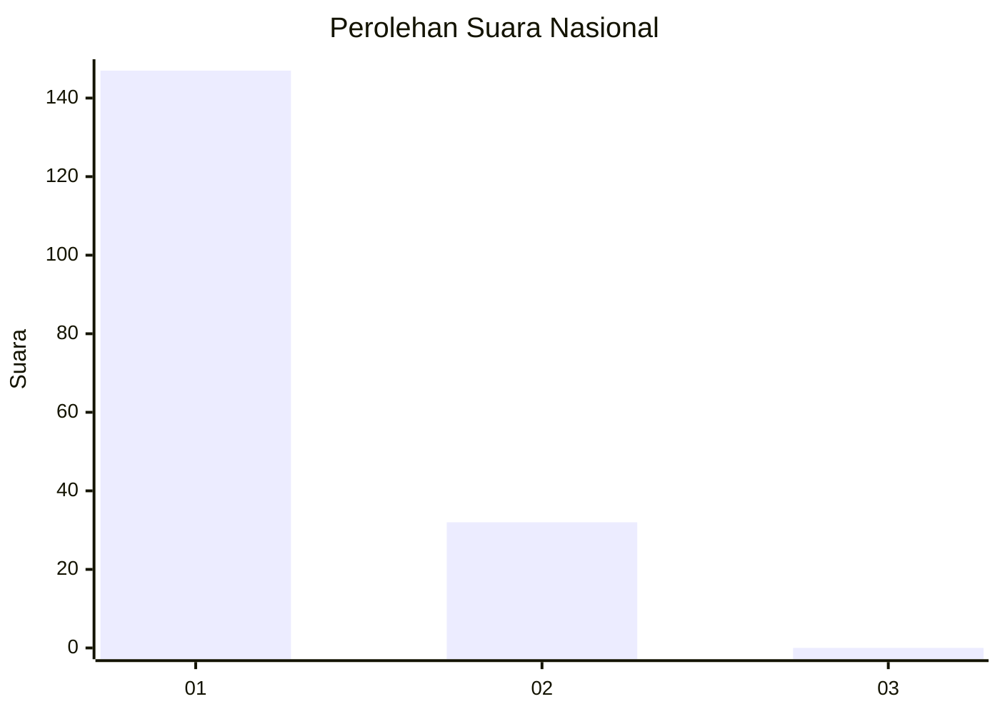
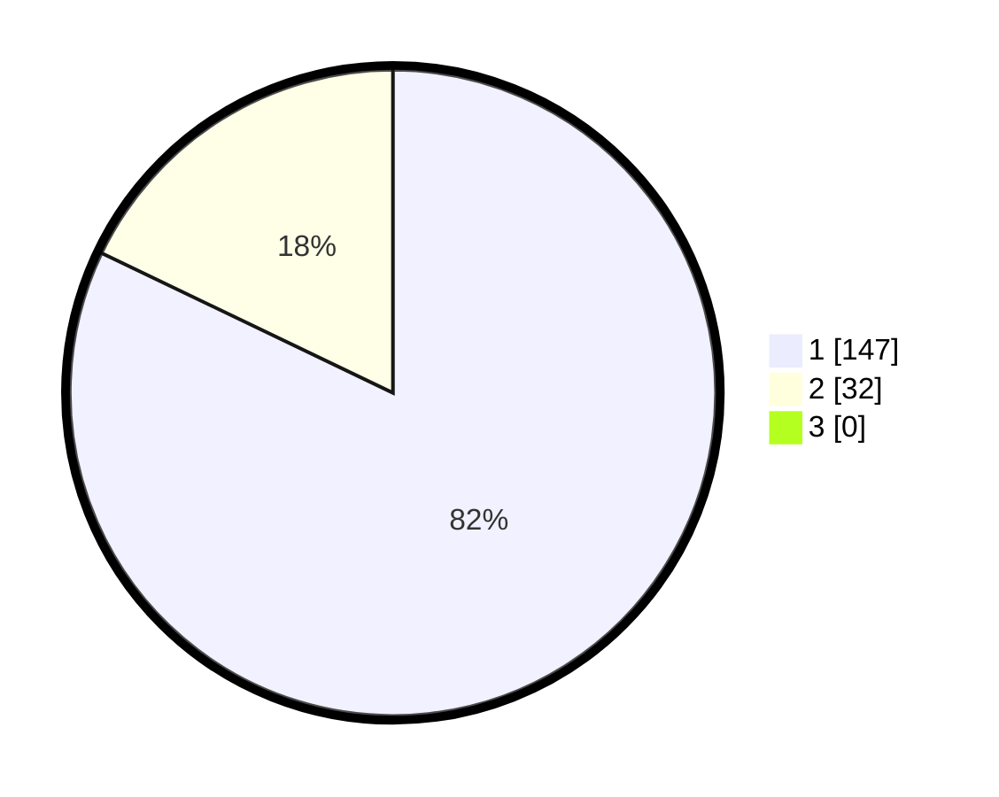

# Hasil

## Grafik

## Tabel

| No. | Nama Paslon    | Suara | Suara (raw) | Persentase |
|:--- |:-------------- | -----:| -----------:| ----------:|
| 1   | ANIES MUHAIMIN | 147   | [147][p-1]  | 82,12      |
| 2   | PRABOWO GIBRAN | 32    | [32][p-2]   | 17,88      |
| 3   | GANJAR MAHFUD  | 0     | [0][p-3]    | 0,00       |

[p-1]: https://github.com/gigit-pemilu/pemilu-2024/blob/main/pilpres/hitung-suara/sub/11-aceh/sub/06-aceh-besar/sub/18-simpang-tiga/sub/2003-ateuk-mon-panah/sub/002-tps/sub/paslon-1.txt
[p-2]: https://github.com/gigit-pemilu/pemilu-2024/blob/main/pilpres/hitung-suara/sub/11-aceh/sub/06-aceh-besar/sub/18-simpang-tiga/sub/2003-ateuk-mon-panah/sub/002-tps/sub/paslon-2.txt
[p-3]: https://github.com/gigit-pemilu/pemilu-2024/blob/main/pilpres/hitung-suara/sub/11-aceh/sub/06-aceh-besar/sub/18-simpang-tiga/sub/2003-ateuk-mon-panah/sub/002-tps/sub/paslon-3.txt

## Foto C Plano

https://sirekap-obj-formc.kpu.go.id/e28a/pemilu/ppwp/11/06/18/20/03/1106182003002-20240214-220922--e5bc9bbb-db0d-49a1-9183-4be0e18b0166.jpg

https://sirekap-obj-formc.kpu.go.id/e28a/pemilu/ppwp/11/06/18/20/03/1106182003002-20240214-221253--edd04cb6-ecd8-490c-a4ce-cfaac7cb412f.jpg

https://sirekap-obj-formc.kpu.go.id/e28a/pemilu/ppwp/11/06/18/20/03/1106182003002-20240214-221449--079609a3-c6b3-4118-9220-e50e5a9ad6c0.jpg

## Metadata

| Key        | Value               |
| ---------- | ------------------- |
| Time Stamp | 2024-02-15 05:00:24 |

## DATA PEMILIH TETAP

Jumlah pemilih dalam DPT: **193**.
 * L: **88**.
 * P: **105**.

## DATA PENGGUNA HAK PILIH

Jumlah pengguna hak pilih dalam DPT: **178**.
 * L: **79**.
 * P: **99**.

Jumlah pengguna hak pilih dalam DPTb: **0**.
 * L: **0**.
 * P: **0**.

Jumlah pengguna hak pilih dalam DPK: **4**.
 * L: **2**.
 * P: **2**.

Jumlah pengguna hak pilih: **182**.
 * L: **81**.
 * P: **101**.

## JUMLAH SUARA SAH DAN TIDAK SAH

JUMLAH SELURUH SUARA SAH: **197**.

JUMLAH SUARA TIDAK SAH: **3**.

JUMLAH SELURUH SUARA SAH DAN SUARA TIDAK SAH: **182**.

