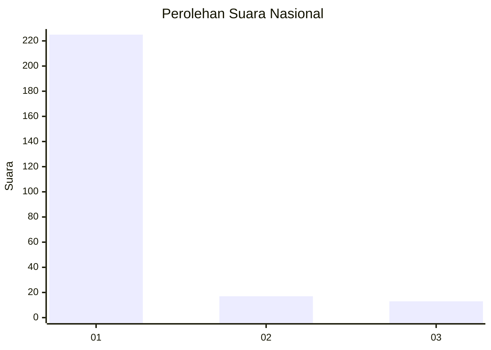
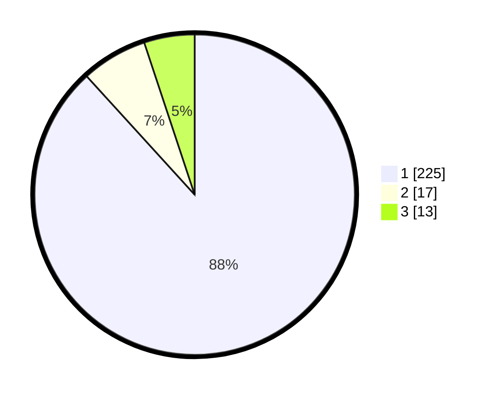

# Hasil

## Grafik

## Tabel

| No. | Nama Paslon    | Suara | Suara (raw) | Persentase |
|:--- |:-------------- | -----:| -----------:| ----------:|
| 1   | ANIES MUHAIMIN | 225   | [225][p-1]  | 88,24      |
| 2   | PRABOWO GIBRAN | 17    | [17][p-2]   | 6,67       |
| 3   | GANJAR MAHFUD  | 13    | [13][p-3]   | 5,10       |

[p-1]: https://github.com/gigit-pemilu/pemilu-2024/blob/main/pilpres/hitung-suara/sub/11-aceh/sub/06-aceh-besar/sub/18-simpang-tiga/sub/2005-ateuk-cut/sub/001-tps/sub/paslon-1.txt
[p-2]: https://github.com/gigit-pemilu/pemilu-2024/blob/main/pilpres/hitung-suara/sub/11-aceh/sub/06-aceh-besar/sub/18-simpang-tiga/sub/2005-ateuk-cut/sub/001-tps/sub/paslon-2.txt
[p-3]: https://github.com/gigit-pemilu/pemilu-2024/blob/main/pilpres/hitung-suara/sub/11-aceh/sub/06-aceh-besar/sub/18-simpang-tiga/sub/2005-ateuk-cut/sub/001-tps/sub/paslon-3.txt

## Foto C Plano

https://sirekap-obj-formc.kpu.go.id/29fe/pemilu/ppwp/11/06/18/20/05/1106182005001-20240222-171533--c9dd278e-1e89-461d-b69f-c53f42e14f50.jpg

https://sirekap-obj-formc.kpu.go.id/29fe/pemilu/ppwp/11/06/18/20/05/1106182005001-20240215-002108--0fb6b9b7-048f-4170-bbfb-10e3ae5e4a08.jpg

https://sirekap-obj-formc.kpu.go.id/29fe/pemilu/ppwp/11/06/18/20/05/1106182005001-20240215-001309--8b32739d-def0-458c-88f1-e8664737747c.jpg

## Metadata

| Key        | Value               |
| ---------- | ------------------- |
| Time Stamp | 2024-02-22 18:00:00 |

