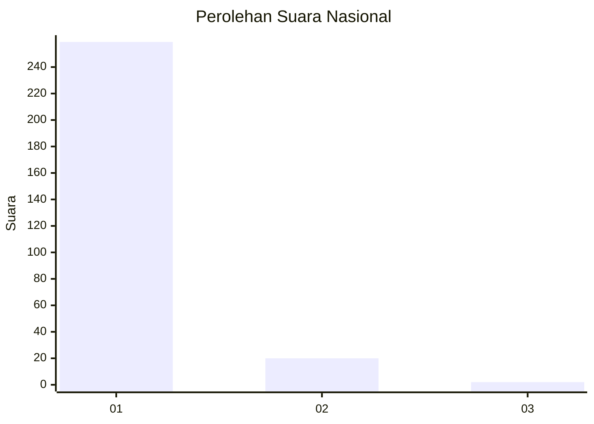
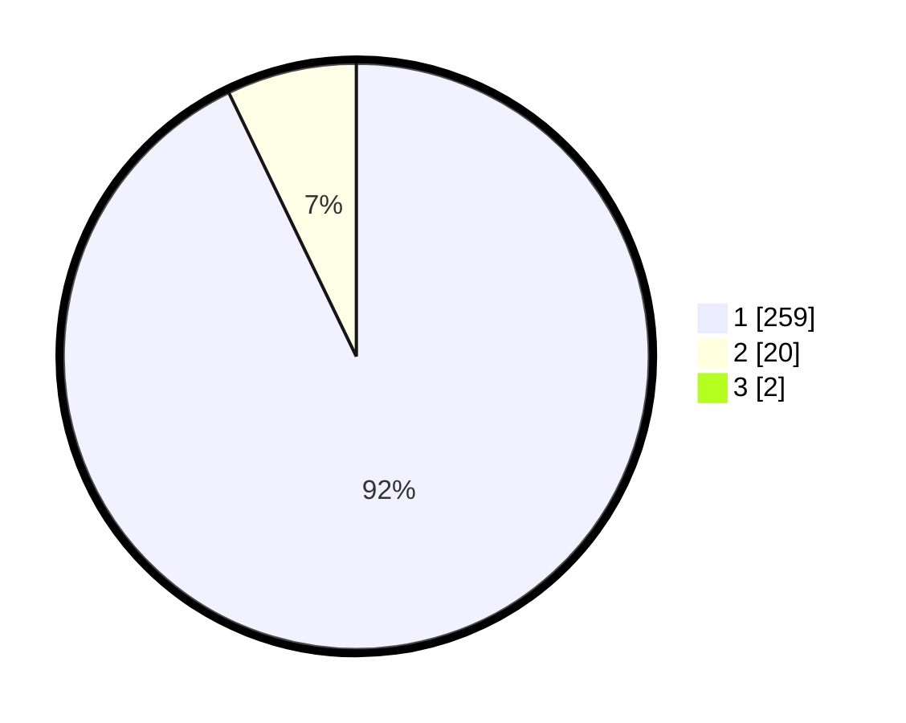

# Hasil

## Grafik

## Tabel

| No. | Nama Paslon    | Suara | Suara (raw) | Persentase |
|:--- |:-------------- | -----:| -----------:| ----------:|
| 1   | ANIES MUHAIMIN | 259   | [259][p-1]  | 92,17      |
| 2   | PRABOWO GIBRAN | 20    | [20][p-2]   | 7,12       |
| 3   | GANJAR MAHFUD  | 2     | [2][p-3]    | 0,71       |

[p-1]: https://github.com/gigit-pemilu/pemilu-2024/blob/main/pilpres/hitung-suara/sub/11-aceh/sub/06-aceh-besar/sub/18-simpang-tiga/sub/2006-ateuk-blang-asan/sub/001-tps/sub/paslon-1.txt
[p-2]: https://github.com/gigit-pemilu/pemilu-2024/blob/main/pilpres/hitung-suara/sub/11-aceh/sub/06-aceh-besar/sub/18-simpang-tiga/sub/2006-ateuk-blang-asan/sub/001-tps/sub/paslon-2.txt
[p-3]: https://github.com/gigit-pemilu/pemilu-2024/blob/main/pilpres/hitung-suara/sub/11-aceh/sub/06-aceh-besar/sub/18-simpang-tiga/sub/2006-ateuk-blang-asan/sub/001-tps/sub/paslon-3.txt

## Foto C Plano

https://sirekap-obj-formc.kpu.go.id/f2fc/pemilu/ppwp/11/06/18/20/06/1106182006001-20240214-205450--32cbc8bb-85b7-4774-9904-558b00a7ee39.jpg

https://sirekap-obj-formc.kpu.go.id/f2fc/pemilu/ppwp/11/06/18/20/06/1106182006001-20240214-222252--e6000994-1407-48e8-8997-d587634b7167.jpg

https://sirekap-obj-formc.kpu.go.id/f2fc/pemilu/ppwp/11/06/18/20/06/1106182006001-20240214-205043--32d4fd78-1ad2-4d55-a1e8-64d7add0b276.jpg

## Metadata

| Key        | Value               |
| ---------- | ------------------- |
| Time Stamp | 2024-02-16 00:30:27 |

## DATA PEMILIH TETAP

Jumlah pemilih dalam DPT: **296**.
 * L: **155**.
 * P: **141**.

## DATA PENGGUNA HAK PILIH

Jumlah pengguna hak pilih dalam DPT: **274**.
 * L: **143**.
 * P: **131**.

Jumlah pengguna hak pilih dalam DPTb: **7**.
 * L: **2**.
 * P: **5**.

Jumlah pengguna hak pilih dalam DPK: **2**.
 * L: **1**.
 * P: **1**.

Jumlah pengguna hak pilih: **283**.
 * L: **146**.
 * P: **137**.

## JUMLAH SUARA SAH DAN TIDAK SAH

JUMLAH SELURUH SUARA SAH: **281**.

JUMLAH SUARA TIDAK SAH: **2**.

JUMLAH SELURUH SUARA SAH DAN SUARA TIDAK SAH: **283**.

