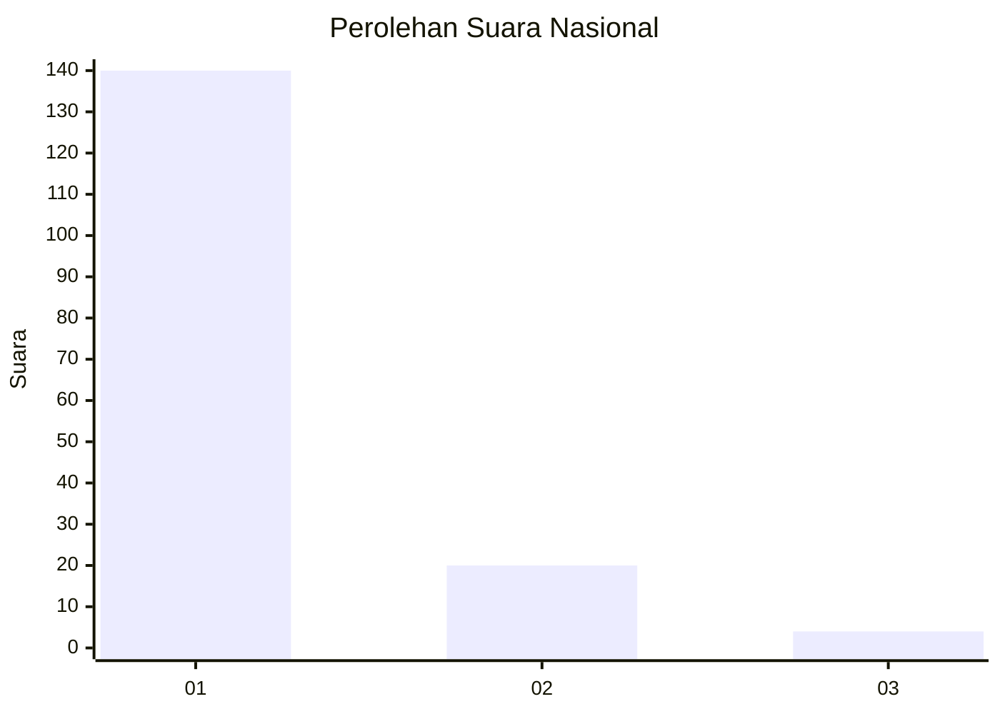
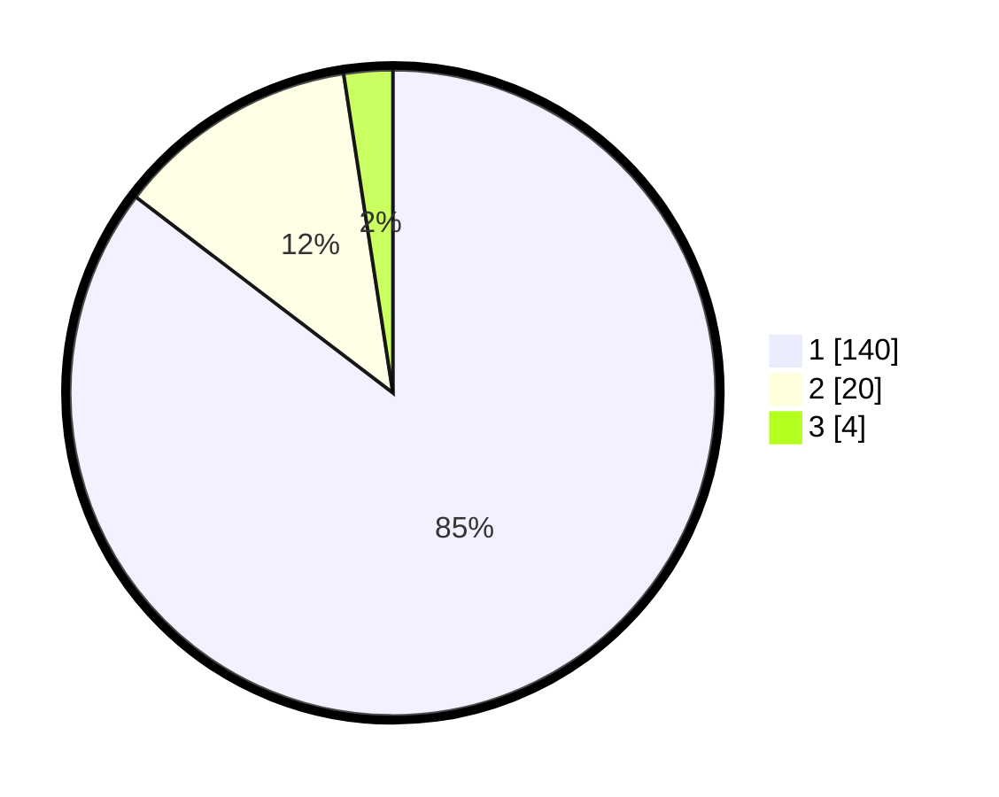

# Hasil

## Grafik

## Tabel

| No. | Nama Paslon    | Suara | Suara (raw) | Persentase |
|:--- |:-------------- | -----:| -----------:| ----------:|
| 1   | ANIES MUHAIMIN | 140   | [140][p-1]  | 85,37      |
| 2   | PRABOWO GIBRAN | 20    | [20][p-2]   | 12,20      |
| 3   | GANJAR MAHFUD  | 4     | [4][p-3]    | 2,44       |

[p-1]: https://github.com/gigit-pemilu/pemilu-2024/blob/main/pilpres/hitung-suara/sub/11-aceh/sub/06-aceh-besar/sub/18-simpang-tiga/sub/2008-lam-batee/sub/001-tps/sub/paslon-1.txt
[p-2]: https://github.com/gigit-pemilu/pemilu-2024/blob/main/pilpres/hitung-suara/sub/11-aceh/sub/06-aceh-besar/sub/18-simpang-tiga/sub/2008-lam-batee/sub/001-tps/sub/paslon-2.txt
[p-3]: https://github.com/gigit-pemilu/pemilu-2024/blob/main/pilpres/hitung-suara/sub/11-aceh/sub/06-aceh-besar/sub/18-simpang-tiga/sub/2008-lam-batee/sub/001-tps/sub/paslon-3.txt

## Foto C Plano

https://sirekap-obj-formc.kpu.go.id/3235/pemilu/ppwp/11/06/18/20/08/1106182008001-20240214-212216--4b5e603b-499c-4675-83d6-680c6a3ee9e7.jpg

https://sirekap-obj-formc.kpu.go.id/3235/pemilu/ppwp/11/06/18/20/08/1106182008001-20240214-212231--987ee7c6-a338-46b6-b798-7141a66559af.jpg

https://sirekap-obj-formc.kpu.go.id/3235/pemilu/ppwp/11/06/18/20/08/1106182008001-20240214-212246--eac87bd1-d3b0-458c-b3a1-4482722e56b2.jpg

## Metadata

| Key        | Value               |
| ---------- | ------------------- |
| Time Stamp | 2024-02-16 00:30:27 |

