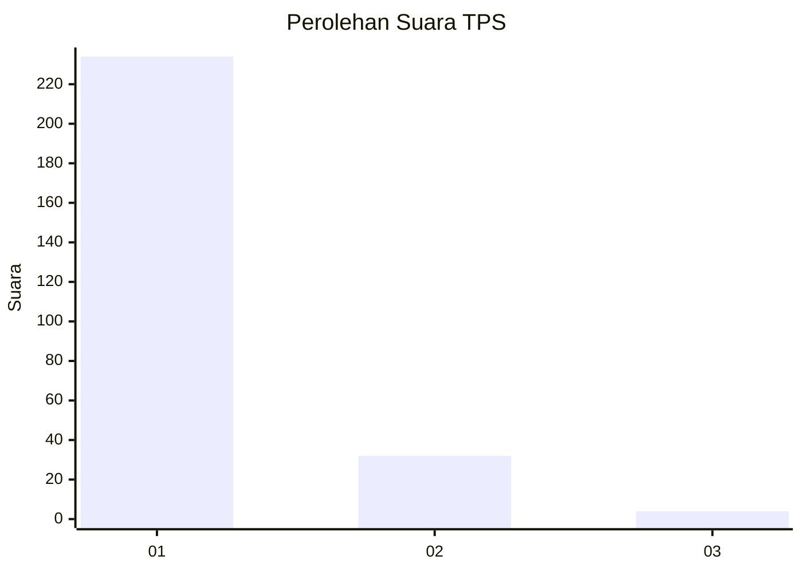
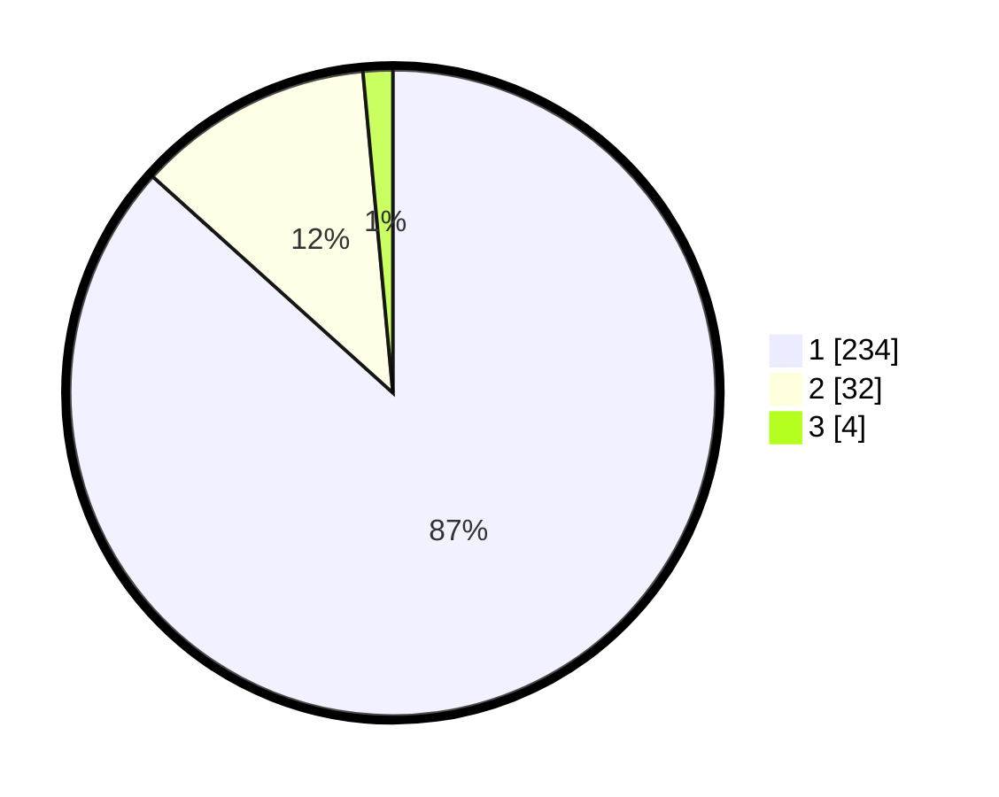

# Hasil

## Grafik

## Tabel

| No. | Nama Paslon    | Suara | Suara (raw) | Persentase |
|:--- |:-------------- | -----:| -----------:| ----------:|
| 1   | ANIES MUHAIMIN | 234   | [234][p-1]  | 86,67      |
| 2   | PRABOWO GIBRAN | 32    | [32][p-2]   | 11,85      |
| 3   | GANJAR MAHFUD  | 4     | [4][p-3]    | 1,48       |

[p-1]: https://github.com/gigit-pemilu/pemilu-2024-11-aceh/blob/main/pilpres/hitung-suara/sub/11-aceh/sub/06-aceh-besar/sub/18-simpang-tiga/sub/2010-batee-linteung/sub/001-tps/sub/paslon-1.txt
[p-2]: https://github.com/gigit-pemilu/pemilu-2024-11-aceh/blob/main/pilpres/hitung-suara/sub/11-aceh/sub/06-aceh-besar/sub/18-simpang-tiga/sub/2010-batee-linteung/sub/001-tps/sub/paslon-2.txt
[p-3]: https://github.com/gigit-pemilu/pemilu-2024-11-aceh/blob/main/pilpres/hitung-suara/sub/11-aceh/sub/06-aceh-besar/sub/18-simpang-tiga/sub/2010-batee-linteung/sub/001-tps/sub/paslon-3.txt

## Foto C Plano

https://sirekap-obj-formc.kpu.go.id/516e/pemilu/ppwp/11/06/18/20/10/1106182010001-20240215-043303--bebc0b44-7d24-4d48-900b-d369db2e890d.jpg

https://sirekap-obj-formc.kpu.go.id/516e/pemilu/ppwp/11/06/18/20/10/1106182010001-20240215-032822--9a21523c-3b6e-4ac8-b2b8-17f8b2435dfe.jpg

https://sirekap-obj-formc.kpu.go.id/516e/pemilu/ppwp/11/06/18/20/10/1106182010001-20240215-043522--58cf7c83-2950-4134-912a-729a028dff27.jpg

## Metadata

| Key        | Value               |
| ---------- | ------------------- |
| Time Stamp | 2024-02-16 00:30:27 |

