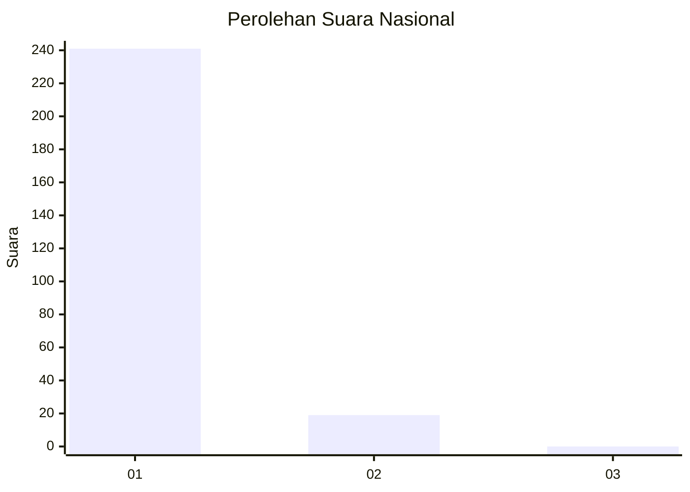
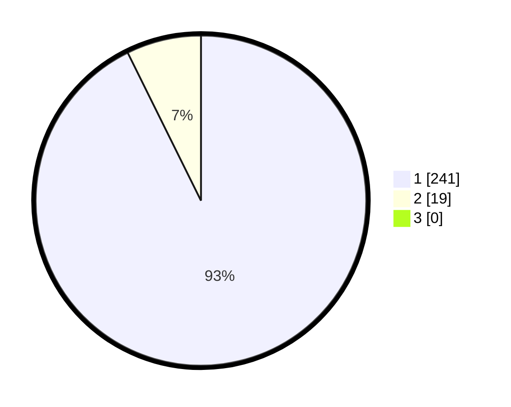

# Hasil

## Grafik

## Tabel

| No. | Nama Paslon    | Suara | Suara (raw) | Persentase |
|:--- |:-------------- | -----:| -----------:| ----------:|
| 1   | ANIES MUHAIMIN | 241   | [241][p-1]  | 92,69      |
| 2   | PRABOWO GIBRAN | 19    | [19][p-2]   | 7,31       |
| 3   | GANJAR MAHFUD  | 0     | [0][p-3]    | 0,00       |

[p-1]: https://github.com/gigit-pemilu/pemilu-2024/blob/main/pilpres/hitung-suara/sub/11-aceh/sub/06-aceh-besar/sub/18-simpang-tiga/sub/2012-lambunot/sub/002-tps/sub/paslon-1.txt
[p-2]: https://github.com/gigit-pemilu/pemilu-2024/blob/main/pilpres/hitung-suara/sub/11-aceh/sub/06-aceh-besar/sub/18-simpang-tiga/sub/2012-lambunot/sub/002-tps/sub/paslon-2.txt
[p-3]: https://github.com/gigit-pemilu/pemilu-2024/blob/main/pilpres/hitung-suara/sub/11-aceh/sub/06-aceh-besar/sub/18-simpang-tiga/sub/2012-lambunot/sub/002-tps/sub/paslon-3.txt

## Foto C Plano

https://sirekap-obj-formc.kpu.go.id/37b6/pemilu/ppwp/11/06/18/20/12/1106182012002-20240214-190720--cc54552c-ddcc-4c1b-8df2-0010fd63253d.jpg

https://sirekap-obj-formc.kpu.go.id/37b6/pemilu/ppwp/11/06/18/20/12/1106182012002-20240214-190812--c4d3bea3-44f4-4703-b823-6e9bc5c9eb6a.jpg

https://sirekap-obj-formc.kpu.go.id/37b6/pemilu/ppwp/11/06/18/20/12/1106182012002-20240214-190509--db7a5161-d7d4-4413-9006-b71c126e1c76.jpg

## Metadata

| Key        | Value               |
| ---------- | ------------------- |
| Time Stamp | 2024-02-16 00:30:27 |

