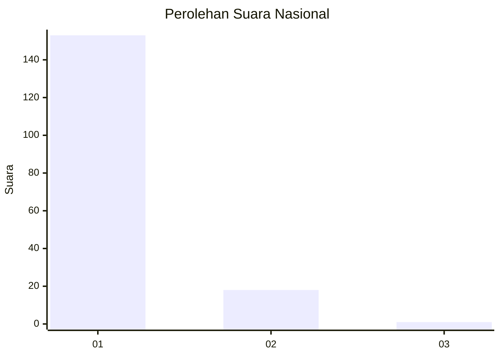
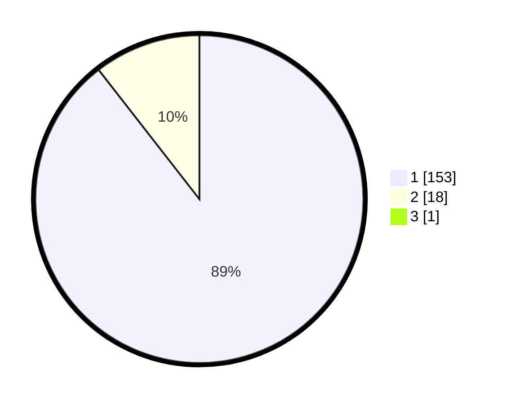

# Hasil

## Grafik

## Tabel

| No. | Nama Paslon    | Suara | Suara (raw) | Persentase |
|:--- |:-------------- | -----:| -----------:| ----------:|
| 1   | ANIES MUHAIMIN | 153   | [153][p-1]  | 88,95      |
| 2   | PRABOWO GIBRAN | 18    | [18][p-2]   | 10,47      |
| 3   | GANJAR MAHFUD  | 1     | [1][p-3]    | 0,58       |

[p-1]: https://github.com/gigit-pemilu/pemilu-2024/blob/main/pilpres/hitung-suara/sub/11-aceh/sub/06-aceh-besar/sub/18-simpang-tiga/sub/2013-lamjamee-lamkrak/sub/001-tps/sub/paslon-1.txt
[p-2]: https://github.com/gigit-pemilu/pemilu-2024/blob/main/pilpres/hitung-suara/sub/11-aceh/sub/06-aceh-besar/sub/18-simpang-tiga/sub/2013-lamjamee-lamkrak/sub/001-tps/sub/paslon-2.txt
[p-3]: https://github.com/gigit-pemilu/pemilu-2024/blob/main/pilpres/hitung-suara/sub/11-aceh/sub/06-aceh-besar/sub/18-simpang-tiga/sub/2013-lamjamee-lamkrak/sub/001-tps/sub/paslon-3.txt

## Foto C Plano

https://sirekap-obj-formc.kpu.go.id/37ce/pemilu/ppwp/11/06/18/20/13/1106182013001-20240215-001404--91da3feb-9c7b-4a72-9058-34cf63ac402d.jpg

https://sirekap-obj-formc.kpu.go.id/37ce/pemilu/ppwp/11/06/18/20/13/1106182013001-20240215-001621--4b1bf6db-1b99-4333-aea6-5ced16a04def.jpg

https://sirekap-obj-formc.kpu.go.id/37ce/pemilu/ppwp/11/06/18/20/13/1106182013001-20240215-001759--07fcd07a-4320-4353-bbff-598e96ef5b20.jpg

## Metadata

| Key        | Value               |
| ---------- | ------------------- |
| Time Stamp | 2024-02-16 00:30:27 |

