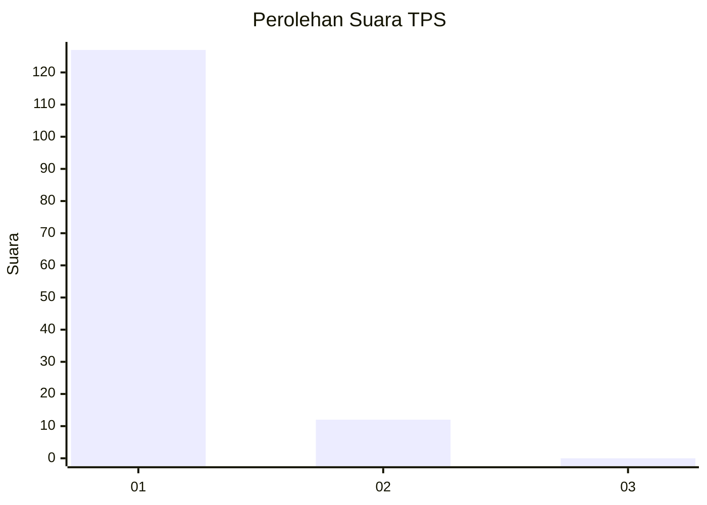
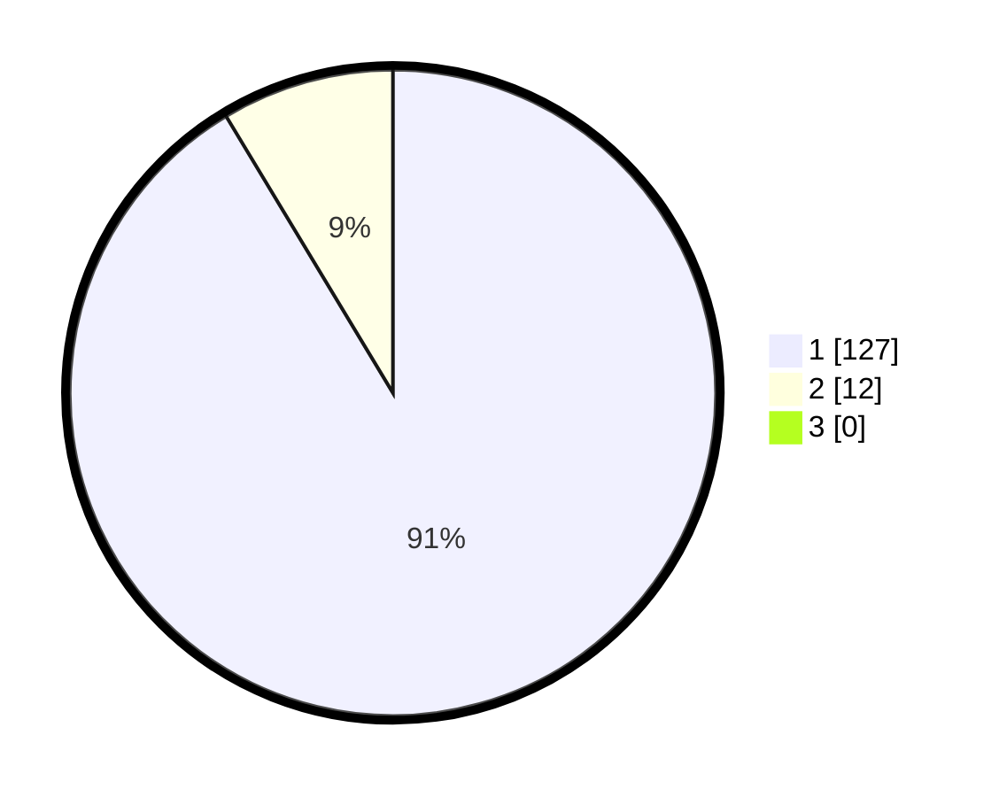

# Hasil

## Grafik

## Tabel

| No. | Nama Paslon    | Suara | Suara (raw) | Persentase |
|:--- |:-------------- | -----:| -----------:| ----------:|
| 1   | ANIES MUHAIMIN | 127   | [127][p-1]  | 91,37      |
| 2   | PRABOWO GIBRAN | 12    | [12][p-2]   | 8,63       |
| 3   | GANJAR MAHFUD  | 0     | [0][p-3]    | 0,00       |

[p-1]: https://github.com/gigit-pemilu/pemilu-2024-11-aceh/blob/main/pilpres/hitung-suara/sub/11-aceh/sub/06-aceh-besar/sub/18-simpang-tiga/sub/2015-blang-preh/sub/001-tps/sub/paslon-1.txt
[p-2]: https://github.com/gigit-pemilu/pemilu-2024-11-aceh/blob/main/pilpres/hitung-suara/sub/11-aceh/sub/06-aceh-besar/sub/18-simpang-tiga/sub/2015-blang-preh/sub/001-tps/sub/paslon-2.txt
[p-3]: https://github.com/gigit-pemilu/pemilu-2024-11-aceh/blob/main/pilpres/hitung-suara/sub/11-aceh/sub/06-aceh-besar/sub/18-simpang-tiga/sub/2015-blang-preh/sub/001-tps/sub/paslon-3.txt

## Foto C Plano

https://sirekap-obj-formc.kpu.go.id/eb0f/pemilu/ppwp/11/06/18/20/15/1106182015001-20240214-223258--f4e4b558-fe9d-4224-8a9d-4767fcf93b41.jpg

https://sirekap-obj-formc.kpu.go.id/eb0f/pemilu/ppwp/11/06/18/20/15/1106182015001-20240214-223330--f10337c3-83ba-4383-a62d-acea7ba02f49.jpg

https://sirekap-obj-formc.kpu.go.id/eb0f/pemilu/ppwp/11/06/18/20/15/1106182015001-20240214-223345--8d294102-efb8-4833-b7c7-ce713813de73.jpg

## Metadata

| Key        | Value               |
| ---------- | ------------------- |
| Time Stamp | 2024-02-16 00:30:27 |

