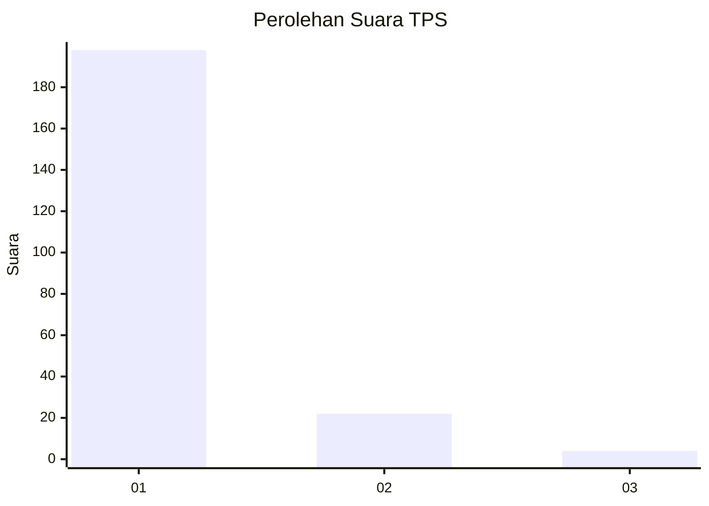
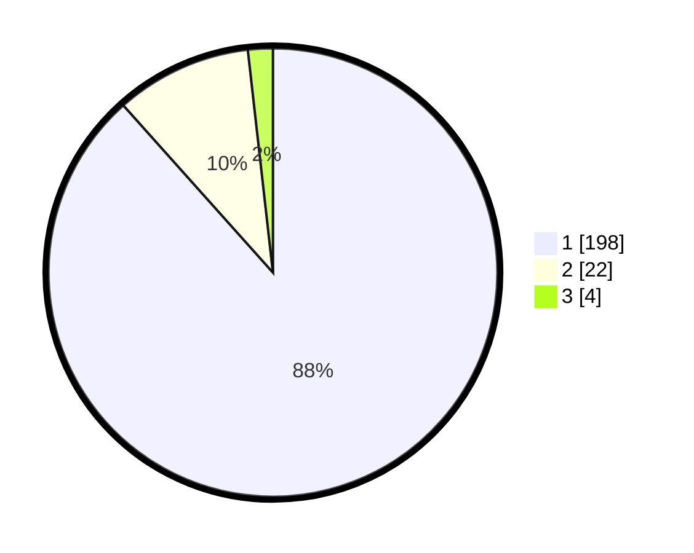

# Hasil

## Grafik

## Tabel

| No. | Nama Paslon    | Suara | Suara (raw) | Persentase |
|:--- |:-------------- | -----:| -----------:| ----------:|
| 1   | ANIES MUHAIMIN | 198   | [198][p-1]  | 88,39      |
| 2   | PRABOWO GIBRAN | 22    | [22][p-2]   | 9,82       |
| 3   | GANJAR MAHFUD  | 4     | [4][p-3]    | 1,79       |

[p-1]: https://github.com/gigit-pemilu/pemilu-2024-11-aceh/blob/main/pilpres/hitung-suara/sub/11-aceh/sub/06-aceh-besar/sub/19-darul-kamal/sub/2005-lamtadok/sub/002-tps/sub/paslon-1.txt
[p-2]: https://github.com/gigit-pemilu/pemilu-2024-11-aceh/blob/main/pilpres/hitung-suara/sub/11-aceh/sub/06-aceh-besar/sub/19-darul-kamal/sub/2005-lamtadok/sub/002-tps/sub/paslon-2.txt
[p-3]: https://github.com/gigit-pemilu/pemilu-2024-11-aceh/blob/main/pilpres/hitung-suara/sub/11-aceh/sub/06-aceh-besar/sub/19-darul-kamal/sub/2005-lamtadok/sub/002-tps/sub/paslon-3.txt

## Foto C Plano

https://sirekap-obj-formc.kpu.go.id/8db5/pemilu/ppwp/11/06/19/20/05/1106192005002-20240215-073816--ea686d1a-b968-479f-947b-00b047cd4bdf.jpg

https://sirekap-obj-formc.kpu.go.id/8db5/pemilu/ppwp/11/06/19/20/05/1106192005002-20240215-073901--f26b2acb-cb88-4860-9bd7-f570f045ee22.jpg

https://sirekap-obj-formc.kpu.go.id/8db5/pemilu/ppwp/11/06/19/20/05/1106192005002-20240215-073946--e4166435-5434-483e-a8e8-4aebd271d9d1.jpg

## Metadata

| Key        | Value               |
| ---------- | ------------------- |
| Time Stamp | 2024-02-16 00:30:27 |

