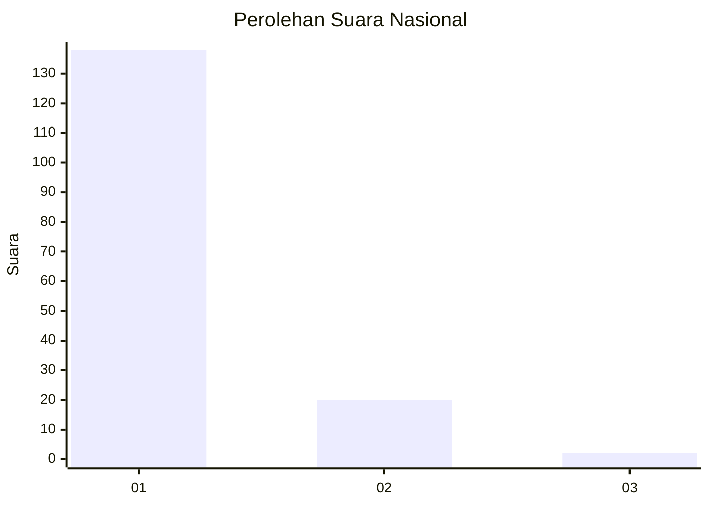
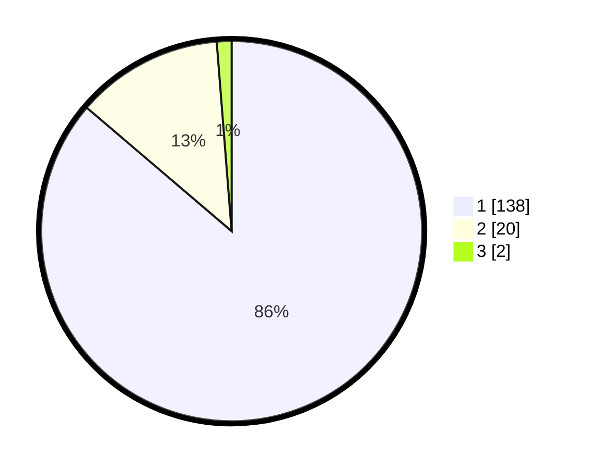

# Hasil

## Grafik

## Tabel

| No. | Nama Paslon    | Suara | Suara (raw) | Persentase |
|:--- |:-------------- | -----:| -----------:| ----------:|
| 1   | ANIES MUHAIMIN | 138   | [138][p-1]  | 86,25      |
| 2   | PRABOWO GIBRAN | 20    | [20][p-2]   | 12,50      |
| 3   | GANJAR MAHFUD  | 2     | [2][p-3]    | 1,25       |

[p-1]: https://github.com/gigit-pemilu/pemilu-2024/blob/main/pilpres/hitung-suara/sub/11-aceh/sub/06-aceh-besar/sub/19-darul-kamal/sub/2007-turam/sub/001-tps/sub/paslon-1.txt
[p-2]: https://github.com/gigit-pemilu/pemilu-2024/blob/main/pilpres/hitung-suara/sub/11-aceh/sub/06-aceh-besar/sub/19-darul-kamal/sub/2007-turam/sub/001-tps/sub/paslon-2.txt
[p-3]: https://github.com/gigit-pemilu/pemilu-2024/blob/main/pilpres/hitung-suara/sub/11-aceh/sub/06-aceh-besar/sub/19-darul-kamal/sub/2007-turam/sub/001-tps/sub/paslon-3.txt

## Foto C Plano

https://sirekap-obj-formc.kpu.go.id/aebe/pemilu/ppwp/11/06/19/20/07/1106192007001-20240214-223119--306abe32-4ecd-4500-9e68-92b626e1284f.jpg

https://sirekap-obj-formc.kpu.go.id/aebe/pemilu/ppwp/11/06/19/20/07/1106192007001-20240214-223322--a5b85bf2-3dff-4271-a1ce-3d7421f485b9.jpg

https://sirekap-obj-formc.kpu.go.id/aebe/pemilu/ppwp/11/06/19/20/07/1106192007001-20240214-223406--7f004f5f-1a9a-4e37-9dd9-4ef72d84473b.jpg

## Metadata

| Key        | Value               |
| ---------- | ------------------- |
| Time Stamp | 2024-02-16 00:30:27 |

